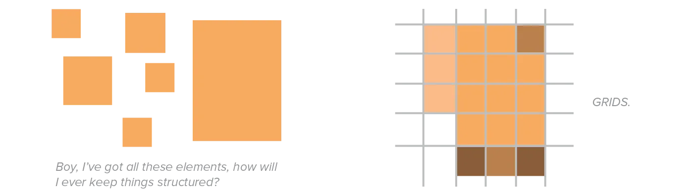
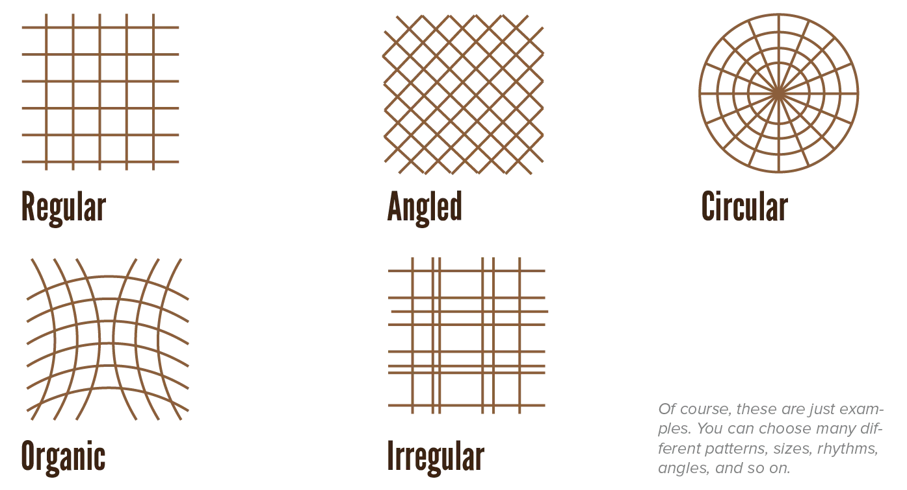
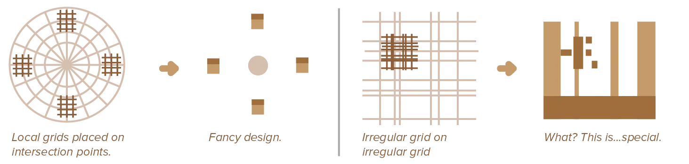
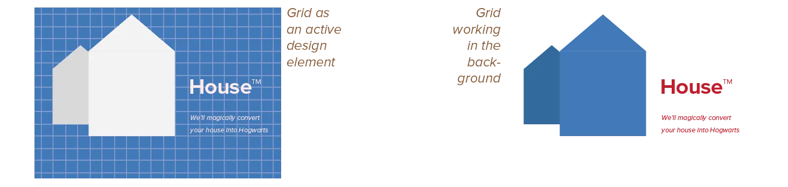

So far, you can establish figure-ground (foreground and background). Within those, you can create layers for each general "level" of the hierarchy. Now let's go one step further: inside a layer, you often want to use one **grid**.

Grids are everywhere. Behind almost every great design is a grid. They are, however, not _mandatoy_ in any way. If you find that a grid is not working for you, abandon it and try something else. Grids exist only to aid and accelerate the design process.

This chapter explains what they are and how you can create and utilize these yourself.

## Why Grids?

We've already seen that people like patterns and logical structure a lot. A grid is the ultimate tool to achieving such pleasing and understandable designs, while at the same time giving you lots of room for creativity and variation.

A well-constructed grid encourages designers to vary scale and placement of elements, without relying on arbitrary judgments.

A grid provides a starting point. It converts a scary blank canvas into a structured field with clear anchors for your visual elements. 

A layer is meant to group elements with the same function. Placing all those elements following one _grid_ is the easiest surefire way to accomplish this.

Also, I mentioned our tendency to think the center of something is more important. By dividing space into numerous equal units, the edges of the composition become just as important as the center. Grids encourage designers to create open and dynamic compositions without turning it into a complete mess.

## Types of Grids

Most people know grids as _tables_. Simple horizontal and vertical lines dividing space into smaller and smaller squares or "cells". 

Yes, this is perhaps the simplest and most popular use. But there are many different types of grids! Which all provide the same benefits, in their own way.

These five types are:

-   **Regular:** The type of grid everybody is familiar with: straight horizontal and vertical lines positioned at regular intervals.
-   **Angled:** A variation on the regular grid, where horizontal and/or vertical lines are angled instead of straight. A simple but powerful variation on the basic grid. Works best if the angle is bigger than 30 degrees, and a multiple of 10 or 15 degrees.
-   **Circular**: Bigger and bigger circles around the centre, accompanied by diagonal lines running through that same centre. Actually quite easy to work with, if you're going for a dynamic and organic design.
-   **Organic**: Instead of straight horizontal and vertical lines, the lines are curvilinear. Tricky to get right.
-   **Irregular:** Instead of placing lines or curves at regular intervals, they are placed irregularly. Very tricky to get right.

It's generally recommended to keep _one consistent grid_ for _one layer_.

Of course, you can use multiple grids inside the big one, hich are called *local grids*. This is, again, helpful to keep complex designs simple and structured. But it's tough! The local grids need to match the global grid well. 

{}
If you used a regular (rectangular) grid for the whole composition, and an irregular local grid on every element, things would still look like they were arbitrarily placed. But using a big spherical grid and a few organic local grids already matches better. Local grids are awesome, but watch out you don't take it too far.
{}

## Visibility

A grid can work quietly in the background, or it can be obviously visible in a design. 

In the first case, people can't really point out the grid you used from looking at your design. It still influenced a lot of the design decisions and overall feeling, but more subtly.

In the second case, the grid becomes an active element within a design. The visual properties assigned to the grid play an even bigger role. Maybe even the grid lines themselves are drawn.

When a grid works quietly in the background, it provides more flexibility and more opportunities to break out of the grid and do special things. 

When the grid is clearly visible, you don't have to worry about losing consistency, but you'll need to strictly adhere to it. You can't show a clear grid and then position your elements _with complete disregard for it_.

{}
If your design has to communicate a lot of data, hard numbers and facts people shouldn't misinterpret, we usually show the grid. To force ourselves to stay consistent and to also communicate this clear structure to our viewer. But if you design a children's picture book, for example, you can use a simple grid to help yourself but not show it at _all_ in the final product.
{}

Neither way is better than the other---it's a choice that depends on your purpose.

## Using Grids

The type of grid you choose should naturally come forth from the purpose of the design. If your style is modern and formal, for example, it would be unwise to choose an organic grid.

> The lines and intersections that result from the grid should be used for the *position* and *scale* of elements. 

The lines can be used for the edges of shapes, actually visible lines within the composition, or simply aligning elements. The intersections are usually great places to position or centre elements.

On top of that, grids help you create active and asymmetric compositions. You can visually balance the elements by counting how much space they take up in the grid, or how many spaces they are apart. In doing so, grids also provide an opportunity for you to leave more areas open or empty, rather than filling up the whole page.

Either way, a designer uses a grid actively and not passively. It's often helpful to let the grid suggest the shapes and placements, instead of doing what's fixed inside your head. Design a good grid---a good blueprint, so to speak---and a beautiful house should naturally follow.

Newspapers, for example, use the same grid on every page. But they use slight variations on the size and position of tiles, as required by the different lengths of articles, to conserve space and ink/paper necessary. 

Similarly, webpages are dynamic and can extend infinitely vertically. This means the grid used for layout is mainly concerned with *horizontal* placement and allows the rest to vary.

Lastly, you might be wondering: *how do grids help with design that's not printed or on a page?* 

Well, grids are merely a way to subdivide space. So as long as a design has a surface or space, you can subdivide it and get a grid.

{}
A physical object's surface can still be measured and divided into lines. The you can place buttons, or handles, or screens, at logical positions and sizes. If your desig nhas multiple physical objects---like an exposition---you can use a grid on the floor to determine where they should be placed.
{}