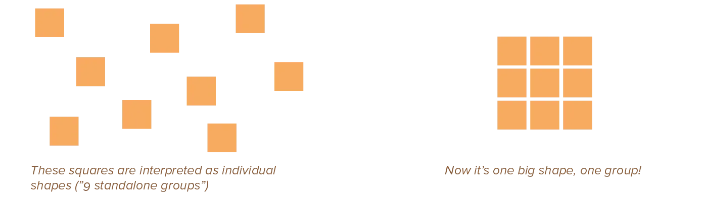
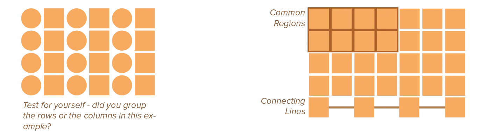
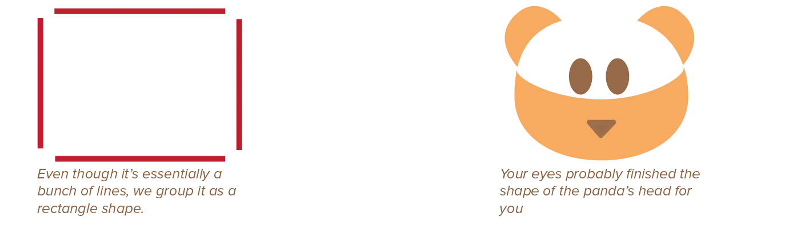
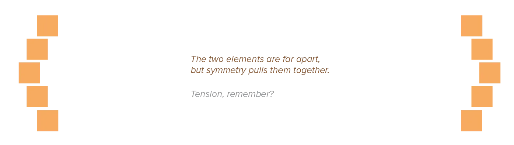
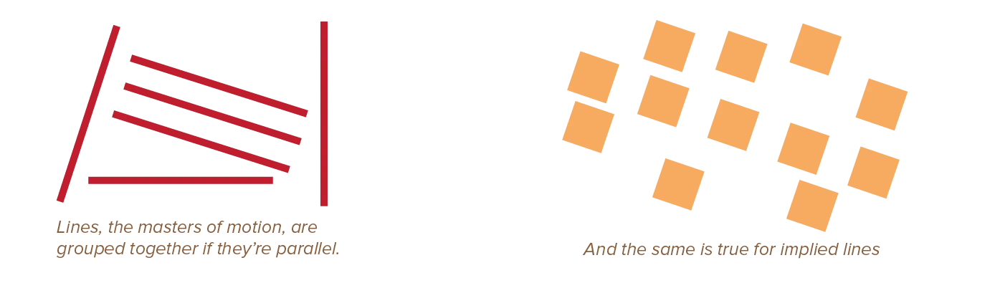
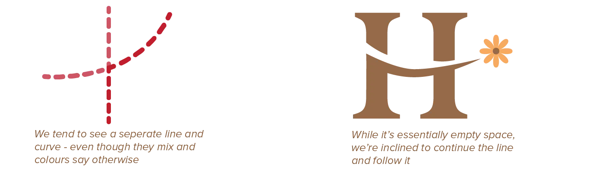
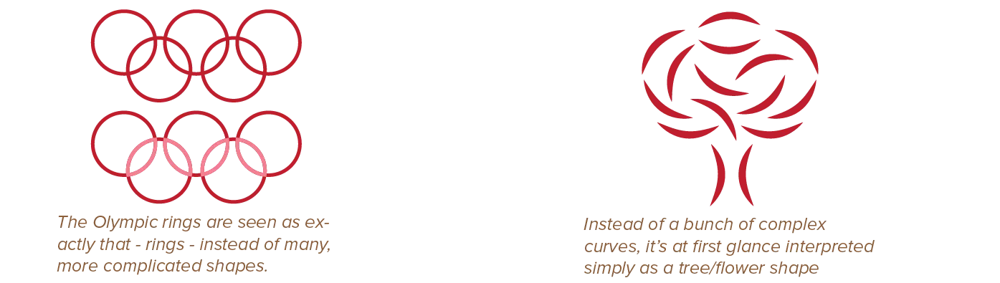
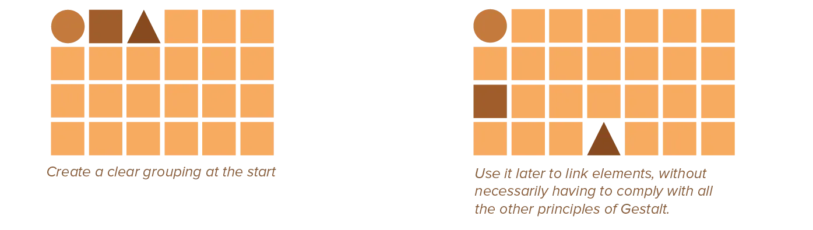

Grouping is the first step for creating hierarchy. It serves to both combine and separate. As a process of combining, grouping transforms elements into larger elements. As a process of separating, grouping serves to break down large and complex objects into smaller, simpler ones.

Once elements are grouped, we can use principles to assign a ranking that shows how important groups are _in relation to other groups_. 

The many ways to group were formulated, long ago, as part of a study on the psychology of perception. That is why they are called the **Gestalt Principles of Perception**

There are eight of them: *proximity*, *similarity*, *closure*, *symmetry*, *common fate*, *continuity*, *good gestalt* and *past experience*. (The first six, however, are the most important.)

Most of these principles have their own chapter later in the course. As I said: grouping is everything within hierarchy. But this chapter provides a summary and overview to get you started.

## Proximity

Elements close to each other are perceived as related and grouped. Elements far apart are perceived as dissimilar and unrelated.

## Similarity

Similar elements are automatically perceived as a group. In order for this to work, of course, there need to also be *different* elements within the design. 

Notice I said similar, not identical. By changing an element _slightly_, they remain connected, while providing variation. Similarity will generally overpower the other Gestalt principles.

Two strategies for applying similarity in a design, which are also related to proximity, are:

-   **Common Regions:** Formed when edges come together and bound a visual area, grouping the elements within it. Useful for grouping text elements and clusters of control elements.
-   **Connecting Lines:** When an explicit line joins elements, grouping the connected elements. Useful for grouping individual elements and implying sequence.

## Closure

Incomplete objects (with holes or gaps) are automatically completed by the viewer's eyes. This means that the mind automatically groups several elements with space between them into one big element. 

For this to work, of course, the object can't be destroyed too much. Our mind still needs to intuitively be able to complete it.

Closure is strongest when elements approach simple and recognizable patterns, such as geometric forms, and are located near one another. This principle enables designers to reduce complexity and the number of elements needed. Not completing some of your lines also increases interest---viewers subconsciously participate with the design.

{}
This is closely related to what I state in my [Drawing](../../drawing/) course. Don't try to draw something 100% realistic, but use simple texture and symbols to _suggest_ texture and form. Our eyes will automatically complete it.
{}

## Symmetry

The mind automatically perceives objects as symmetrical and forming around a center point. It is perceptually pleasing to make elements symmetrical. And when multiple elements seem to be symmetrical around the same centre point, the mind will automatically group them together. 

This is related to what I explained about mass and gravity, of course, in the chapter on [Mass](../../design-properties/mass/). The more mass something has, the more it attracts everything around it to its own center, grouping those elements.

## Common Fate

Elements moving in the same direction are perceived to be more related than elements moving in different directions. Or elements that are stationary. 

This refers to elements that *imply* motion, as well as elements that actually move (like a video or animation).

The effect is strongest when motion occurs identically: same timing, same velocity, same direction. Moving objects will be perceived as foreground, and stationary objects as background.

## Continuity

Our mind assumes that the past will continue into the present. If we've seen elements forming a line, we assume this line continues. If we've seen four red squares in a line, we expect the square after that to also be red.

This means multiple elements can be close and mixed ... while _still_ being perceived as separate elements. 

* Small angles or changes will lead to continuation: the eye assumes these belong together and follows it.
* More acute angles or drastic changes will lead to elements being perceived as unrelated.

Of course, this only works if you have multiple elements within the same group. Otherwise there is no "pattern" to establish, nothing to automatically "contiue" in the viewer's mind.

## Good Gestalt

Elements are grouped together if they form a pattern that is regular, simple, and orderly. When presented with a set of elements that can be interpreted in multiple ways, people will interpret it in the simplest way. (Fewer rather than more elements, symmetrical rather than asymmetrical, and so on.)

Minimize the number of elements in a design to reduce extra cognitive effort needed from viewer. Favour symmetrical composition when efficiency is priority, and asymmetrical compositions when interestingness is priority.

## Past Experience

Past experiences help group or separate elements. We know from experience that a word consists of multiple letters, even though one could interpret it as one large symbol when looking from a distance. 

In fact, research shows that, when we read, we often know the word without looking at all of it. Because our mind simply assumes the word from past experience with these general shapes and words *starting* with these letters.

This means you can use _common knowledge_ to make a design simpler and more intuitive. Don't fight human nature, use it to your advantage.

But it also means you can _override_ all the rules above, all the default heuristics humans use. Give them a certain experience at the start---prime them---so they will understand something else later on.

