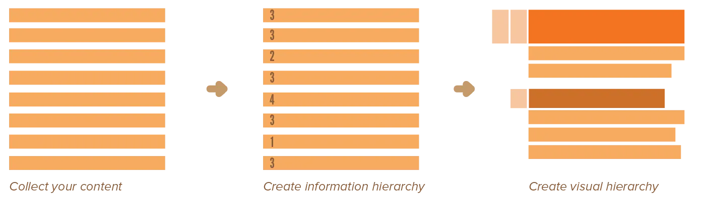
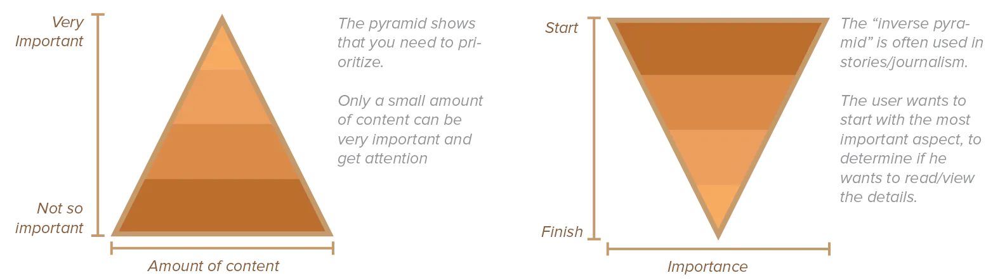
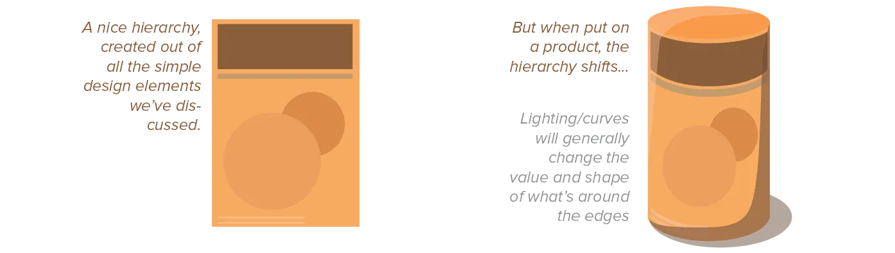

We've discussed the fundamental visual elements and their properties. Let's move on to the bigger picture: placing all the elements together within the same design---without turning it into complete chaos. 

Expressing order is the central task of the graphic designer. If the viewer doesn't know what is what, or where to start, the whole design falls apart. (Unless it was your specific intention to create a confusing design without clear meaning. In which case it still helps to read this chapter, so you can _break_ all its rules.)

The keyword to making any good desgn is *hierarchy*. To reduce chaos, we need to (visibly) put things into groups and establish relationships between every pair of elements on the page. And as we create those relationships, we create a hierarchy that answers questions like ...

* What is the most important element in the design? 
* What is the least important element in design? 
* How do we make every headline important, and in doing so attract attention towards the piece of text below it?
* Which elements are in the same group? (Meaning the express the same or releated information?)

This is **the only question** within design. Every decision comes down to hierarchy. Because remember, graphic design merely communicates information visually. Even if you merely want to make something look pretty, it has a _reason_ it should look pretty, so any graphical decision should not destroy that reason.

As such, one chapter isn't enough to explain it. From now on, all chapters will explain one design principle that helps with hierarchy. 

You'll notice these principles are all based on one thing: how the human brain works and how our eyes observe. 

These principles are the result of a basic understanding about how people perceive certain visual stimuli. And you should think about design that way as well: what can I do to make people interpret a design the way I intended? Even if it's just a bunch of flat shapes on a paper?

Remember that design isn't (necessarily) art. The first and foremost function of design is to communicate the same message to every user, its secondary function is to make it visually appealing or interesting. Usually, if you work on getting your hierarchy right, the visual elements will automatically fall into place.

## Tools of Hierarchy

You already have the many tools for hierarchy under your belt. To create structure, you can use: points, lines, position, orientation, size, colour, typography, texture, patterns, mass, and shape. 

Hierarchy employs these clear marks of separation to signal a change from one level to another. You will now simply learn _how_ to use the knowledge you've already gained.

{} 
If you have an equal number of square elements and round elements in the design, the squares will automatically be grouped together in the viewer's mind. And they will be the first to attract attention because of their sharp outlines.
{}

Good, small examples for studying hierarchy are *table of contents*. A poorly designed table of contents uses conflicting or contradictory alignments, redundant numbering systems, and an overall graphical clutter. Analyse table of contents to get a good grip on hierarchy.

{}
This is more of a typography issue, though. Check the [Typography](../../../typography/) course for those kinds of things!
{}

Lastly, pay attention to **dimensional hierarchy**. When your design is three-dimensional, you have the added challenge of legibility across and around curved planes. Three-dimensional objects are bathed in light and shadow, and you need to take those into account in your hierarchy as well. 

{}
An unfortunate cast shadow in an exposition (in the real world, physical) might completely obscure a painting or an important visual element. Or text written on a cube might be cut off in an awkward way, unless you walk around the cube to continue reading.
{}

