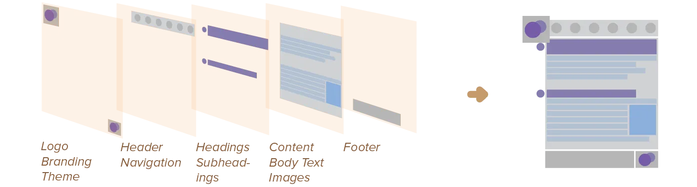
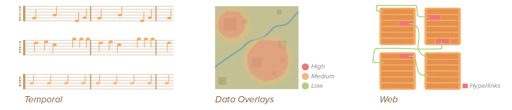
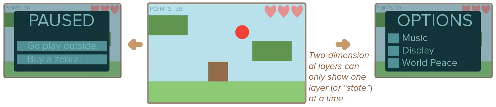

Great! You've now established the figure-ground relationship. It's time to establish the hierarchy between smaller groups of elements. I think it's best to do this in different levels or _layers_.

It gives you a process to use. I mean, you _could_ randomly pick elements and think "hmm what should I do with this?" until your design is done. But you'd have a hard time staying consistent. And editing the design later if anything changed. And, actually, humans are bad at true randomness.

Instead, establish the _layers_ of your hierarchy, and then just create them one after another. This way, you can style a whole _layer_ so all elements automatically share the same visual identity. You can move layers around. You can name the so you immediately know what they represent. It forces you to keep hierarchy in mind all the way.

{}
For one of my latest books, I drew a map _while_ I was writing the story. To keep track of the places and countries I'd invented, the fantasy names I'd dropped. But ... how do you design a map when you don't know the content? I created layers for hierarchy: land names, city names, river names, important landmarks, less important landmarks, etcetera. Whenever I wanted, I could change the design of the _whole layer_ to something better. And whenever I wanted to add content, I had a clear place to do so.
{}

Establishing a _good_ set of layers is already half the job. There should be enough layers to express every level of importance (and make the design interesting), but not so many it becomes a mess.

## What are Layers?

Layers are simultaneous, overlapping components of an image or sequence. Any design is build from multiple layers. In mechanical reproduction, processes have always used multiple layers or multiple steps.

A layer contains elements that are visually or logically connected. For example, a layer could hold all the headlines of a page. Or it could hold all the elements at the bottom of a three-dimensional design. Or it could hold all page numbers. 

Layers can be obvious and serve as a graphical element within your design. For example, you could draw a thick border around a whole layer, clearly _visually_ separating it from the rest.

Most of the time, though, they are simply a tool for you---the designer. To create hierarchy and a clean process, from start to finish.

## Types of Layers

Two general types of layers exist: **physical** and **virtual**.

* *Physical* layers can be felt. They are a result of overlapping material in a design (such as cutting and pasting). 
* *Virtual* layers are structural layers, including the layer systems seen in design software (such as Photoshop).

Additionally, layers can be *linear* or *non-linear*. Linear layers have a clear beginning, middle, and end. They are useful for leading or guiding a viewer through a design, telling a narrative. Non-linear layers are useful for reinforcing relationships between layers, acting like the glue or the repeating pattern.

### Linear Layers

Within the realm of linear layers, these kinds of layers are commonly used:

-   **Sequential:** The simplest layering structure available. Layers are put next to, after, or on top of each other based on their place in the sequence. The layer representing the start of the story is shown first, and the one concluding the story last.
-   **Temporal**: When working with a sequence of simultaneous events---such as in film or music scores---it's best to create multiple parallel layers. Any other type of (layering) system will most likely only confuse your audience.

### Non-Linear Layers

Within the realm of non-linear layers, four more specific types exist:

-   **Grouping**: Layers that aren't necessarily visible, but group elements together. For example, you could decide to cut elements that represent the same thing out of the same material, or you could decide to put elements about the same topic within the same layer in your software. They're sometimes called *hierarchical layers*, and used---not surprisingly---when information has superordinate and subordinate relationships with each other.
-   **Typographic**: It's often wise to put textual elements that belong together in the same layer. This could be the case if they're part of the same narrative, or if they all have the same rank of importance.
-   **Data**: When conveying data or information, multiple overlays are often used. By putting these on different layers you allow users to read levels independently, as well as perceive the connections between the levels. Make sure, though, that those layers are distinct yet follow the same general design style.
-   **Web**: When information is a network with many different kinds of relationships with itself, revealed by associative linkages to other layers.

Sometimes, it's also helpful to make a different distinction; between *two-dimensional* and *three-dimensional* layers. 

* The first type refers to separating information such that only one layer can be viewed at a time
* The second allows multiple layers to be viewed at any given time (usually through overlapping or transparency). 

Three-dimensional layers are the most common, and the previous examples already showed what they look like.

