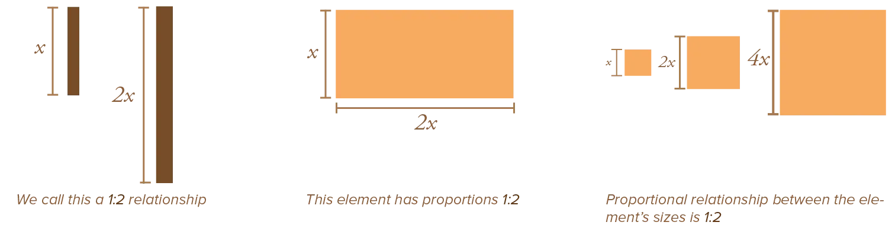
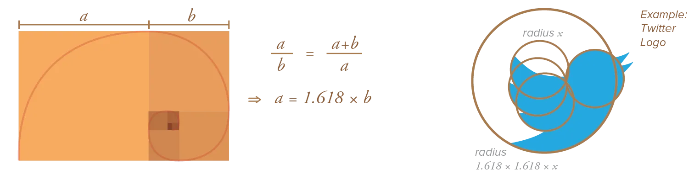
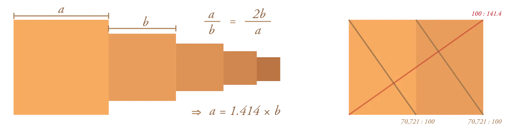
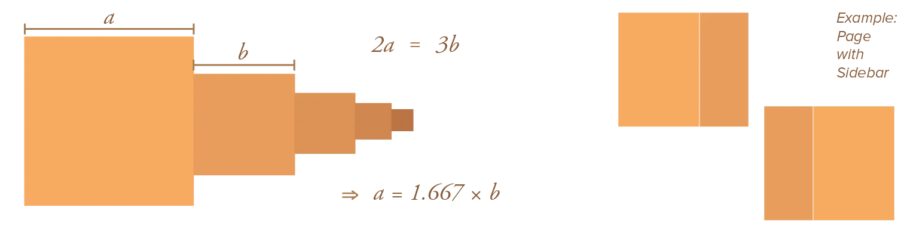
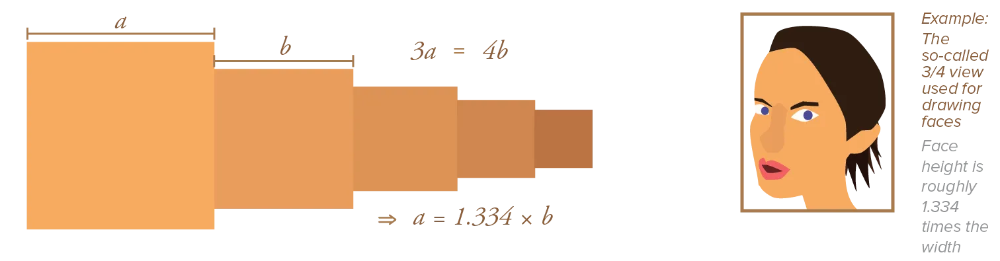
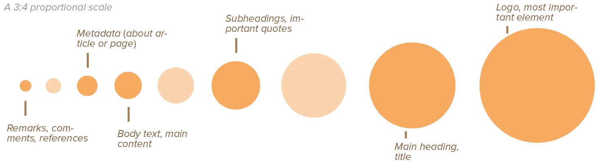

Proportion is a way of expressing how the magnitude of an element relates to that of another element. This could be the length of a line compared to the length of another line, or the scale of a square compared to another square, or the height of a circle compared to the height of a square.

As you see, proportional relationships exist within an element itself, but mostly between all elements on the page. Every element automatically has a certain proportional relationship with all other elements in the design. Whether you like it or not, this happens automatically, because all elements have _some_ size.

As I've said before, this means you need to _take control_ and make conscious designs about your proportions!

Using a proportional scale helps choose the right size of any element within the design. It also helps balance designs, as you can back up your ideas with numbers that are balanced.

Proportions are therefore usually expressed in a mathematical sense: as a ratio between the lengths or sizes of elements. If we say the proportion between two lines is `1:2`, we mean the first line is exactly half as long as the latter. (And the other way around, `2:1`, the first line is exactly twice as long as the latter).

This chapter discusses the most well-known proportions. And why they are visually pleasing, or help your design some other way.

## The Golden Ratio

Most people have heard of this ratio, as if it were some magical thing you should always adhere too. Yes, the Golden Ratio *is* a beautiful proportion! It can be found all over classical art and nature. 

But it's not the best ratio for every design. It's a great place to start. But if it doesn't fit, just try something else.

So, what is this Golden Ratio? It's the ratio between two segments such that the _ratio between the smaller segment and the larger one_ is the same ratio as _between the the larger segment and the sum of both_. 

In mathematical terms that becomes a proportion of **1:1.618**.

The golden ratio pops up everywhere in nature. Not only in the length of lines, but also the size of curves, number of leafs, seed patterns in the center of sunflowers, and so on. That's why we often perceive it as natural and comfortable. 

Additionally, we feel it's balanced. It's literally defined by the fact that it preserves ratio between two differently sized elements! (Smaller to larger is same as larger to sum of both.)

## The Root 2 Proportion

We all know a square has two sides of equal length. When you draw a diagonal line through such a square, the line length has proportion root 2. (You can find this by applying Pythagoras' Theorem.)

In mathematical terms, the proportion is **1:1.414**.

What's special? Well, this means the ratio is maintained when the elements are divided in half. Forever. 

Again, this means more balance in your design, as smaller and bigger elements will keep exactly the same ratio. Not surprisingly, this proportion is used for standard paper sizes (A0, A1, A2, A3, A4, ...)

## The 2:3 Proportion

The `2:3` proportion is a result of the human fascination with things that come in threes. Similar to the *rule of three* in writing, it suggests anything that comes in triples is more visually pleasing. 

In mathematical terms, the proportion is **1:1.667**.

What's special? Anytime you have three of something and divide/scale it, the proportion stays 2:3. For example, if you have 3 cubes and want to divide them, all you can create is _one group of 1 element_ and _one group of 2 elements_. Hence, 2:3.

As long as you rigorously stick to this proportion, this property makes it balanced as well.

## The 3:4 Proportion

Lastly, the `3:4` proportion is a more workable alternative to the 2:3. It still uses that magical number three, but combines it with the four, which allows things to be easily put into squares and grids. 

In mathematical terms, the proportion is **1:1.334**.

What's special? It's easily divisible into multiple combinations, making it flexible to work with when constructing grids. Otherwise, this proportion is less balanced and seems less visually appealing than the others.

## How to Apply Proportions

There is no single best proportion. Pick the proportional scale you think is best for your specific design. 

You also don't have to follow the scale exactly. By skipping multiple steps, you create a **varied scale**, which adds to the contrast and dynamics of your design.

Applying proportions is a simple matter of performing these quick calculations, every time. When you place a new element on the page ... 

* Check with the size of another element (that should follow the same scale)
* Multiply or divide it by the ratio of your proportional scale.
* And you have your final size!

{}
Say you were using the golden ratio for your typography. Your biggest headline is 62pt, and you're satisfied with that. 

Then, your second biggest headline could be 62 / 1.618 = 38pt big. 

Furthermore, your body text could be 62 / 1.618 / 1.618 / 1.618 = 14pt big. 

It's fast and simple, but it should provide you with a balanced and good-looking design.
{}

## Don't forget the outside

Don't forget the outer dimensions of the medium you use! If your design is meant for an A4 paper, you'll already have the proportions of that paper you need to take into account. 

It's often best to work with the proportions your medium gives you, instead of working against them. The other way around, if you have an amazing design but don't know what paper size to use, let the proportions decide!