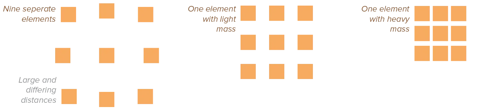
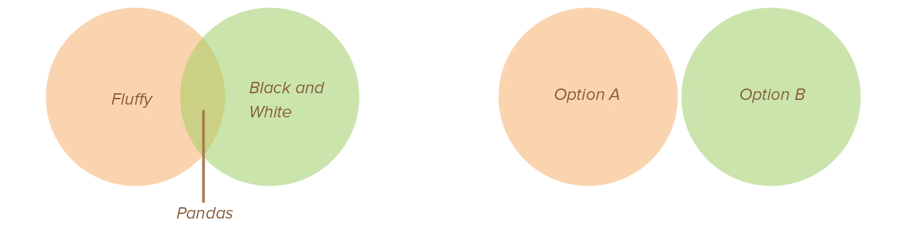

Together with alignment, proximity is the second strongest design principle.

> Elements that are close together are perceived to be more related than elements that are farther apart. 

Your eyes only have a limited field of view. They will automatically connect the elements they can easily see, and interpret elements outside or in the corners of their view as disparate.

## The Purpose of Proximity

Unlike the previous two principles, there's only one purpose to proximity. It groups elements together and organizes, but it doesn't necessarily improve the aesthetics or interestingness of a design. That's the reason why, even though it's very powerful, I've listed it as the third principle. 

Proximity reduces complexity and reinforces relationships. Conversely, lack of proximity results in the perception of several disparate chunks, and reinforces differences among elements.

On top of that, proximity can be used to direct the viewer's eye and create points of interest. As explained earlier, groups of elements with close proximity can be seen as a *single element* with a *heavy mass*.

This attracts attention. It also quickly gives that attention away to something with a lighter mass, something easier to look at.

## How to Use Proximity

Think about what elements belong together: place those near each other. 

Think about what elements certainly **don't** belong together: place those far apart.

It helps to squint your eyes, to only see your design vaguely or in a blurry sense. Count the number of visual elements on the page by counting the number of times your eye stops. More than three to five stops? See if separate elements can be grouped together into closer proximity, to become one visual unit. (Of course, it depends on the size and structure of the design piece.)

Proximity can also be interpreted in a more general, thematic way. For example, connect or overlap elements to show they share attributes. Proximal but non-contacting elements are interpreted as related, but still independent.

## Pitfalls to Avoid

Avoid too many separate elements on a page. Avoid leaving equal amounts of white space between all elements, unless those single elements represent a subgroup by themselves ( = it's the only element on a certain level of the hierarchy).

Avoid even a split second of confusion over whether a headline, subhead, caption, graphic, or whatever, belongs with its related material. Actively create this relationship with close proximity. Ensure labels and supporting information are near the elements they describe. Use direct labelling on graphs instead of legends.

{}
A common issue I see happens with _headings_. The spacing for headings, on websites and most layout software, defaults to _equal_ spacing both below and above. But what does this accomplish? It means the paragraphs before and after the heading are equally far away. Which leads to confusion as to what the heading belongs to. 

Instead, use little space _below_ a heading and lots of space _above_ it. This pushes the paragraph _that actually follows the heading_ much closer to it. Proximity does the rest.
{}

On the other hand, don't (accidentally) create relationships between elements that don't belong together! If they are unrelated or ambiguously related, move them (relatively) far apart from each other.

And lastly, don't stick things in the corners *and* in the middle.

## In summary

When several items are in close proximity to each other, they become on visual unit rather than several separate units. Items relating to each other should be grouped together. If the information is organized, it is more likely to be read and more likely to be remembered. As a by-product of organizing the communication, you can also create more organized and appealing white space.