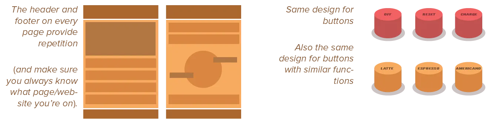
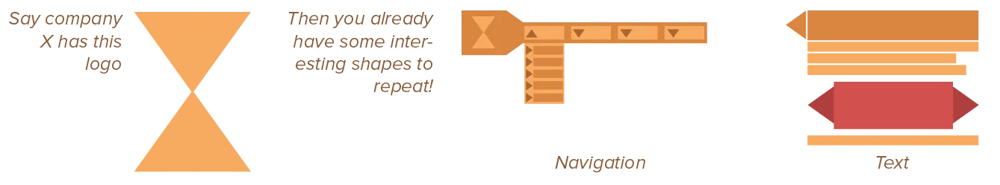
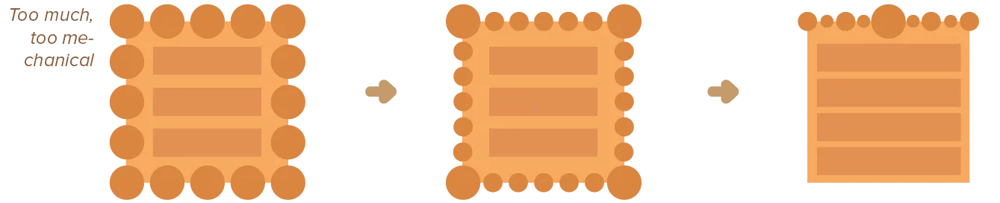

We've already seen the importance of repetition on a small scale, with patterns and alignment. Now we can take it one step further. Repetition within a design could also just be called *being consistent*. 

It refers to the fact that good design is consistent and constrained. They don't use _all the colors_ and _all the shapes and lines_. They usually employ a few unique elements, and then _repeat_ this foundation across the whole design (in different ways).

## The Purpose of Repetition

The purpose of repetition is, again, to bring order to chaos. It unifies and strengthens a piece by connecting what would otherwise be separate parts. Repetition is useful on small or single-page designs, but absolutely critical in big or multi-page designs. 

On top of that, it can create visual interest. If a viewer sees---at a glance---the same odd shape appear once or twice, he will probably look for more instances and see what connects them or what they mean.

Repetition gives people a sense of security and reduces confusion. It also makes a piece come to life. That's why it's also often called *rhythm*. 

{}
This website has the repetition of _hexagons_! Where possible, I reused that shape in the design. This creates a cohesive look, a website you can recognize quickly when you see the first hexagon. It also simplifies the design and allows the content to shine, because the design is built from only a few elements.
{}

{} 
Magazines and websites have the same basic layout with repeated elements---such as the header, footer, colours, and typographic choices---which is adapted to the content that has to fit on any particular page.
{}

## What are good shapes to repeat?

Ideally, they should be distinct.

* When people see that shape, they recognize the design instantly. ("Ah, two wide triangles, this must be the X website I'm looking it.")
* The shapes you repeat have good contrast _to one another_. (One of your repeating shapes is small and soft, another big and spiky, etcetera.)
* They can easily be changed _slightly_. (Rotating, scaling, recoloring, etcetera can be done easily without destroying their effect.)

## How to Create Repetition

Be lazy.

Don't create new elements or designs for every layer in your hierarchy. Create a few basic buildig blocks, and reuse them everywhere!

Remember my example about the hexagons on this website. Yeah, I could have given each course (or category) their own _shape_. It would have been more work ... for a less coherent design. 

So be lazy. Find what already repeats, find your basic blocks, and repeat them _more_!

* First look at the elements you're already repeating, unconsiously or by accident. See if you can make them an active part of the composition by making them more prominent. 
* Then, check with the elements whose sole purpose is repetition: lists, tables, and so on. 
* When you're done finding *existing* and necessary repetitions, and strengthened them, start *creating* new repetitions.

Again, we learn why _grids_ are so useful. Repetition comes naturally when you use it. Because a grid is a _repeating pattern_ of lines and points that fills your design. If you place the same element at the corner of the grid on each page, boom, you have repetition. If you place elements exactly three grid spaces apart, always, boom, you have repetition.

## Pitfalls to Avoid

Avoid repeating elements so much that it becomes annoying or overwhelming. Be aware of the value of **contrast**. Unless the repeated elements are the most important part of your design, you don't want them to stand out too much, but instead blend in with the rest of the design.

Also, "perfect" regularity---continual, relentless, formulaic, superficial repetition---is even more horrifying than confusion. Life needs a balance between regularity and chaos, between pattern and variation.

{}
When it comes to repetition, just remember: "Less is more, but less is usually at least three" If that makes sense to you.
{}

## In summary

Repetition creates hierarchy efficiently throughout large design projects. At the start, establish a few shapes that fit your content. Then reuse them everywhere.