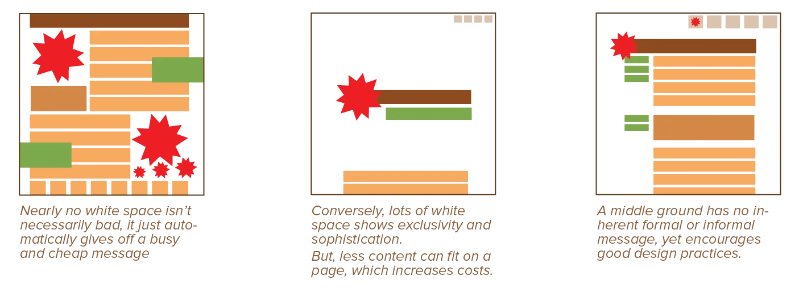
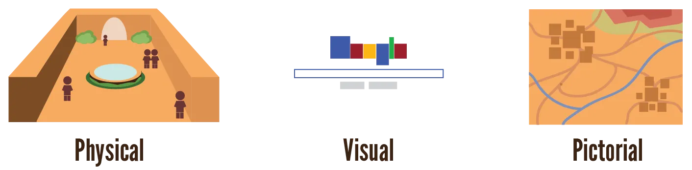
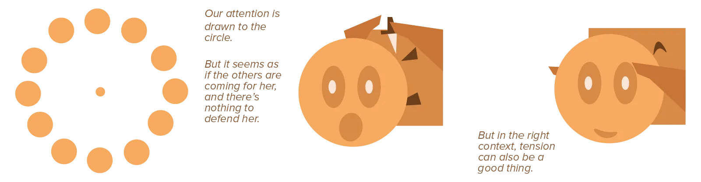
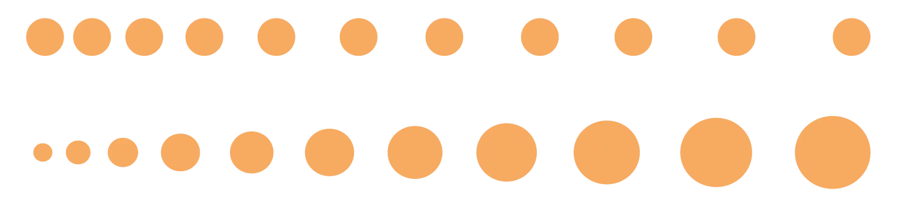

I intentionally left out any remarks about space in the previous chapter. People often forget the importance of space, even though it has many important applications. That's why I wanted to dedicate an entire chapter to the subtleties involved with the concept.

## Horror Vacui

The Latin phrase *horror vacui* translates to *fear of emptiness*.

It's the tendency---instilled into every human being---to fill all the space we have available. 

Somehow, we favour filling blank spaces with objects and elements over leaving them empty. We often fill our living rooms with lots of stuff, without knowing exactly why we feel the need to do so. 

We can see this principle in action with budget stores, who fill their entire show window with products and "sale" signs, as opposed to expensive, specialized stores that are for the most part empty and employ minimalistic text. People associate an overcrowded design with restlessness and cheapness, and find it overwhelming and difficult to focus on.

What's the takeaway? If you want people to associate your design with high value and sophistication, employ more white space! Dare to leave more empty room. Instead of building on top of your existing design, time and time again, spend some time figuring out what you can _remove_.

It's all about confidence. If you are confident that the elements in your design look good and are worthy of attention, you dare leave all the space around it completely empty.

{}
It's also a bit about budget and restrictions. Cheap stores usually fill their store to the brim, because they simply have too much stuff for too little space, and can't afford a bigger store. But the practical, realistic, budget-limited side of design is not part of this course.
{}

## Types of Space

Space can actually mean two things: 

* Emptiness: an area with no elements in a design
* Another name for the three-dimensional world (with depth). 

The second meaning has already been discussed thoroughly in the [Form](../../design-elements/form/) chapter. This chapter will therefore focus on the first meaning.

We can identify three general types of space:

-   **Physical Space:** In a three-dimensional design, actual empty space between objects. Of course, there's always *air* between objects, but nothing else.
-   **Visual Space:** In a two-dimensional design or surface, space between elements where no other element has been placed. Of course, you have to see *something*, and that would be the (back)ground.
-   **Pictorial Space:** When designs need to represent an actual physical space, such as maps or building plans for a house, we call it pictorial space. In this case it actually encompasses both meanings of space! We represent a space in the three-dimensional real world with carefully chosen areas of (relative) emptiness in a design.

In all cases, though, the principles about space hold up. In all cases, as well, you'll always have a background for the empty space. This background could be a white wall, a blank paper, or a complex pattern, or a gradient, or a window---as long as this background is meant to be *ground*, and not *figure* within the composition, the concept of space holds up.

## Properties of Space

Space has a direct relationship with time. When there's space between you and a certain threat, there's time to react to it. (Or time to just become scared.) When there's space in front of you, you can spend time moving forward. When there's space between an object and the floor, it will crash into the floor some time from now.

As you can see, space implies **tension** and **motion**. The same forces we saw earlier in the [Mass](../../design-properties/mass/) chapter!

Lots of space isolates a figure. It makes the element alone and free, but also vulnerable, creating tension between itself and whatever other elements are in the design. Overlapping objects violate the space of another, creating tension, but they are also joined together into a single unit.

On the other hand, only a sliver of space is scary as well, as the element can't move. Space allows for movement and brings life to a design. Placing elements near each other with progressively smaller or bigger amounts of space implies an element is moving forward / backward in space, or accelerating / decelerating.

As usual, these principles have their own chapter later on. All design principles are very tightly connected to each other. This makes it a bit hard to grasp (and teach, to be honest) at first. But hopefully, everything clicks once you're done reading. By explaining concepts in small bits, over time, before they are formally explained, your brain will have time to remember them. It will be primed to understand them better once they get their full chapter.

## A last note

Lastly, remember that space can't be placed on a page like elements. You don't "add" space, even though we often say it like that.

It's a secondary effect of adding the figures, which means it can be unpredictable what happens. 

Using a grid certainly helps with leaving enough space of the right shape. Using the principles and properties I've outlined should help you even more with using space effectively. (For example, remember the proximity principle. Lots of space around an object to make it stand apart, little space to group objects visually.)

When positive and negative space are equal, spatial depth is lacking and a more visually static composition is the result. With space as an active design element, it should come to life.