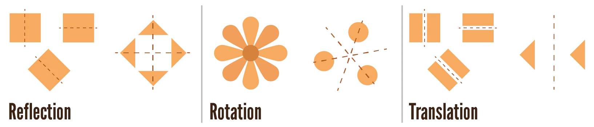
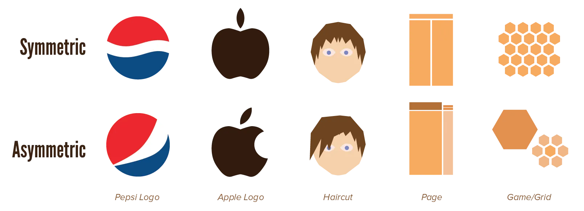

The strongest principle of graphic design is *balance*, as it encompasses all the other principles. Balance and hierarchy, the magical duo of graphic design!

This automatically means that the strongest visual property of any design is *visual symmetry*. Balance achieved through the location, rotation and scale of shapes. It can be within an element, between multiple elements or areas of a design, or across a complete design.

On the other hand, you can achieve balance through other properties---such as colour or weight---which we call *asymmetry* (or *asymmetric balance*).

Both have their advantages and disadvantages. This chapter helps you choose which one to use.

## Symmetry

Symmetry can be found everywhere in nature. It is inherently balanced and harmonious. 

Symmetric objects are easy to see and identify, because they are 

* Simpler to understand
* Automatically perceived as groups (as seen with the *Gestalt principles*).

They are typically seen as figure, and not ground, which allows them to get more attention and be more memorable. Symmetry of (positive) shapes also has the additional effect that the negative space is symmetric as well.

This makes them seem like the ideal candidate for every design. But symmetrical designs are also often static, stationary, formal, or even dull, due to how predictable they are.

## Types of Symmetry

Three types of symmetry can be distinguished:

-   **Reflection:** Mirroring an element along a *mirror line*. This could be a central axis, essentially flipping the element, or it could be a line somewhere else. This mirror line can best be horizontal or vertical, but diagonal mirror lines are not unheard of.
-   **Rotation:** Rotating elements around a common centre point. Again, this can be the centre of the element itself, or some point way outside of it. Any angle and frequency can be used, but regular intervals and a medium angle often work best. Small angles would seem like you made a mistake, while irregular intervals destroys the symmetry.
-   **Translation:** Locating an equivalent element at another position within the design. A symmetry occurs between two elements, but it's not a reflection, because both elements are oriented the same way.

Regular reflection or translation is more _formal_ and ordinary. Reflection along diagonals and rotation are more _playful_ and adventurous.

Symmetry is an especially helpful tool in creating patterns. By copying one or two elements, yet performing a symmetry on them, beautiful patterns automatically emerge.

## Asymmetry

Theoretically, asymmetry is everything that's not symmetry. But, that means total chaos and cluttered design is also included in the definition, which is never what we want! 

Instead, we want to focus on asymmetrical balance (*informal balance*), the opposite of symmetrical balance. 

Instead of balancing elements with the same element, only reflected/rotated/translated, we balance elements with other things. 

This could be anything! 

* Balancing a colour with its complementary colour
* Balancing an area of heavy weight with areas containing lots of space
* Balancing lots of sharp shapes with soft, organic shapes

Asymmetry fixes all the bad things about symmetry. It's inherently active, informal, dynamic, and organic. It's a non-systematic and more creative way to achieve balance. 

Now asymmetry seems like the best thing to do with any design, doesn't it? But there's a big disadvantage: it's much more complex and difficult to achieve. 

An asymmetrical composition is easily *not* balanced, and the result is jarring and disorienting. That's why it's recommended to start with a little symmetry (such as a grid) and then transform parts of the design to asymmetry.

Think of it this way: nature mostly consists of symmetry, but there's also something called "handedness". We, humans, have symmetrical bodies, yet strongly prefer using one hand over the other. Symmetry makes everyone a little beautiful, handedness makes everyone a little special and unique.

## Types of Asymmetry

There aren't any clear-cut types of asymmetry you can employ. Find your most important, big, dominant element---and then balance or contrast it with many smaller, lighter elements.

The process is best visualized as a literal balance scale. Place your focal point or biggest part of the design on one end, and see what amount and what type of elements you need on the other end to balance it out. 

You could assign a high value to a red element (a bright warm colour), for example, and low values to blue and purple ones (as they are cooler colours). 

Similarly, you could assign higher values to sharp shapes than to organic shapes, as the first attracts attention more. Again, contrast is key here.

To clarify the concept, let me introduce an effective and popular compositional principle that relies on asymmetry: the **rule of thirds**.

Divide your area into 9 equal blocks, by drawing three horizontal and three vertical lines. You essentially get 4 intersections around the centre. If you place your dominant element on one of these intersections, you can balance it out by placing contrasting elements (*counterpoints*) at the opposite intersection.

Of course, this only works if your dominant element isn't too big or strong. If that's the case, centre it and go for more symmetry.