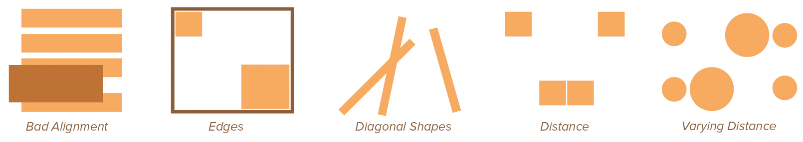
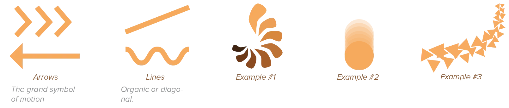

These principles, *tension* and *motion*, have popped frequently throughout this course. They aren't a necessary principle or element for a design to work, but they are often what makes a design dynamic and makes us feel like it comes to life. 

You can view compare it to stories. Stories become better and more engaging if many things _happen_ and it's full of _tension_. It's another strange aspect of human psychology. Somehow, we _like_ when we get a little stressed out by something, we _like_ when something isn't completely stable. That's why we read stories full of tense and dangerous interactions, and designs are nothing more than a story told visually.

A design could do very well without any implementation of these principles. But I suggest you incorporate at least some of it in every design. Additionally, by knowing how they work, you're less likely to accidentally use them wrong.

## Tension

> Perfect tension occurs when two (or more) elements attract each other equally. 

They pull on each other, contrast each other, or balance each other with equal power.

The end result is that none of the elements moves, shifts or changes. Instead, they create tension, and _maintain it_. 

Because of this, tension is usually a direct result from applying all the principles mentioned earlier, especially contrast. If you leave a lot of space between two equal elements, there's tension, as the user wants to see them together. If you lift one element high off the ground, there's tension.

The difference between tension and just stationary elements, is that tension attracts attention and is a form of imbalance. The focus point is constantly *shifting* between the elements in tension. 

Therefore, if *everything* is tensed up within a design, it's not balanced and will probably feel uncomfortable. Tension needs to be balanced with places of rest, stability and calm.

Remember that tension can be bad thing and a good thing. When you're scared, you're tense, but when you're full of joy or energy, there's also tension in your body. The context---the other elements within a design---determine what mood the tension conveys.

## Creating Tension

Let me give you some more specific guidelines on how tension can be realized. (These are in addition to the principles you've already learned in earlier chapters.)

-   **Bad alignment** causes tension. An element that is not in line with the others, actively breaks that line and causes contrast or conflict.
-   The edges and the centre of a design are the points of greatest attraction, and elements near it will compete for this attention. **The closer something is to the edge or centre, the greater the tension.**
-   When the figure-ground relationship in a design is **ambiguous**, tension is created as shapes and forms tend to be foreground one second, and background the next.
-   **Diagonal shapes**, especially multiple diagonal lines that don't move in the same direction, cause tension. It feels like elements of the design are collapsing or falling over.
-   **Asymmetrical compositions** automatically cause some tension, although it depends on how far you go with the asymmetry.
-   Elements **extremely far apart** or **extremely close** cause similar levels of tension. The only difference is that elements in close proximity are seen as related or even grouped as a single unit, while elements far apart are naturally regarded as distinct.
-   **Varying the space** between elements creates a dynamic interest, but also tension. Viewers expected a pattern or consistency, but instead get something different each time. Equal and regular spacing creates visual static and uniformity.

Our lives are filled with opposites, and therefore tension. Making those opposites come together and have a conversation with each other, so to speak, makes design more engaging and meaningful.

## Motion

> Motion occurs when two (or more) elements *don't* attract each other equally. 

One is stronger, heavier, and more important than the other. This force causes the other elements to move toward it. 

We need to view "elements" in a broad sense. The edge of the paper is a design element. The different properties of an element can imply motion by themselves as well.

Because actual motion isn't always possible in graphic design---when you work with static layouts or images---you need to find ways to provide the illusion or feeling of motion. 

The main purpose of implying motion, then, is to direct the viewer's eyes where you want them to go. To keep them moving around the design instead of wandering off or focusing on only one aspect.

Of course, there are areas where motion is more than possible. Animation, websites, interactive design, video games, and so forth. Motion is not just possible, it's highly recommend. The difference between an okay game and one that feels _great_ to play, is usually just hundreds of animations and slight movement on details (such as trees swaying in the wind).

If you're working with product design, motion of course can also mean actual motion and movable pieces. In all cases, the same principles hold true. Make it clear that something moves and how it moves, and make people inclined to try it out and play with it.

## Creating Motion

The closest and most effective thing we have to imply motion is repetition or *rhythm*. 

> By repeating certain elements, yet (progressively) changing some things, we can give the illusion that those changes are actual motion happening in real time. 

Think of it as music. Repeating a fixed set of alterations creates the "tempo" or "beat" of the design. Every element becomes a note, and the white space the silence. 

The properties of the element determine the kind of note: a high element is a high note, a heavy element is a low, bass-like note, and so on.

You can apply this any way you like. 

{}
If you see a line of rectangles with progressively larger amounts of space between them, you're inclined to follow it and get the feeling a single rectangle is moving along the paper. If you repeat a set of circles, and one of them has a different vertical placement, it seems as though that circle is jumping.
{}

Lines are critical to implying motion. Multiple diagonal lines going in the same direction show motion and direct the viewer's eye towards their target. The same is true for a pointed, triangular shape. Rectilinear lines appear static, while sinuous lines appear to flow.

All in all, structured variety is the keyword. Let properties and elements flow on a fixed scale to give a feeling of rhythm and constant motion, but make sure you don't overdo it and make the design piece too energetic and chaotic. Variety in a single beat can come from making things progressively larger or smaller. But irregular, asymmetric, or exaggerated beats can be applied just as well.