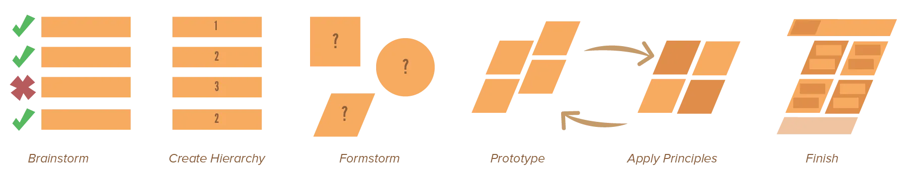

In this course we have only discussed one topic at a time. The only remaining questions, for this final chapter, are therefore:

* Where do I start? 
* What steps do I take and in what order?
* What is a process to use that combines it all?

Well, this is essentially completely up to you. It depends on the project what is easiest to start with, and whether certain stages of the process overlap. 

There are, however, some general steps to be taken, which are are commonly pursued (in the same fixed order).

These steps are: *brainstorm*, *create hierarchy*, *formstorm*, *prototype, apply principles*, *finish*.

## Brainstorm

In this stage you research the topic, collect all information and determine your message and minimal requirements. 

{} 
Say you need to design a poster to recommend a certain new product. Let's say it's a product that helps writing books. 

Then, firstly, you research everything that has to do with books and stories. You find visual symbols that people relate to good stories, but also visuals related to bad stories, or frustration with writing. Find *what* people struggle with the most when they try to write their own book.

Afterwards, when you've collected lots of data, you look at the requirements your client (implicitly) gives you. Perhaps they want certain colours to be used, or they have certain graphic elements all over their website they want to bring back, or they only want posters in a certain paper format.
{}

## Create Hierarchy

When you have your message and content, you need to structure it. Divide it into groups and determine levels of importance. 

Start with the focal point: the single most-important element, or step, or piece of information.

Once you've established it, you can create a hierarchy of all other elements simply by checking their (subordinate) relationship to the focal point. How you're going to *visually display* that hierarchy is not of importance at this step. You've learned numerous ways to do so, and they can all be applied later.

## Formstorm

With your information structured, you're ready think about visual forms. This can be done from two different points of view.

Firstly, you could look at all techniques you know for grouping and establishing hierarchy, and try them out one by one. Just go through all of them and apply them the best way you can with the data and restrictions you have. Don't be judgmental now---try a lot, even when you think you got it or you think something will never work out.

Secondly, you could forget those principles and think out of the box. Search for visuals related to what you're doing and see if you find out why they work so well, or if you can copy some parts of them in your design. Research *action verbs* related to your topic and data, and try to find visual elements solely based on that verb.

{}
In my example about the self-help book on writing, an obvious action verb is _writing_ and _reading_. When I say them, you'll immediately have images in your head: of books, paper, pens, fonts, keyboard, etcetera.
{}

## Prototype

Great! You've established a basic idea of what forms and shapes you want. You've established how you want to create the composition, with what hierarchy. 

Put it all together and start prototyping. 

This simply means that you take all your ideas and see if you can put them together. Once done, that's one "draft" or "version"

Perhaps change some things here and there to fit all elements. An idea can seem awesome on its own, but it's all the elements together that will have to make up the final design. This means it's okay to change an original idea or remove elements completely, *if* they really don't do your design any good.

Repeat this again and again, version after version, improving and iterating the original idea.

This process should actually be executed at the same time as the next stage. They are intertwined and go hand in hand.

## Apply Principles

Apply the principles you've learned. Let them decide optimal placement and properties for an element. Especially adhering to strong *alignment*, *repetition* and *contrast* will give you good starting points for creating the final composition.

{}
Remember, if everything is big and bold, nothing is big and bold! Apply the principles, but take a step back and do some prototyping before it goes out of hand.
{}

## Finish

You've ironed out mistakes. You're at version 5, or something like that, and are happy with the elements, the composition, the clarity. Maybe you have multiple versions that all have their own advantages and disadvantages.

Now refine it into *one* final design. If you have multiple prototypes, you'll have to choose between them before starting with this stage. Adding finishing touches to *all of them* won't help your decision and will take lots of time.

These finishing touches can be anything. Small changes in placement or size, addition of extra (explanatory) text, subtle changes in colour, removing or adding one or two small elements. 

Especially important is that you revisit the design multiple times after *taking a break* for at least a day. Also try to look at it from different positions and angles. When you're caught up in designing something, you often forget that everybody else won't look at it and feel about it the same way as you, the creator, do.

If you have to make large decisions now, you've messed up in some earlier stage and should go back to the beginning.