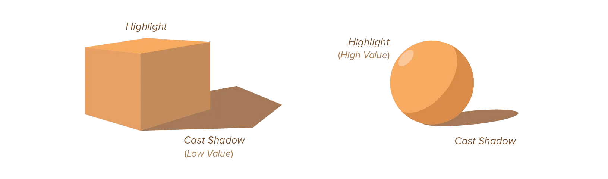

Without light, we would see nothing. Light _enables_ us to see the world. If you can see something, it must mean light waves have bounced off it and reached your eyes.

Think about it. In other words, it means we _cannot see_ without _light interfering with what we see_. There simply does not exist any visual element that is not influenced by light.

The kind of lightning heavily influences the look, mood, and interpretation of a design. Because we're so used to always having one or multiple sources of light, a design is aesthetically pleasing when it doesn't contradict the rules of light, but instead uses them to establish hierarchy and order. 

On top of that, light automatically creates the illusion of depth. And it helps with one of the most important principles of design: *contrast*.

Always pretend your design was illuminated by some light source. It will force you to stay consistent with what people expect from the real world.

## Types of Light

It's best to establish the light source(s) working on your design at the start. Arbitrarily applying lighting to every element is never a good idea, as it would create inconsistencies and confuse your audience about the environment of the design. Pick them once, pick them well, and stick to it.

Every light source has a few properties you need to figure out: **position**, **strength** and **colour**.

The *position* is the placement in the three-dimensional world. The light can be above all elements, in between them, behind, in front---whatever you want. Objects with top-down lighting look natural and friendly, while objects with bottom-up lighting look unnatural and scary. 

In general, it's preferred to shine your light source shining from an angle. That's when most of the form is revealed, that's when shadows are most interesting. Illuminating objects straight-on means you lose all advantages.

The *strength* is the amount in which the light influences its surroundings. A weak light (such as a light bulb) only affects the elements nearest to it. It only adds a little bit of contrast. A strong light (such as the sun) affects all elements in the exact same way and is very apparent. A weak light creates shadows and highlights with very soft edges, while a strong light creates hard edges.

The *colour* of the light is, obviously, what colour light waves the light emits. The sun shines with yellow/white light, which is good, as it shows every object in its true colours. But a blue light sets a much more grim or dark mood, while a red light creates the sensation of warmth and sunset.

## Visual Cues for Light

_How do we create these illusions of light in our designs?_ Again, we can use some simple tricks based on how light works in the real world.

Light shows itself through **highlights** (where light hits the object directly) and **shadows** (places the light can't reach). 

No matter what colour an object is, its highlights will have a higher brightness, and its shadows a lower brightness than usual. We call the amount an element is in the light or shades its **value**.

The most apparent shadow of any object is its *cast shadow*. This is the shadow cast on surrounding elements, because our object is blocking light from reaching those. Technically, this means that it isn't part of the element anymore, as the actual value difference happens on the other affected elements. 

I think it's important to realize this property of light, as it binds elements together and can create unexpected shapes.

The *highlight* on objects is often smaller and less obvious. It still excites strong feelings of power, brilliance, fluorescence, and amplitude.

The general rules? 

* Elements of higher value draw attention or add emphasis. 
* Elements of lower value recede into the background and can easily be missed
* Without strong enough value differences, it's as if the light isn't there at all. The form and edges between objects are missed by the viewer.
* By adding a smooth transition between the light and dark parts of an element (a *gradient*), we invite the viewer's eye to then follow that path, helping us direct the viewer around the design.

## Transparency

The other important visual cue is *transparency*, sometimes called *opacity* or *alpha*. 

* When an element is **transparent**, we can see through it. (To some degree. Fully transparent would mean we don't see the object at all.)
* When an element is **opaque**, we can't see through it at all. (This applies to most elements in our world.)

The important thing to notice is that an element can only be transparent if there's light acting on it! Without a light wave to travel through it, a transparent object is no different from an opaque one.

When a transparent object overlays another object, the light waves that find our eyes are a mix of the colours of both objects. Therefore, more transparency creates a stronger sense of lighting.

You must be careful, however, not to overdo it. Most objects in the real world aren't transparent. (I mean, can you name anything transparent besides glass?) And ignoring that fact in your designs could turn it into a big, artificial mess.

Nevertheless, transparency is a good method for adding multiple layers of complexity to a design. It also conserves space: you can overlap multiple shapes while still being able to see both of them. It's effective in creating depth, without sacrificing visual data.

On the other hand, this means that transparency is rarely suited for the purpose of *clarity*. Instead, use it to create dense, layered imagery.

Transparency connects two (or more) objects. Don't use it for contrast. It's hard to contrast two things if they blend together.

Our brain simultaneously perceives both objects at different spatial locations---sometimes one seems in front of the other, sometimes it's the other way around. This adds to the visual intrigue of a design, but is a bad idea for efficient or simple designs.