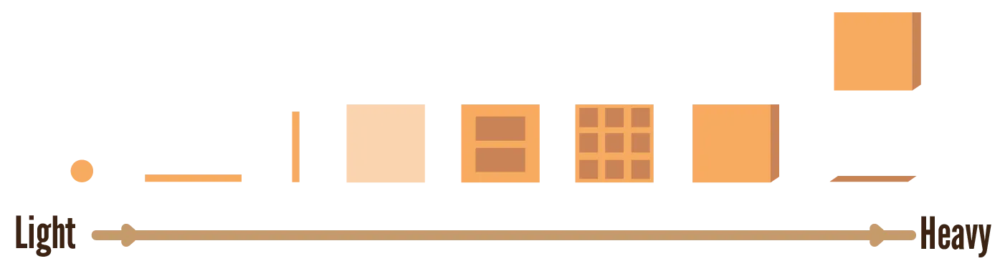
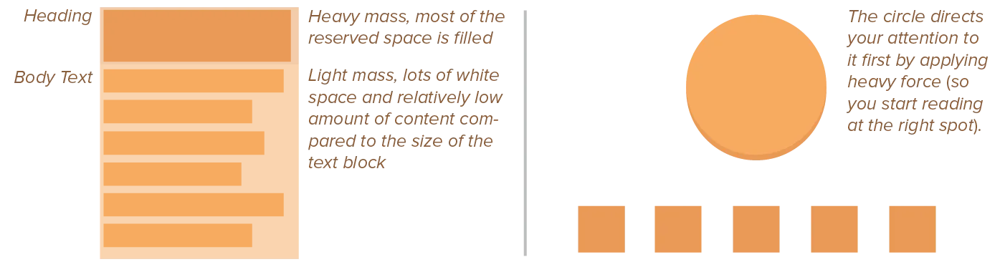
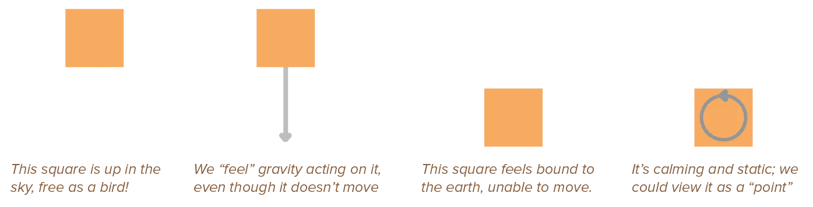
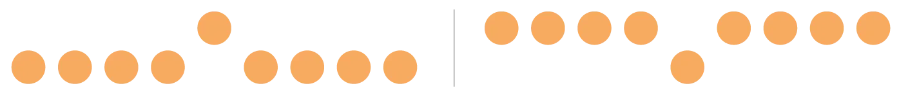
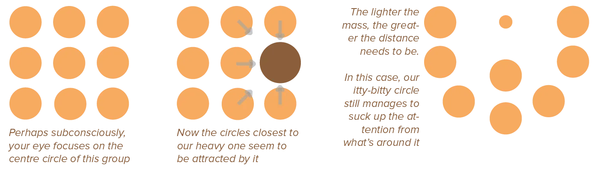
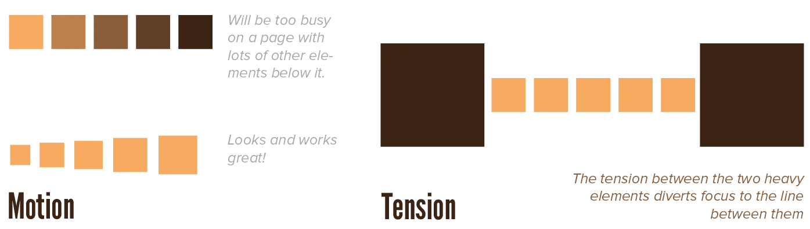

Depth has been mentioned numerous times as being a very important factor. I provided tools to create it, such as playing with light / shadow and scale. (Things close by are big, things are away are small.)

But depth on its own can easily fall flat. A big balloon, is still a really soft element that will float away. It doesn't have the same impact as a block of solid metal of the same size.

In other words, depth needs **mass**. 

* Without mass, something feels lifeless, flat, whimsical or unimportant
* With mass, something feels alive, three-dimensional, serious or important

A solid form weighs heavier---literally as well as metaphorically---in a design than a see-through or air-filled one. A two-dimensional shape is perceived as a paper-thin element with no mass, while a three-dimensional form automatically receives more mass.

You might think: _well that sounds very important, why didn't you start with this?_ (Or you might think: _this all sounds very vague to me!_)

I waited until the last chapter (of this section) because it encompasses all previously mentioned ideas. And because it's both important and vague, so I waited until you were ready for it.

## Density

Maybe "density" helps you understand the concept better. 

> High density = high mass. It's about the relation between the inside (fill) and the outside (edge). 

A very dense element has lots of content in a small packaging, which gives it a greater mass. A not-so-dense element has a large area (maybe a shape, maybe white space) for little content, which gives it a smaller mass.

A large circle that only contains one small number, still has a low mass, even though it's overall size is large. A tiny circle with a very detailed texture, conversely, has a high mass.

An element without a clear boundary, will assume the white space around it belongs to it. If multiple elements compete for that same white space, the density of elements becomes more vague, removing many of the (automatic) principles I explain below.

## Force

In physics, force is calculated as *mass* times *acceleration*. That relationship is just as important in design.

Something with a solid or heavy mass will draw your attention to it, but also makes you feel more uncomfortable and restless. The forces acting on it are too strong to allow your eyes to rest or focus. 

On the other hand, something with a light mass will recede more into the background, but is easier and more comfortable to look at for a while. 

Big media with less content seems lighter in mass, while small elements with too much content seem heavier.

{}
A body of text is much easier to read when the line height is bigger. Why? It means there's more white space between subsequent lines. So the same content now takes up more space: its mass or "density" just became smaller.

If you want to attract attention or establish a starting point for reading the text, however, you usually employ big and bold headlines. Fonts and sizes that fill almost their entire space and are "heavy"
{}

We encounter several forces in nature _every second of every day_. This means every human subconsciously reads these into designs as well. 

The strongest and most obvious one is **gravity**, accompanied by **motion** and **tension**. Things fall down, that's simply always true. As you sit reading this, you feel your body being pulled into the chair---and the chair resisting your weight. Gravity, motion and tension are constantly battling. 

So people expect that consistency in a design, subconsciously.

{}
There are, of course, many more forces, such as electromagnetic and friction. But all of those aren't really directly applicable to graphic design. They are more invisible, less frequent, or hard to capture. Although, one could study "friction" as a negative force when it comes to Usability. The more friction between design and user, the less usable a design.
{}

## Gravity

For our design purposes we distinguish two types of gravity: 

* The gravity of the earth that pulls objects towards the ground
* The fact that every physical body attracts all bodies around it. (And their attraction force is scaled by their _mass_.) 

Yes, these are the same. This is just "gravity". But the distinction is useful for visual design.

Because most objects in our world are really small, we don't actively notice the second type. But we can see its effect on a larger scale: for example, the sun attracts all the planets around it, forcing them to circle around her.

### Downward Gravity

The force we see in action every day. We're used to it. We expect things to quickly drop to the ground. In order to give your design elements more depth and realism, you should keep this illusion of mass in place.

As a result, the bottom half of a design feels "grounded". Elements there feel heavier, sadder, or more threatened and constrained. At the same time, they are balanced.

On the contrary, the upper half of a picture is the "free sky". A place of freedom, happiness, and triumph. Objects placed in the top half often feel more "spiritual".

Higher objects have "greater pictorial weight". Our attention is drawn to the object, or it feels more important, because it is perceived to have a high mass. Because we expect it to fall down any time, it's very active.

Think of it this way: there's a reason the nasty fine print is always at the bottom of a page.

Again, the idea comes from physics. When an object is held up in the air, it receives extra potential energy proportional to its mass, whilst standing on the ground makes the object static, seemingly without mass.

Consider this example of a bunch of dots, with one placed higher on the page. Doesn't it seem like that dot is jumping? Doesn't it attract your attention? Of course, other design principles are at play as well. But we automatically assume the other dots are at some sort of ground level and that the other is defying gravity. When we turn it around, though, the effect feels much weaker, maybe even unnatural or uncomfortable.

### Spherical Gravity

Spherical gravity simply means that objects attract elements in a circle around it towards its centre point. 

Objects with more mass display a stronger gravitational effect. They seem to pull elements in their neighbourhood towards themselves. This makes them a clear focus point. Your eyes are direct to it. But it also groups the elements it attracts.

Elements of lighter mass don't portray this effect. (Unless its compensated by a large distance between itself and its surrounding elements.)

Note the "spherical" here. This isn't just between two elements, this isn't between "ground" and "sky". Elements will interact with _all_ elements around it. Keep this in mind, to prevent accidentally grouping elements or making the wrong thing a focal point.

The most obvious case is the center of a page: it is automatically the focus point (if no other elements reposition this focus point). If a page has only one element, where do we place it? The center.

There's a reason we say things are the "center of attention". This effect can actually work against you, if you want your viewers to see more of the design than just its centre. It's your job, therefore, to be aware of this effect and redirect the viewer's eyes towards other elements on the page.­

## Motion & Tension

By creating the illusion of motion, we can direct a viewer's eyes around a piece and make it more dynamic. We've already seen many ways to do so, and will see many more, but I just wanted to point out the relationship with mass here. 

> A heavier object takes more force to move. (Remember, force = mass times acceleration.)

If you apply motion in your piece, apply it to principles with _light_ pictorial weight. (For example, a design with many lines or arrows has lots of motion. There'll be a chapter dedicated to explaining this further.) 

To move objects with heavy mass requires _so much force_, that it asks too much of your viewer's attention, or your design. Think about it. If you place a huge circle in the design ... you can move it maybe once or twice, before the design is completely filled and cluttered. Elements with low mass, however, can be repeated, changed, moved around more easily. And now you know why.

Similarly, tension will be discussed in further detail later. But it's essentially the invisible force connecting two elements. Or, rather, connecting the space or elements between them. 

If you place two similar elements far apart, the viewer will assume they form a group ... and the space between them (which indicates otherwise) is full of tension to them. But the lower the mass of objects, the weaker this force of gravity and motion, the less apparant the tension.

## Conclusion

You have finished the second section of this course, congratulations! So this feels like a good moment to recap and practice.

The exercise is simple: use the elements and properties you've learned to create patterns / textures!

More importantly, decide on the mood or message of the pattern _beforehand_. Think "I want something for the background". Or "I want something that grabs your attention". Or "I need something that shows elegance and sophistication".

Now find the right elements to use for your purpose. Remember what soft shapes are and what they convey. Remember how to use lines for the right purpose. Remember how to give elements a sense of depth and importance, by changing the most important properties. Remember everything discussed so far. 

And then combine them into a pattern you can reuse across a design.

That's all design is. Find your purpose---then use your knowledge and skill to immediately find the right elements and rules.

For example, I'd want something more soft and predictable for a background. A regular shape, with muted colors, with the exact same predictable space between each element. By knowing what I want, I can save _a lot of time_ I'd otherwise lose by trying all sorts of things and failing.

You'll still fail. Even the best designers can try five things that just don't look great, before they find their perfect match.

But it's the difference between being a designer who _gets things done_, and being someone who just _tries_ to design.

Now you can continue to the third and last section about design _principles_.