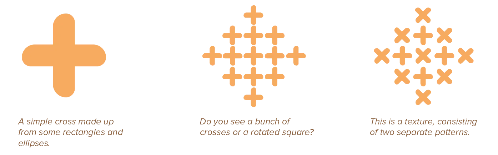
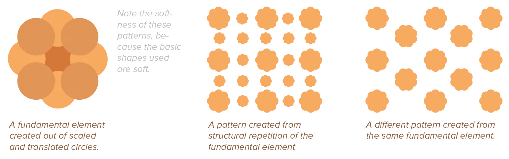
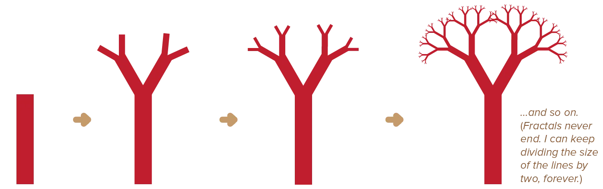
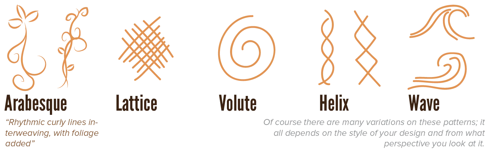
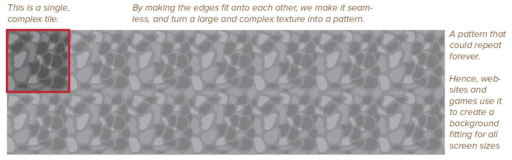

Last chapter introduced the basic concept of _texture_. It also shared some general rules and principles on how to create them.

This chapter goes more in-depth by describing the simplest, yet most effective form of texture: **pattern**

A pattern, just as a texture, is achieved when points, lines, and shapes combine into something. Something that subverts the identity of the separate elements in favour of a larger texture. In other words, the individual elements become unnoticeable and give the attention to the larger texture that appears.

What's different about patterns, is that they are *perfect*. Instead of adding subtle variations or changing the colours here and there, a pattern is a consistent, undisrupted collection of repeated elements. Because of this, a pattern---even though it may consist of maybe hundreds of smaller elements---can be seen as one individual design element within a composition.

## Repetition

Humans are always subconsciously seeking for patterns. Patterns are noticed and interpreted quickly, which means they can attract attention and create interesting visuals. On the other hand, repetition of a simple basic pattern is predictable and boring, and can make elements automatically recede into the background.

{}
Many of my websites, especially unique pages for my (video) games, have a pattern on the background. But it's usually just rows/columns of dots, triangles, simple icons, etcetera. A very predictable pattern! But this means you don't actively notice it and it stays in the background.
{}

Either way, every pattern is the result of **repetition**. Actually, it's the result of two kinds of repetition.

* The fundamental element of the pattern is repeated in a consistent and fixed way, without variation or change.
* This fundamental element, however, is created by picking a small set of basic design elements. And for each layer, these are copied while making (slight) adjustments.

_What things should I change per layer?_ Anything! But these are the five common properties:

* Placement
* Rotation
* Scale (also line thickness)
* Colour
* Shape (either changing the whole shape, or only moving some points/lines)

The last two are a bit trickier. You need to make sure you don't change too much, or the contrast within one fundamental piece of the pattern is too big and makes it fall apart.

Obviously, you shouldn't just randomly repeat everything. Every pattern follows some repetitive principle, be it a *grid*, (computer-generated) *algorithm*, or *physical rhythm* found in nature.

{}
In real-life flora we can find lots of *fractals*. The idea behind them is simple: every step, you copy an existing element two times, place them at the end of the previous element, and reduce their size by a fixed ratio. The results are often pretty pictures.
{}

_Are the rules really so strict? Can't I create texture/patterns from anything?_ Of course. These aren't rules, they are guidelines.

Modifications aren't absolutely necessary. Some patterns are better when copies aren't altered, because they are simpler. (In other words, be _conscious_ of when you make modifications to a pattern.)

But these guidelines are _based on human nature_. As you design more and more, you will notice 99% of textures/patterns follow this. It's just a part of human nature: we like a balance of patterns and variety. 

And breaking rules, fighting human nature, is best left until the moment you're an expert at something and can comfortably do so.

## What Makes a Good Pattern

You should see patterns as minimalist textures. Whenever a design feels overwhelming or noisy, try replacing texture with much simpler patterns.

Interesting pattern designs often result from a mix of regular and irregular forces, as well as abstract and concrete ( = recognizable) imagery. A pattern should have a strong relationship to geometry, as it's a repetition of fundamental elements in a predictable and organized manner. 

Due to this underlying structure, patterns are **always** synthetic, man-made, and mechanical---never organic.

To make them less cold and abstract, it's therefore recommended to *draw ideas* from organic textures. Some common patterns to explore are: arabesques, branching, circulation, helixes, lattices, meanders, nests, spheres, spirals, symmetry, volutes and waves.

Patterns are best when they are as simple as possible. When patterns become too complex, they create the illusion of complete randomness. If you really want your pattern to be complex, structure can be recovered by tiling the pattern using seamless tiles.

In the rest of this course, patterns will be referred to as **motifs**. A motif is a recurring element or object in books, stories, music, and basically every art form. It's more standardized language. 

And it primes you to see patterns as more than just textures on a single object. Because repeating common elements is also crucial to making a design more cohesive _as a whole_ ...

More on that later.