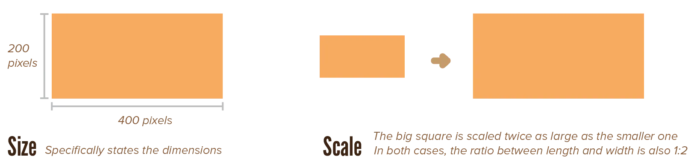
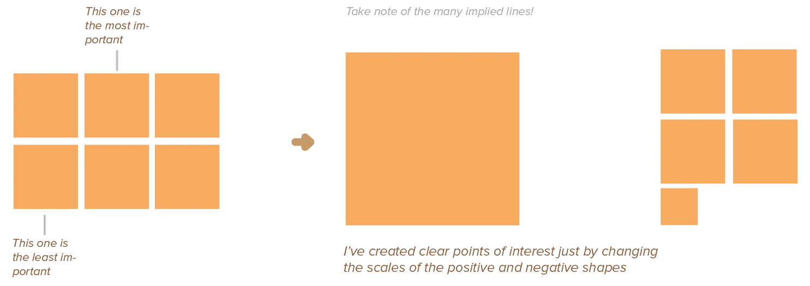
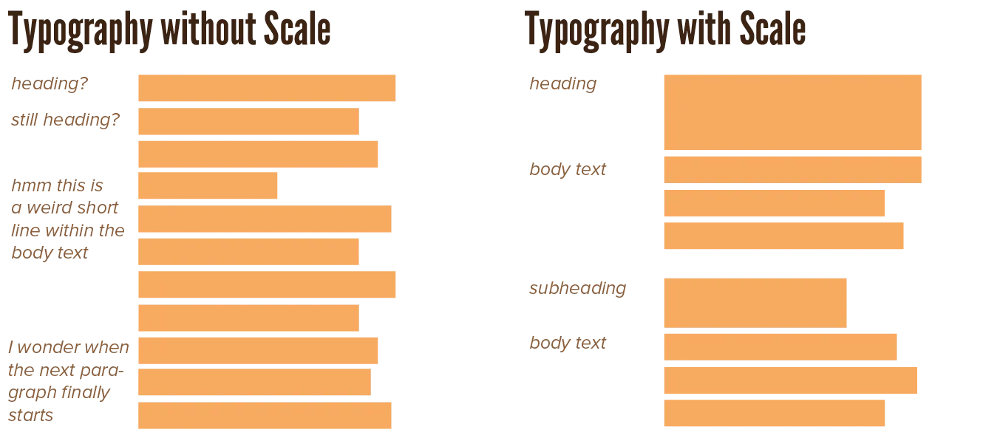
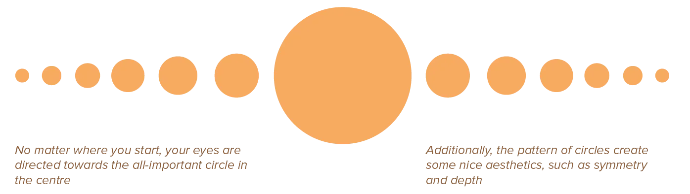
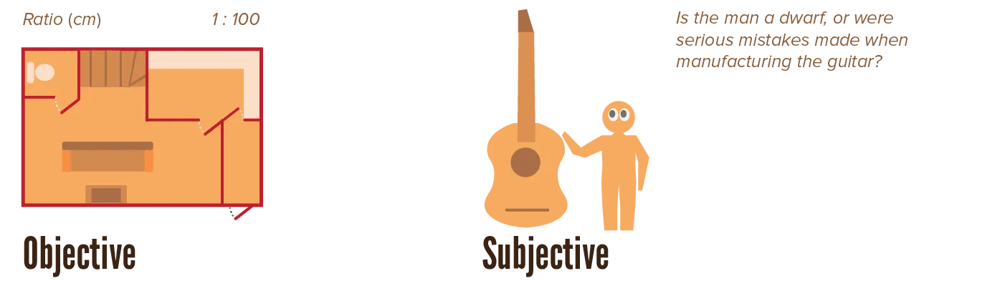
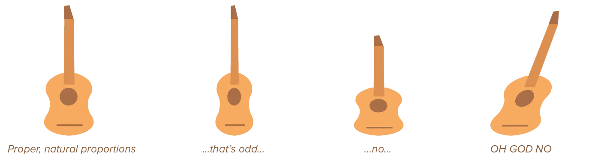

At first, I wanted to call this chapter *size*. Then I realised that wouldn't be entirely correct. Size is fixed, but *scale* is relative. 

After *light* (and shadow), the most important cue in a design is how large or small an element is. When you put a gigantic square on the canvas ... it still feels relatively small when you put *even larger* squares next to it. 

Yes, elements will always have some exact _size_---but that's not what's important. The relative size is important, and I call that _scale_. Relative size shows the relationships between elements. Something can be perceived as much smaller than it actually is, due to its context.

Another distinction has to be made between scale and *proportions*. While this chapter looks only at the size of one design element, proportions look at the ratios between the scale of *all* the elements on the page. Including negative space or white space. Including patterns between three, four, or even more different elements.

The two concepts are tightly linked, though. You'll see many more principles applied in the [Proportions](../proportions/) chapter. I wanted to mention some key concepts here to get you started.

## The Meaning of Scale

If all elements have the same size, a design feels dull and static, lacking in contrast and hierarchy. Use scale to convey a sense of depth and movement and draw attention to our focus points.

Large elements seem to pop off the page. Smaller elements tend to recede and seem further away. This creates a sense of depth, but bigger elements don't always have to draw attention. A small element surrounded by a vast amount of space is equally effective.

Besides creating depth, scales inherently create a hierarchy and rank among elements. When other variables are kept constant, the largest elements will seem first in rank and most important, and the smallest last and least important.

Scale is also a property of elements you can change over time. By gradually making an element bigger and bigger, you can make it seem like its moving towards you. Conversely, by making it smaller and smaller, it seems to move out of sight. Even when applied subtly, this is a very effective way for making designs more dynamic.

{}
I've made many games in many game engines. In all of them, one of the first things I wrote was a general library of animations. The ones I used the most were a simple "pop" or "bounce". Simply by scaling something up and down in half second, you add lots of life to all the interactions in a game.
{}

Because scale is so dynamic, it can be used to direct the viewer's eye towards certain elements. By gradually changing the scale of elements, you imply a line running through the elements, pointing towards something else. If similar enough, the viewer even considers those elements as _one_ element changing size over time.

## Objective versus Subjective Scale

Why does scale depend so much on context? Because we automatically **compare**, anytime we receive sensory input. 

In order to understand new things, we compare it to things we already know or have already seen. This can be other elements of the design, but will at first glance most likely be personal associations.

We differentiate two types of scale:

-   **Objective:** The actual, literal size of an element expressed in some globally accepted unit. When relation to an object's size in real life is important---such as with maps or architectural plans---objective scaling is necessary. One needs to measure the lengths of lines in the real world, and use a fixed ratio to convert that to a line within the design.
-   **Subjective:** Refers to a person's impression of the object. For humans, a house may seem incredibly large. For ants, humans themselves are huge. When working with objects viewers might be familiar with, keep into account how they may feel about the relationship in scale. Depicting a woman and a house next to each other as if they were equally big may work in abstract cases (such as icons), but not when you're trying to be more realistic or concrete.

What's a direct consequence of this? Scaling something disproportionately leaves the viewer confused and uncomfortable. Humans have this really innate sense of "which proportions work" and "which proportions are not natural", even for objects you imagined and they've never seen before!

This is often what people mean when someone has a "good eye" or "talent for design". They simply mean they've developed a way to use this innate sense to give anything they design the right _scale_ and _proportions_.

Within objects in the real world, there's a relationship between their width, height, and depth. On the paper, this is a fixed relationship between width and height. A guitar viewed from the front, for example, is far wider than it is high. Depicting it differently looks odd and unnatural.

