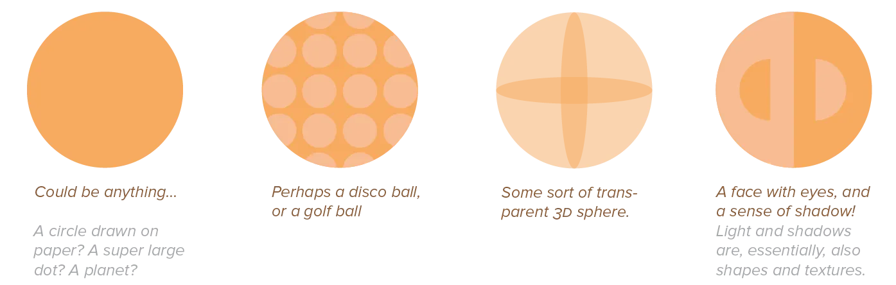
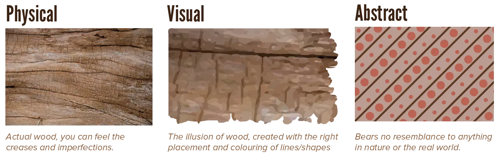
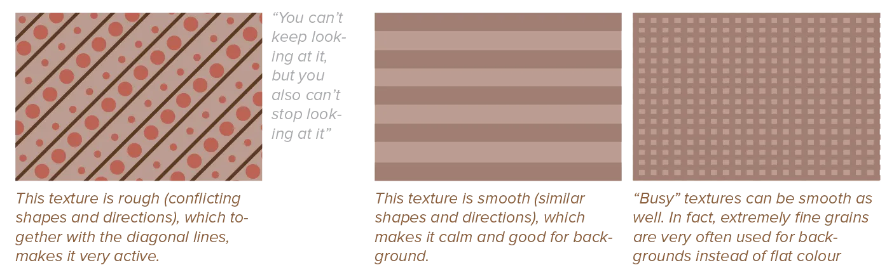
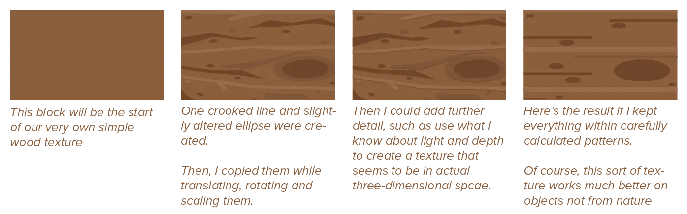

So far, all examples and explanations have been very simple. We've seen simple lines, mostly straight and one colour. We've seen shapes, filled with one solid colour. We've seen these in all sorts of combinations. We've milked everything out of these simple concepts!

But now we're ready for the next step. What is it? Adding **texture**.

Almost nothing in the real world is just a single flat, evenly coloured surface. Every object has a certain *texture*. A certain look and feel created by the bumps and grooves in its surface. The material of which objects are made, as well as the process through which it was made, are the reason you'll rarely find two identical objects. Even if they have the same form. 

{}
A round lightbulb will look very different from a ball used to play soccer. Which looks and feels different than any of the balls used for other sports. If we were to fill all these with a single colour, they'd all look like the exact same circle!
{}

Textures increase the richness, beauty and interestingness of a design. They also make it feel more realistic, natural, and comfortable. Even sharp textures in a design (perhaps used to convey a sense of violence or danger) are deemed better than no texture at all. 

This doesn't mean, however, that you should start applying as many special textures as you can to all elements. As always, *contrast* between areas of texture and no texture is the best way to go. Less is more. Have a clear hierarchy, a clear element that should receives focus, and elements that should recede into the background.

I've mentioned those terms like _hierarchy_ and _background_ several times now. For a good reason! The latter half of the course talks about all those general principles. But to understand that easily, we need to lay the groundwork now, understanding even more basic concepts.

So let me talk you through all the different types of textures and what feelings they evoke.

## Three Types of Texture

In general, we can put a texture into one of these three categories.

-   **Physical** (or literal): Actual tactile variation on an object's surface. Examples are wood, sand, fur, or canvas. It's three dimensional, which means it can be felt, and the look of the texture is determined by how light acts on it. Rough surfaces reflect light very differently than smooth surfaces, glossy material looks different than matte, fabric can be nubby or fine.
-   **Visual**: The illusion of real-life texture, created by our familiar points, lines, and shapes. It can't actually be felt, but it looks as if it were real and tactile, and as if it has depth.
-   **Abstract** (or implied): Texture that doesn't resemble any material from the real world. This doesn't mean that it's random or ugly---it simply means that it's not something you'd just find lying around as you stroll through the park. For example, a field of text is an interesting texture as well, just like a pattern of circles overlapping.

To fill an element with texture, you simply combine all the basic elements we've already seen in an elegant wa!. You can base your textures on real life materials, or abstracted versions of it, or invent them yourself.

There's one important difference to note:

* If you're working on digital design, you'll always start with flat shapes and no texture. Texture is _added_ later.
* Conversely, in physical (product) design every material you'll use will have a default texture attached to it. Texture needs to be accepted, or _removed_.

This means that different media ask for a different approach towards textures. With one you'll have to be careful about the textures you automatically get and try to minimize their conflicts. The other requires you to actively think *would this benefit from adding a texture?*

## Feeling the Texture

Texture can be used to establish a mood, or convey a sense of physical presence. Every texture adds richness and detail to any composition, but its impact and power depend on the surrounding textures. Textures add overall surface quality, as well as reward the eye when viewed up close.

* Rough textures are visually active and kinetic. 
* Smooth textures are passive and calm. 
* Other characteristics of textures depend on the characteristics of the elements involved (points, lines, shapes, ...)

If the texture mimics a real physical material, it takes over its associations. This is a very common technique: when searching a design for a specific message, search well-known physical objects related to it. Then copy their textures, colours and shapes.

{}
Wood always has a comfy and natural feeling to it. Metal is harsher and colder. Typography, perhaps, has the most interesting and varied texture of all. Our letterforms are very unique individually, but a text block combines that into its own, new texture.
{}

You could look at texture as being descriptive **adjectives** in visual communication. A circle becomes a "wooden circle". A rectangle becomes a "vintage rectangle". An organic blob becomes a "sheep-like blob".

Appropriate and meaningful texture can give the simplest visual element resonance and a spark of life. Effective use of texture can connect a variety of emotions and messages to simple shapes.

## Creating Texture

Of course, there isn't _one perfect method_ to create every texture. Some textures have a high degree of contrast and are built from relatively large elements. Others are low contrast and have a fine, delicate grain created from lots and lots of small elements.

A good texture balances pattern and variation. It has a familiar and recognizable pattern, but enough variation to not make it look too artificial, formal or cold. Confusion is bad, but "perfect regularity"---continual, relentless repetition---is even more horrifying. Life needs a mixture, a balance between regularity and chaos.

Therefore, the best way to create a texture is by building it in layers. 

* Start with one layer of elements following a simple rule or pattern
* Add another layer that shares some elements, but also changes to a new rule or pattern.
* Keep adding layers that stay 80% the same, and change the other 20%
* Until you achieve a texture that looks and feels how you want.

{} 
In painting, textures are the result of adding multiple brushstrokes on top of each other. Many physical products achieve a specific look or feel by putting layers of the same material on top of each other in different ways. You won't find a brush that draws "wood" with one stroke in the real world. And so it helps to think the same way in digital design.
{}

Next chapter talks more about this process of creating your textures.

### Images

Of course, there's also always the option of using images as textures. But it's hard to find the perfect image. And even harder to find _many_ perfect images that also work together. 

If you study professional designs, you'll see they rarely use many images. They might have one _subtle_ image on the whole background. And one or two _huge_ attention-grabbing images as the main element of the design. But no more than that.

### Light & Shading

Depending on where your light is coming from, you can use darker and lighter tones of an object's colour to signal grooves and bumps in the surface. While this process often takes some time, the result will---more often than not---be a surprisingly realistic texture.

And lastly, because text is such an interesting texture, a popular method for creating texture (among designers, anyway) is by solely using text. The legibility isn't necessarily important. It's about the visual texture it creates.

