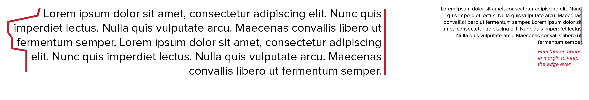

Last chapter taught how to distribute the space within a text block, to optimize readability and aesthetics. Now we look at _aligning_ the text within the space, for the same reasons.

Design always benefits from **strong lines**. That is no different with typography. Any design _will_ create edges, either consciously or implied. It's generally wise to realize this, so you can keep these lines even and parallel, or balanced in some other way.

Typographic elements can be aligned *horizontally* or *vertically*. The most important is horizontal alignment, which has four different types: *flush left*, *flush right*, *centred* and *justified*.

## Flush Left

Flush left has a hard edge on the left and a soft one on the right. 

Every sentence starts at the exact same position on the left, but ends at different positions on the right. It's the most popular form of alignment. It's probably the most logical one for people reading left to right. The uneven edge at the right is called a *rag*, which is why we also call this alignment *ragged right*.

The good thing is that it respects organic flow of the language and avoids uneven spacing between words. The bad thing is that it can be disgraced with a "bad rag"---an ugly wedge-like shape for the rag.

## Flush Right

Flush right has a hard edge on the right, and a soft one on the left. It, thus, is also called *ragged left*. 

It's a welcome departure from the familiar flush left. Ideal for captions, sidebars, and marginal notes. These should stand out as their own thing in the hierarchy (seperate from body text), and using this alignment, you get the same benefits as flush left. It can place related elements near each other without letting them interfere.

The bad thing is that some readers might be confused for a few seconds, reading it the wrong way. Large pieces of flush right can be hard to read for the untrained eye. Bad rags threaten this type of alignment as well, with the added problem that punctuation at the ends of lines can weaken the hard right edge. 

One solution to this problem is to let any punctuation hang in the margin. (You align the _text_ to a hard edge on the right, but any punctuation after that simply continues beyond the edge into the margin.)

## Centred

Instead of pushing the start or end of lines to the left or right, one can align lines of text along the same main axis. Centred alignment means that all lines share the same center. Most pieces of text aren't identical in length, so the uneven lines cause a rag on both sides.

It's formal and classical, bearing associations with history and tradition. It breaks a text out of its flow and creates an organic shape. Because of its uneven shape, it stands out more.

So use it only on text that needs to stand out. For example, the opening lines of a website might be centered and big. The rest of the article continues with flush left, standard size text. Any application on _longer_ pieces of text is doomed to fail and look messy.

## Justified

In justified alignment, both the left and right edges are hard. This creates a very clean, even and uniform shape. It's also extremely efficient, which is why it's the norm for newspapers and books.

To force the lines into the same measure, however, word spacing is added or removed. This can create ugly gaps, which you never want. This can be avoided by making the line length long enough (in relation to the size of the type), as more words allows word spacing to be changed more subtly.

The best solution, however, is hyphenation. With right and centre alignments, hyphenation is sometimes considered a deadly sin. With flush left alignment, it's okay. (You're not getting the benefits of two hard edges anyway, so why hyphenate?) 

With justified alignment, it's a blessing. Justified text for _narrow columns_ or _without hyphenating_ is a bad idea.

{}
I started using these things as guidelines for writing content, actually. If I write a paragraph that _can't_ be justified and hyphenated to look great, I am probably writing words and sentences that are too long and unwieldy. Instead of saying "argh I'll just use flush left", I think a bit longer and rewrite the content instead. It's usually a huge improvement.
{}

What do I want you to take away?
* Use justified and hyphenated text when working with _columns_ or _loads of text_. It creates the most even text blocks, with two hard edges.
* Use flush left otherwise. It feels natural and organic, while keeping one hard edge.
* For left-to-right readers, flush right stands out and can be confusing. (For right-to-left languages, the other way aroud of course.) Use it for design elements completely _separate_ from the body text.
* Centred alignment should be restricted to single lines or titles.

## Vertical Alignment

Vertical alignment within regular text blocks is already taken care of! All letters sit on a common baseline. 

There might be times, though, when you want to align a phrase to a _vertical_ baseline. For example, many shops aren't allowed to place a wide sign over the street (extending too far), so they're forced to use vertical signs that spell the store name from _top_ to _bottom_.

There are two ways to do this.

*Stacked Capitals*: Use capital, roman letters on top of each other. Centering this column helps even out the differences in width. Because capitals should all have an identical height, this can look fine. Do pick a font where the capital letter **I** isn't too narrow.

> **Type Error:** Don't stack lowercase. It's awkward, because ascenders and descenders make vertical spacing uneven and unbalanced.

*Vertical Baselines*: Simply write the phrase like you normally would, and then rotate the whole element by 90 degrees. This preserves the natural affinity and texture of lowercase letters. It can run from top to bottom or bottom top, which is both fine.