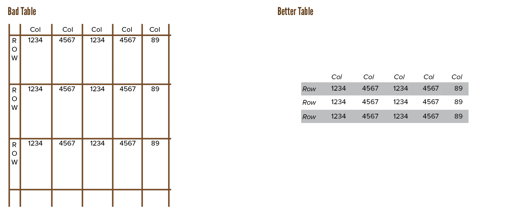
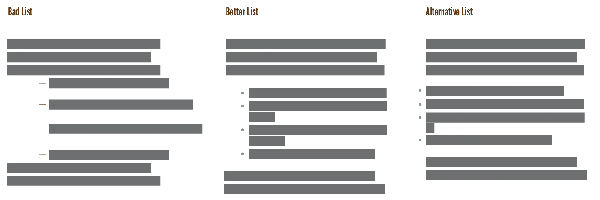
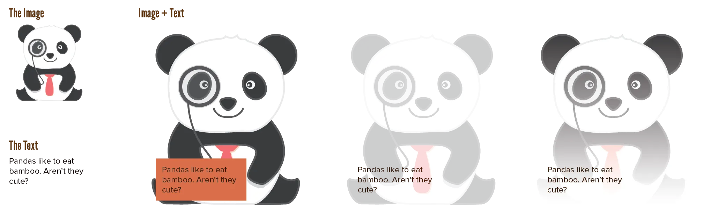
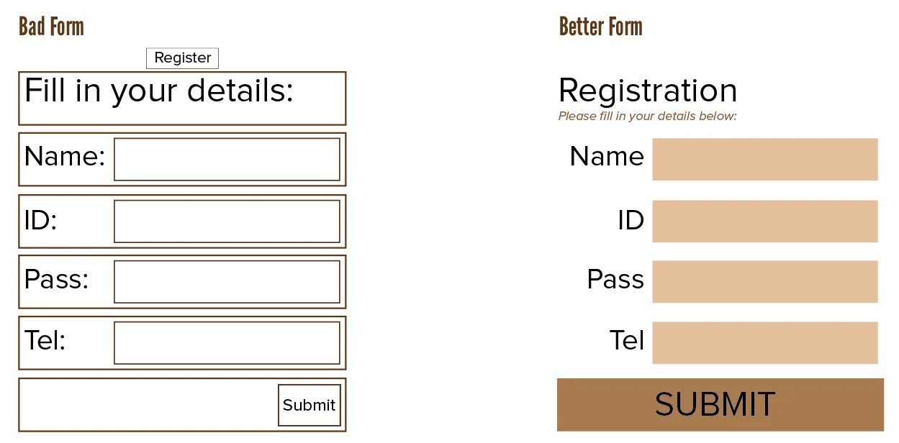

This course has mainly talked about text blocks. The majority of every typographic design is obviously made out of these. 

But there are several special design elements that aren't just a block of text. These require further investigation. I'm talking about: *tables*, *lists*, *images*, and *forms*.

## Tables

Tables (and Graphs) are like grids within grids. You might use a certain grid for the overall page design, but a table is too fine-grained to fit within that large grid. 

Instead, you have one of the hardest tasks imaginable: you need to make a large set of numbers or data interesting and understandable, while at the same time keeping the table consistent with the overall layout.

Luckily, I have some guidelines for you:

-   Always set all text horizontal. Yes, vertical can save space, but at the cost of comprehension.
-   Letterforms that are too small or condensed may *not* be used to save space
-   A minimum amount of "furniture"---such as rules, boxes, and dots---should be used. This allows for a maximum amount of
    information, and makes it easier to establish relationships between data.
-   Do use as many _divider hints_ as possible: rules, tint blocks, or other guides. They should run in the reading direction: horizontally. In the case of lists, indices or numerical tables: vertically.
-   A rule located at the edge of a table (either top/bottom, or left/right side) serves no function.
-   Leave enough white space.
-   As expected, use *tabular figures*, and align columns. For figures, flush right alignment or on the decimal is usually best.

> **Type Error:** Prevent *data prisons*. Don't overemphasize the grid of the table. Don't lock data inside a box with thick borders.

> **Type Exercise:** Find a poorly designed chart or table from an old textbook. Redesign it.

## Lists

Lists are meant to stand out from the rest of the text. They communicate many items in a short and quick manner. 

{}
Older tutorials of mine forgot that lists existed. They listed everything in text form: "first you do X, then you do Y, and finally you arrive at Z and A." Most of those are much more efficient as a list. Because, well, it _is_ a list of items.
{}

Two types exist:

* **Unordered**: order doesn't matter, use the standard bullet in front
* **Ordered**: order does matter, use the standard numbers in front.

Alternatives to the bullet are squares or arrows. You can use any icon if you keep it small---they should be big enough to register as "hey, a new list item", but nothing more.

Here is a list of things to look out for ...

* Lists, by default, are indented from the left in most software. Some people recommend hanging the bullets in the margin instead. If done well, this is great and saves space. If done poorly, readers miss that you just started a list.
* Don't leave too much space between list items, or they will be perceived as separate paragraphs, instead of items from a list. 
* Avoid over-punctuating your lists. They should be short and sweet. That's their whole purpose.
* Nested lists are fine ... if used once. Avoid if possible. Reconsider your life choices if you use _double nested lists_ 😛
  * Look
    * How messy it gets
      * Oh so quickly 

## Images

Combining text and images usually works fine with the default rules. Place the image where you want, let the text "float" around it.

Here are some more principles if you want something fancier. First of all, **avoid placing text over images**.

But if you really want that ...

-   Lower the contrast of the image
-   Place a background behind the text. (Usually just a white or black, semi-transparent box.)
-   Use a gradient to achieve both: solid background behind the text, which slowly fades into the picture.
-   Give the letters a thick contrasting _outline_. (Works for placing text over _anything_.)
-   Maybe even a double outline. (An inner outline in a contrasting color, an outer outline in the original text color.)

{}
Update! Research shows that pandas 🐼 don't necessarily even like eating bamboo 🎋. Which is ... a bit of a sad fact, really, so let's pretend they do and keep this image.
{}

Either way, avoid *textured type*: using an image to fill letterforms, instead of solid colors.

## Forms

The idea behind forms is that they ask a user for input, and expect the user to put exactly the right information in the right spot. To accomplish this, people tend to put boxes and vertical lines around everything. 

Don't. Remove them. Use other properties to distinguish the different groups:

* Use space to separate elements on the page.
* Use color, font and style to indicate what is what and how things belong together
* Use horizontal lines to accentuate areas of the page; rather *above* a heading to signal a new section, than underneath it. (As most people do.)

## Websites

It used to be common practice to misuse tables on the web to create layouts that adapt to different screen sizes. 

Nowadays, luckily, most people know how bad that is. It comes back to those semantics again: browsers expect what's inside a table to be data, not a complete website. 

{}
Update! There used to be a block here about not creating Flash websites or content. For a myriad of reasons. But Flash is dead now, and has been for a long time. As far as I can see, all (typographic) Flash content was updated or removed with it.
{}

Webpages also require more contrast and columns of smaller line-width than usual. More than 70 characters becomes tiring. (Although this is slightly out of your control when devices can literally have infinitely many sizes and settings.) 

Screens are good enough now to use serif fonts for the body copy. Mixing it with sans serif still remains the wise choice for digital typography.

Colour is free on the web, so use it. Instead of full white or black, however, it's often better to use light or dark greys. Colour is a good way to increase the contrast without meddling with other typographic choices, but should not be your only visual cue. (As colourblind people exist and, again, different devices have different color settings and brightness settings.)

And last of all, *symbol fonts* are very effective. Design is all about communication, I keep saying it. If you can put a phrase or paragraph of meaning into _one symbol_, you hit the jackpot. Reuse the symbol across the design, instead of repeating text. It also works across different languages and cultures.