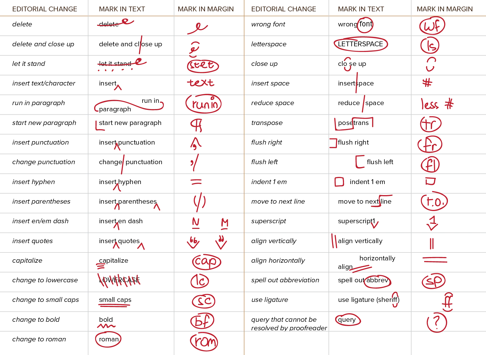

Great! You have written your content. You have typeset it to have a clear hierarchy, to be legible, to communicate the message and mood that you want. And, hopefully, still have some life and flair.

Now it's time to check everything you did. People make mistakes, nothing is perfect the first time.

This is where _editing_ and _proofreading_ come in.

They fix grammatical, spelling and punctuation errors. They fix parts where a sentence doesn't flow nicely, maybe because of the content, or maybe because the design pushed it in the wrong direction. 

Many people---including me---report spotting errors more easily when reading text in print (*hard copy*) rather than on a screen (*soft copy*). But both processes are valid.

The term *proofreading* comes from the fact that, before final printing begins, multiple test copies called *proofs* are made. This is, of course, only applicable when something has a final form. Websites, for example, are dynamic and ever-changing, and will probably need constant updating.

## General Advice

-   Let other people check your text. They will spot errors and mistakes you've learned to ignore.
-   Don't over-format your text. As you're writing, you shouldn't think about the typography, but only the text itself. This is especially true for authors. The final design of their books is usually not chosen by themselves, and depends on the length and structure of the final text. (And interrupting yourself while writing to fix some typography stuff isn't great for the productivity.)
-   Don't wait for proofs to do any critical examining. I always keep a list of possible errors or possible problems at all times during a project. I might not _do_ anything with them until I finished the first version, but I already have the list.
-   As you proofread and edit a text, don't obfuscate the original text. Don't just put down a red cross mark. Let the original text stay visible, then state exactly what is wrong.

This article is especially about the last part: a strong system for editing and leaving notes.

## Soft Copy

Editing soft copy is quick, as you can immediately change things within the editor. On the other hand, however, you must scrupulously remove all the edits before final production begins. You're also more limited in your choices for editing: you can't write or draw on the page as you can with hard copy.

Typographic styles (such as *italic* or **bold**) can be changed directly, just like converting hyphens to dashes, or *dumb quotes* (straight quotes) to *smart quotes* (curly quotes). 

When it comes to changes in the text itself, though, the editor needs to communicate with the author. The following notation is common:

-   Words to be removed are ~~struck out~~
-   Words to be added or substituted are underlined, highlighted, or
   coloured.
-   Comments to the author are \[set within brackets\]
-   When it comes to punctuation, strike out the entire word instead of just the punctuation. Underlining punctuation is messy.

## Hard Copy

The image below explains easy (and common) ways to show what's wrong within the text, as well as marks to add in the margin to clarify what exactly should be done.

