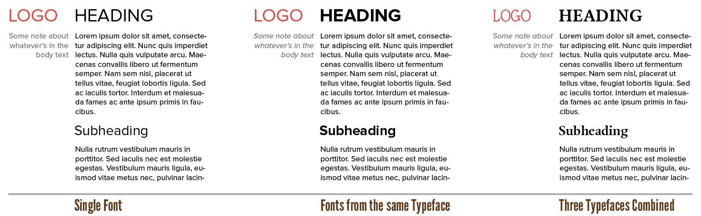

With all this knowledge about letterforms under our belt, we can make informed choices about the fonts we want to use!

Even if you play it safe and only use fonts from one typeface, you still need to find the typeface that portrays the right mood and message.

Unfortunately, though, fonts don't come with a description "reminds people of rock 'n roll" or "radiates with joy". The meaning of a font depends on many things:

* Its historical and cultural meaning ( = related to a time-period or movement)
* Its physical meaning ( = related to some well-known concept from real-life, usually nature)
* Its visual forms and typesetting ( = related to things that look visually similar)
* Its context

Before you use a font, find out these details. For what purpose was it initially made? How has it evolved? What feeling do the forms evoke? Do they make me think of other shapes or physical objects? 

For example, large sweeping curves remind people of nature, of bend leaves, of people stretching, of wind blowing. Big blocky letters that are all exactly the same size, remind people of formal, static, rigid, cold settings.

Now that you can classify type faces, you can add specific descriptions to fonts. You might design a website about programming or news about computers. So you think: "I want a _geometric_ typeface for that." Now you have a much clearer picture of what you are looking for.

> **Type Exercise:** Pick a word, preferably an emotion or feeling, and make it look like what it means.

## Professional Fonts

Every computer comes with **system fonts**. These are automatically installed, like Arial and Helvetica. They are generic and neutral. But you can be sure they are readable and will function on any other device.

**Professional fonts**, on the other hand, have been hand-crafted by typographers for a purpose. They have more character and more font styles. They have more special symbols or other characteristics to make them stand out when used the right way.

As you can guess, professional fonts are the way to go. Don't default to using a system font.

Professional, however, doesn't necessarily mean expensive or paid at all. Amazing fonts can be found for free. I recommend you start experimenting with those first, before spending money on fonts. 

Paid fonts, however, will always be more unique and special. You get what you pay for, so to speak. Paid fonts include _any_ style or weight you could dream of in a single typeface. They support many special features. And most likely, you're one of the few people using that specific font.

Therefore, I'd like to define a *good font* that way:

* One that has letterforms that are distinct enough to be told apart and recognized
* But not so strange or individual that one has trouble reading it

In typography, everything's connected to everything. Individual elements can only be noticeable at the expense of the whole. A good font balances this.

## Finding & Acquiring Fonts

Where do you find fonts? 

First, check what you already have. Many software adds its own fonts to your computer. There should be an application or program that keeps track of all your fonts. If you can't find it, you can always open a new Word document and look through the list of fonts at the top left.

If nothing suits your purpose, I recommend the very popular [Google Fonts](https://fonts.google.com).

The main complaint against it is that "you rely on Google" and "you will use the same font as thousands of others". Those aren't very strong complaints, not when you're just starting your typographic journey.

Their fonts are _free_. It's very easy to find and sample them. They are picked to be at least of "good enough" quality.

Otherwise, Google search for font packs, recommendations or bundles.

You can't really go wrong. Downloaded fonts should come in a known font format (`ttf`, `otf`, `woff`). Double-click them. It should pop-up a window asking if you want to install it. Once done, you can use it in your projects!

{}
If you download a whole family, it will be zipped into a `zip` file you need to unpack. Any other extension? Don't click it. Font files are safe, any other files should not be trusted.
{}

Over time, you'll build your own library of typefaces. Don't rush this process, though. I made the mistake, when I was very young, to download absolutely every font I could find. First of all, my computer slowed to a crawl. Secondly, I never used 99% of those fonts, and only improved my design skills once I really stuck with one typeface I liked for a long time.

## The Typeface Selection Process

Design is all about striking a balance between practicality and aesthetics. You will never find a font that is both absolutely unique and beautiful ... and will also fade into the background when you need it to. Or a font that has these crazy curvy letters ... and is also readable at 12pt.

So I repeat myself: discover _what_ you are looking for in a font. Then go looking for it. And understand you won't find a font that fulfills more than one or two purposes.

These are my priorities:

* A font that fits the _content_ or _message_ of text.
* A font that matches the indended _audience_ and _mood_
* A font that fits within my technical or design constraints

Constraints bread creativity. So let them be, use them to be creative. Fitting the content is less flexible and thus has a higher priority.

> **Type Exercise:** pick a typeface and pretend that is all your computer can handle. Your whole design _must_ only use fonts from this typeface and nothing else.

You will find a single typeface is usually enough. Only add more if you really need them. If you can write down a clear _reason_ for adding multiple typefaces. Otherwise, first explore the different weights and styles of the typeface you've already chosen.

> **Type Error:** In general, more than two different typefaces is too much

When you do bring in more typeface families, they should

* Fulfil a function your basic family can't
* While achieving visual balance with your main family 

For example, your main font might look very regular. So add a second typeface that has bolder and more attention-grabbing letters. A second typeface is often called an *accessory* or *accent*---and that's also how you should use it.

{}
This idea can be seen all across graphic design. When picking colours, for example, people usually pick a "foreground" (most of the content, has attention), "background" (less important), and "accent" (to highlight very specific parts).
{}

Lastly, sample fonts at _many sizes_ and with _many phrases_. Some fonts look very nice when set large or small, but quite ugly when displayed at another size. I still regularly pick a font that looked amazing and well-suited at first, but revealed itself to be a troublemaker when the requirements of the design changed slightly.

 

Next chapter will talk more in-depth about matching fonts.