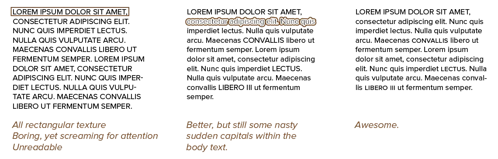

I've mentioned different *weights* or *styles* of one typeface multiple times. This chapter explains exactly what that means. They are simply variations on the basic idea or structure of a type family, **bold** and _italic_ being the most common.

Use these to signal changes in the hierarchy. Either by giving something more weight (like a headline) or less weight (like a comment). Because they belong to the same typeface, they automatically look cohesive and work well together.

*How do you vary a font AND keep the basic structure intact*? Good question! We identify four "sliders" you can pull on a font:

* Make it lighter or heavier
* Make it narrower or wider
* Make it blockier or rounder
* Make it more upright or more slanted.

Each of these can be applied in different degrees. The regular font will usually be somewhere in the _middle_ on all these, and you can pull the property to the left (less extreme) or to the right (more extreme).

> **Type Exercise:** After reading this chapter, create a typographic design with a clear hierarchy using only different font styles from the same typeface.

## Heavy versus Light

A font is called *heavy* if its strokes are thicker than the regular version. When a font is only marginally thicker, it's called *semibold*. When a font is quite a bit heavier, it's called *bold*. A font that is extremely heavy is called *extrabold* or even *black*.

On the other hand, a *light* font has thinner strokes than the regular version. Because the regular letters are actually quite thin already, fonts usually have at most a single light version. If there are multiple, they are called *thin* and even *extra thin*.

Sometimes it's easier to view these as numbers. Regular or medium is usually **400** or **500**. Lower numbers are thinner (**100** being extra thin), and higher numbers are thicker (**900** being black).

When creating websites, you can use numbers to identify the precise `font-weight` you want. But as I warned you previously: if the style doesn't exist, computers will _simulate_ it. By simply placing all letters at an angle. Or adding a rough outline. Which, as expected, doesn't look great.

_Why doesn't it look great?_ Aha, this is an example of what typographers do to create a _good_ style variation. Bold letters are thicker than the regular letters. The result? Less whitespace. This makes them seem _smaller_ in comparison.

So a good font counters this by subtly making the bold variation higher and broader. This helps keep the _counters_ open and visible. This helps readers _perceive_ all styles as being the same size.

Without such modifications, readability quickly falls apart. More on this at the end of the chapter.

When to use this?

* Bold is attention-grabbing. Most people prefer _italics_ for emphasis, because bold style can feel like the type is screaming in your face. (For that reason, italic emphasis is also the default in many markup languages.) As such, bold and black are usually restricted to headlines or very short phrases that _need_ to stand out.
* Light typefaces are best suited for those messages we want to look delicate and elegant. Use them to accentuate rhythm or flow. By making something smaller, you automatically lend emphasis to *other* parts of the design. Becomes tiring to read when in larger blocks of text.

## Condensed versus Wide

Instead of only changing strokes, it's also possible to change dimensions. A font is *condensed* if its letters are stretched more than normal in the vertical axis ( = higher, less wide). A font is *wide* if the opposite is true ( = wider, less high).

It's hard to condense or stretch a font without making it look ugly or unreadable. Only *expert sets* have such well-designed variations. Look for families with "Condensed" or "Wide" at the end of the name. Alternatively, they might be called "Compressed" and "Extended".

Sensationalist newspapers or designs usually employ bold, condensed typefaces. This allows them to attract attention, whilst being economical with their available space.

The wide variant is less common. You mostly find it in _title screens_ or _catchphrases_, for movies or marketing. By stretching the text much wider, it eats more space and looks like more than it is. 

## Upright versus Slanted

The default form of letters is (nearly) upright, which we call *roman*. If the letters in a font are slanted, which means they have a much more diagonal stress, we call them *italic*. 

Italics are usually the best way to emphasize or highlight words. They are less attention-grabbing than heavy typefaces and fit better within the flow of roman text.

You can write longer paragraphs or text blocks fully in italics. I wouldn't recommend the same for bold.

## Blocky versus Round

A blocky font removes serifs and curves, and replaces them with geometric box-like shapes. 

A rounded font has even more exaggerated curves (and sometimes serifs). They make ever corner _round_ instead of angled. Rounded fonts are therefore sometimes called *soft*.

This is less common. But some typefaces have a few font variations with "soft" or "round" in their name. The other way around---a generally round typeface that gets a blocky variation---is very rare.

Traditionally, 

* Blocky forms are more serious, formal, professional or dare I say it "cool".
* Rounded forms are more playful, happy, fun and relaxed.

{}
The header font for this website is _Dosis_, a rounded font. I use the _black_ variation, the thickest it can get. This provides the most contrast and really makes the round edges stand out. With less thick variations, it is too similar to the body text, and you barely notice its softness.
{}

## Uppercase versus Lowercase

Though technically not a style, the difference between using only uppercase or only lowercase letters can be used to your advantage.

Capital letters are tougher to read, because they have less variation and decoration. They are all the same height and general style. So don't use them for larger paragraphs or lines.

But with short sentences, they are a great way to add emphasis and variety without using a different font style.

If you want to do something similar within body text, use the *small caps* I explained earlier. Small caps are also often recommended when abbreviations or roman numerals.

## A Huge Word of Warning

The styles I described above should be *separate font files*. On the computer, when you want a typeface bold or italic, it will look for the corresponding font file. If it can't find it, however, it will thicken or slant the letters following a standard algorithm. Don't let this happen to you.

> **Type Error:** Never, ever, distort type or use fake variations.

> **Type Error:** No, underline is not a font style. Don't look for it, as no font family will have it. It's just a line, a a design element you can _add_ to anything. Only add underlines for personal editing or note-taking. Especially nowadays, this is associated with hyperlinks on the web, and nothing else.

Instead, find a typeface that naturally supports all the variations you need. This means you shouldn't use fake bolds, fake italics, fake small caps, or fake condensed/wide versions (by distorting the letters yourself).

{}
I maintain a huge website filled with connected short stories: [The Saga of Life](https://thesagaoflife.com/). My main purpose was to have a website that is _easy_ and _fun_ to read on all devices. When picking fonts, I therefore restricted myself to font families that had many handmade variations: regular, italic, bold, black, medium, ...

It meant I had to throw out some fonts that looked really cool, but it was the right decision. The reader can choose their own font, and whatever option they choose, all stories will look consistent and readable.
{}

{}
Placing text directly over images, or images directly over letters, is not recommended. I'll discuss some ways to eliminate this problem later in the course.
{}

