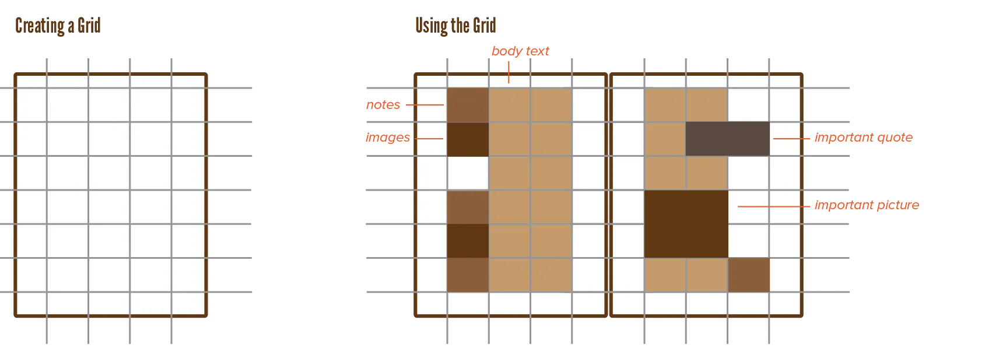

Look how far we've come! We started with the absolute smallest parts of typography, and now we're at the big picture. The overall design filling up the whole page (or any other medium you happen to be using). 

It's quite a daunting task to fill many pages with much content, while staying consistent and free of clutter. Designers, therefore, usually employ a *grid*.

A grid **divides the design space** into smaller parts using a **regular pattern**.

This might seem like the typography will become too mechanical and "perfect". But the infinite ways through which you can subdivide and fill a grid prevent this from happening. The grid should not force you to design the page in a certain way. Instead, you should use it as a tool that shows ideas for great placement and dimensions for blocks of text.

## Single Column

The simplest possible grid is the **single column**. This column can be centered, leaving equal margins at all sides. It's easy to turn this into a spread, because it's the same for the left and right page! 

This is highly economical, but also boring. 

Software usually asks you about page dimensions and margin width **at the start**. This encourages you to design from the *outside in*. Start with margins, space, and overall design ... and work towards the finer details.

If you're looking for inspiration, however, it's better to design from the *inside out*: pretend the page is infinitely large, experiment with the finter details ... and only add the grid to all pages when you've found your style.

## Multi-Column

There are many ways to create a **multicolumn** grid. Draw horizontal and vertical grid lines using a certain pattern to create horizontal and vertical zones. Fill some with content, leave others empty for balance. The finer your grid, the more flexibility you have, but also the more small choices you need to make.

A common application of the multicolumn grid is when text and images are displayed together. You could split them and put them into separate columns, or put the text in separate columns and let the images flow together with them. You could reserve a vertical area for captions and notes, while the body text "hangs" from a common horizontal line.

How you create the grid, and how you use it, is your choice. But it will be influenced by the content. Adding lots of different zones when there's nothing but body text to display, is overkill and unnecessary. If the contents vary---illustrations, number of lines, many blockquotes, etceter---a flexible grid is needed.

## Modular

While regular grids simply draw horizontal and vertical lines, which automatically divide the page, modular grids work with *modules*. 

A module is nothing more than a rectangle that contains one type of content. There's no subdivision *within* modules anymore. 

This type is more organic and natural, leading to asymmetric designs. How do you keep those designs consistent? By keeping an even amount of _space_ between the modules, and making their size multiples of the same basic dimensions.

You can generate very complex grids by overlapping multiple layers of modules. But this often isn't necessary.

> **Type Exercise:** Pick a simple modular grid and arrange the layout in as many ways as you can imagine. If you feel adventurous, include more variables (orientation, alignment, weight, size, colour, and so on).

## Proportions

As always, it's best to work with a scale. 

* Keep a fixed distance between text blocks
* Keep text blocks to a whole multiple (2 times, 3 times, 4 times) of a basic size
* If your font sizes follow a scale, apply the same one to the text block sizes.
* If a block contains a larger font, follow that by resizing the block by the same amount.

These are not the endproduct, these are the start. 

* Build your grid quickly by picking a scale and sticking to it everywhere.
* Now you have a basic structure you can _modify_ to be less rigid and symmetric.

A basic grid is easy to create and will magically make everything look at least decent. You can always tweak from "decent" to "amazing". But if you try to go from 0 to "final design" in one step, you will have a hard time.

Improvising and experimenting yields the best results. If you have a sudden feeling about something, try it out. First calculate the optimal settings for something, but discard them if it doesn't work out. The best grid is one that shows you what to do when you've lost track. It hides itself to give attention to the content and aesthetics of the design, but it presents itself when structure is needed.

> **Type Exercise:** Determine a small set of simple, fixed rules for yourself. These can be about a grid, but also about any other typographical element we've discussed so far. Now create two designs: one where you started with a basic grid, and one without. See what works for you and how it changes the end result.