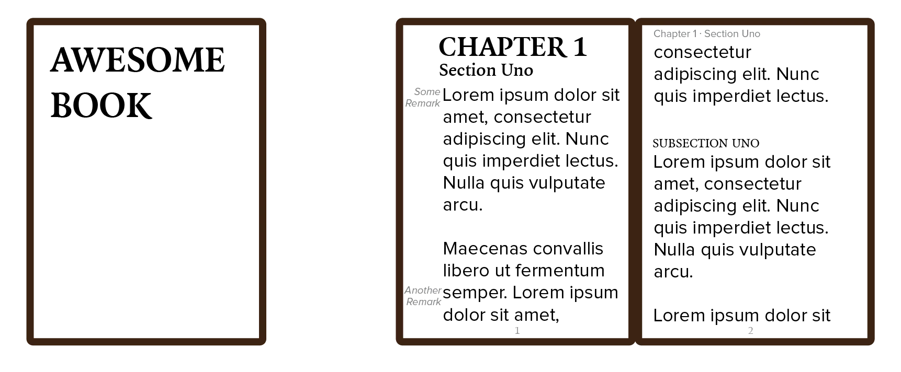

I've already mentioned emphasis and hierarchy several times. Now we have all the tools to finally take an in-depth look at it. 

Hierarchy is **the most important aspect** of any design. (Even legibility can sometimes take a backseat in typographic designs, if that's part of your message.)

Any design is a wall of information. Humans can't handle that. We need to know what is important and what isn't. We need to know where to _start_ and where to _go from there_. Design needs to communicate all that information, first and foremost.

Hierarchy is about clarifying the levels of importance and establishing relationships between different text blocks. It can be established in many, many ways. This chapter looks at some of the key concepts.

## Contrast

**Difference** among elements is created with contrast. One or multiple visual *cues* must signal the user that a change in hierarchy is happening. 

There are many ways to do this in graphic design, of course. Read more about this in the [Graphic Design](/tutorials/visual/graphic-design) course.

I will only mention typographic contrasts here.

The general options for creating contrast are

-   **Size**: The most obvious one, visually and structurally, which I will discuss thoroughly in the next sections.
-   **Style**: A change from one style to another, such as switching from regular text to boldface.
-   **Alignment:** Text blocks or phrases that are aligned differently will feel distinct.
-   **Direction**: With this I refer to the general direction or dimensions of a text block. For example, body text might be put in a wide rectangular field, while a narrow column beside it might contain notes or remarks.
-   **Colour:** A change in colour can be very noticeable, or not at all, depending on the style and size of the text. Colour can also increase or decrease the importance of a piece of text, depending partly on the context. (Read more about this in the [Colour Theory](/tutorials/visual/colour-theory) course.)
-   **Space**: Indenting or adding more space around text blocks will literally move them away from other elements.
-   **Placement:** Readers expect headings to be at the top, for example, while text blocks pushed against the edges of the paper seem of lesser importance or an afterthought.
-   **Texture:** You can change the texture of a piece of text by choosing a different typeface altogether, or changing the case (as lowercase has more texture than uppercase). Whether this increases importance and attracts attention depends on the properties of this added typeface.
-   **Form:** The outer form of a text block (e.g. rectangular, circular, trapezoid, and so on) also provides a strong visual cue that differentiates between content. This is hard to achieve without compromising legibility, though.

As you can see, there's a lot of cues, and they can be used in near infinite amount of combinations. It's therefore recommended to never use too many signals\-\--more than three cues is usually too much. Multiple cues should only provide backup for each other; a single subtle shift should be enough to establish hierarchy for the focused reader.

Because of this, it's recommended to change one parameter at a time when trying to establish your hierarchy. If you immediately assign three cues to every level of hierarchy, you'll clutter the foreground and waste time and space on something you don't need.

## Common Structures

You can design your hierarchy any way you want. (I keep saying this: there are no laws in art.) 

But there's a common structure that works well. Everybody uses it or is familiar with it. 

> **Type Exercise**: try to find reasons _why_ the structure below works well. Try to discover it in your favourite websites, books or magazines. Whenever humanity reaches a concensus on something, it's always very educational to figure out _why_ it was deemed a good idea by so many.

This structure is something along the lines of:

* Title
* Chapter
* Heading
* Subheading
* Body Text
* Notes 
* Metadata (information _about_ the design or content)
* Structural Elements

The title is the shortest, but often biggest and most obvious element on the page. When people see a page, they need to immediately scan the title. To see what type of content will follow. If it's what they were looking for.

From there on you can have multiple levels of headings (depending on how your content is structured). These need to be visually distinct from each other, yet make clear that they are a heading. 

As I said earlier: **no near misses**. Don't make your heading 20pt and your subheading 18pt. Be bold with your contrast!

Use as many headings as you need---no more and no fewer. If your content has only one header or maybe none at all, go with that and don't invent headers.

Only then comes the body text, which is relatively small in font size and doesn't have much other contrast applied. Body text is all about readability, flow, not adding _anything_ that might take the reader out of it. 

A separate level is also used for notes or asides that talk about the body text, but aren't important enough to be within the body text.

Lastly, we have the structural or navigational elements, such as page numbers, or a phrase in the margin that states your current location within a book. These should never be in view as the user is reading. But if they need to go somewhere else, they should be easy to find and understand. (In other words, design them in such a way that a reader sees them for a millisecond and instantly knows "ah, a navigation element, ignore".)

## Font Size

The best way to start a hierarchy, is by determining the fonts and font sizes for each particular level. We've already talked about matching fonts and trying to stay below a maximum of two fonts. 

When it comes to font sizes, you usually require more variety and bigger contrasts between the different sizes.

> **Type Error:** Never use only one font size for a complete typographic design. 

> **Type Error:** If you want to style a really unimportant element, don't drag the font size down to something illegible! Instead, use faded colors, different font or casing, different placement to show this element is really just a sidenote. Even sidenotes need to be legible, when somebody wants to do so.

Font size should be determined with a *consistent scale*. For example, multiply every font size by *1.618* (golden ratio) for every level in the hierarchy.

The number is is up to you, but you should never arbitrarily pick sizes. By using a scale, you establish a pattern and rhythm, while ensuring an adequate amount of contrast.

The best font size for body text in print is **10&ndash;12 points**, and for the web it's **15&ndash;25 pixels**.

*Why is the recommended size for web larger?* Because the web is different. We usually view webpages from a greater distance, on a bigger screen, with a lower resolution. Webpages are huge projects with extra dynamic elements and scrolling ability. So text needs to fight more to be easily legible.