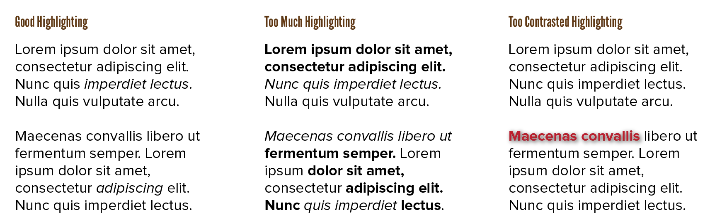
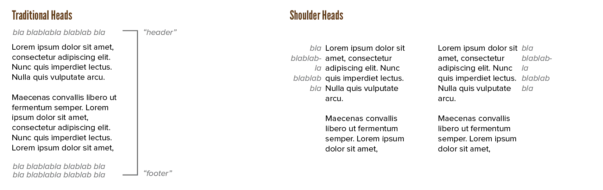

Last chapter introduced the common hierarchy used in most projects. Let's look more closely at a few of those elements.

## Title Pages

The title page is the first thing most readers will see. It should stand out. It should be clear it is, in fact, a title page, and not how a regular page looks.

You have a lot of freedom here. Except for one thing: setting expectations. The title page should use a style that conveys the right message and tone. It's the first thing people see. And when they see it, they should have an idea of what's inside, and whether they want to read that or not.

{}
The same is often said about novels. In the first chapters, you want to build audience expectations. Like: "hey, this is a book about dragons and magic" or "hey, this is an adventure with a sprinkle of romance". You will always set expectations. Make sure you set the right ones. Failing to meet expectations of a design usually leads to worse reviews than failing to create good content.
{}

Additionally, most books have some empty pages after the title page to set it apart from the rest of the work.

For the same reason, multiple nearly-empty pages should be left at the end of a book to balance it out and not come to an abrupt stop. When adding preliminaries, which is always a fun thing to do, give them adequate space as well.

When it comes to title pages for chapters or certain levels of the hierarchy, set them in a form that works together with the overall design. If headers stand out or contrast too much, it distracts from the all-important body text. Don't let the title page oppress the text, but make it a symbol of the importance and presence of the text.

## Highlighting

When it comes to the body text, there are always subtle changes in hierarchy to be made. Perhaps you want to emphasize a single word in a phrase, or a single phrase within a long piece of text. The visual cues for these changes should not be so subtle that you can't immediately spot them, but it's also no good when many visual cues add up inside a text block.

As a general rule, threfore, **highlight no more than 10 percent of the text**. (Notice how I never use bold type for more than a few phrases per chapter?)

The effects of highlighting decrease as the amount increases. Use only a small number of techniques, but apply them consistently.

Italics are preferred, especially for longer phrases, as they fit with the flow of the text. Bolding is the next best option, as it is more detectable or legible. Underlining should be avoided; reserve it for hyperlinks on the web.

Avoid using different typefaces as a highlighting technique. It's _too_ much contrast. So instead of a highlight, it becomes its own completely separate text block within another text block. (Unless you can find two fonts that look very similar, of course. But then you get into the "no near misses" territory!)

For the love of god, avoid making text blink or animated. Adding animation to text is wonderful when done delicately, as a one-time fun thing. But it should not be annoying If it's an interactive medium, there should be an option to turn it off.

{}
Blinking text was one of the first things added to the website design language (CSS). I don't know what on earth they were thinking. But for a few years, the internet was filled with these blinking way-too-colorful websites that hurt your eyes 😂
{}

When it comes to colour, highlighting with very bright colours is actually not recommended. They attract too much attention. Against a white paper, other bright colours are obviously hard to see. A subtle shift in colour is already enough. Highlight using desaturated colours which are clearly distinct.

Inverting elements works extremely well for text and is underused in my opinion. This is when you switch foreground and background color or shape. If your text is black on white paper, you can emphasize with white text on a grey background block. It's effective at attracting attention, but adds considerable noise. It doesn't work that well with icons or shapes, though.

## Notes

Notes can be anything. A remark about the body text. A complete paragraph with additional information. A footnote or reference. 

However, the traditional "formal" way of adding notes---at the bottom or top of the page---is actually the worst one. We're used to reading top to bottom. If at the top, they interfere with the main text. If at the bottom, we've forgotten what the note is about by the time we reach it.

I prefer notes in the **side** margin, and perhaps adding footnotes and references as a long list at the end. 

If you use superscripts within the text, check their weight and spacing. They should, again, be balanced. Clearly a superscript, but otherwise just part of the text. In the notes themselves, always use full-size numbers.

Another name for notes in the margin is *shoulder* or *run-in head*. This reveals another idea: adding the heading or title of the current section in the margin can work wonders as well.

## Semantics (on the web)

The following bit is about markup language and website design. Nevertheless, it should be valuable to know for anyone, even if you don't code or create websites.

With the rise of the web, it's become common practice for people to use your work on many different devices. Additionally, visually impaired users might make use of a screen reader to read your work aloud to them.

Therefore, the underlying **structure** of a design is more important than the final **look**. Even on the web, it's important to establish a proper hierarchy *before* adding any visual ornamentation or extras. 

This is called "semantics". Mark up your content by what it **is**, instead of what it should **look like**. 

{}
When making a website, the `<h1></h1>` element creates a heading. It also makes text bold and much larger. Newer website designers therefore often _misuse_ this element when they simply want big letters. They mark the text by what it should look like, rather than what it is. Which is the opposite of semantics.
{}

Instead, only use tags to show what something is. Completely separate content from style. You can always style the tags later in any way.

Why is this a good idea?

* Google (and other search engines) can index your content better
* When you look at the content, you immediately see what everything _is_ and are never left in doubt
* It can easily scale to different devices, because style is not hardcoded into the content
* It enables many tools to help impaired users, as they rely on getting the structure of your text right

Some quick tips:

* Caption your tables, images and other figures.
* Add "alt tags" ( = descriptions) to images
* Provide a descriptive, meaningful title to hyperlinks. (Not "this link" or "go here". Yes, I have made this mistake too in the past, in many of my online articles.)
* Place the navigation within `<nav></nav>` tags
* Don't hide things behind animations or scripts or buttons. If somebody used a terrible internet connection and an old crappy device, they should _still_ get the content in a consistent and legible way.