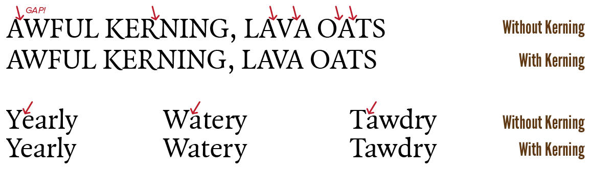
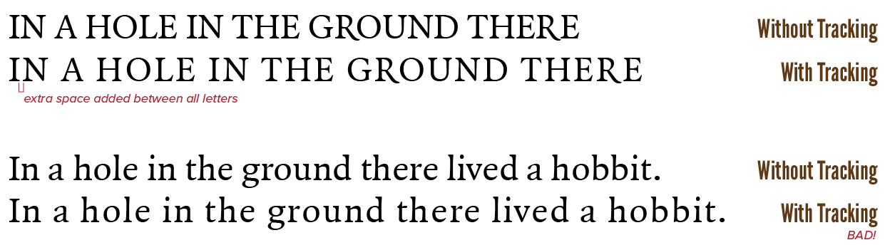
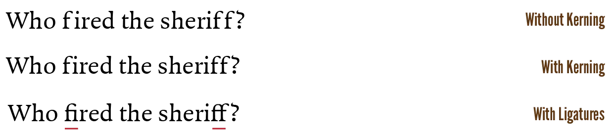

Now that we've looked at all individual letterforms and special characters, we can look at combining them. You might think this is obvious: just place letters next to other letters, and voila, you get a word!

But actually, there is much more at play here. Allow me to introduce **kerning** and **tracking**.

## Kerning

Ironically, when letters are spaced out uniformly, their pattern isn't uniform enough. 

Some combinations of letters leave too much space between them. On the other hand, others could actually do with a bit more space!

This is solved by **kerning**. When you kern, you set an alternative spacing between _specific_ letter combinations. Every good font has it---and you should use it. (Some software or systems can turn this off. Be mindful of that.)

The results of such a kerning process are saved in a kerning table, included within the font. This kerning table will be created by the typographer and enabled by default. 

Most software allows you to tinker with this. I've adviced against tinkering with fonts. 

In this case, I actually don't think this is too bad. I use it when text becomes extremely large---as that is when tiny spacing issues become most apparent---or when I have a very specific dimension/space a font should fill.

In general, a good font has consistent and moderate kerning. You don't _actively_ notice it, but many letter combinations are spaced irregularly to make the text look way better.

## Tracking

On top of kerning, you can set the amount of space between *every* pair of letters. We call this **tracking** or letter-spacing. 

By default, a letterform will be saved inside a font with a sliver of space around it, which we call the *set width*. A tracking value of 0 should prevent your letters from touching each other, but only just.

By increasing the value, you add more room to breathe, but you also run the risk of letters becoming too individual and unconnected. It becomes difficult to comprehend words. The smaller the type, the more space is needed. Only big, robust headlines can support closely spaced letters

> **Type Error:** "One who would letterspace lowercase, would steal sheep."

Only use alternative tracking for uppercase and small caps. Or really bold and thick titles that create conflicting letterforms, which is similar to uppercase. In this case, **5%&ndash;12%** letterspacing is optimal. Especially abbreviations and acronyms amidst normal text benefit from spaced small caps.

Either way, make the shoe fit, not the foot. If you want to save space, don't apply negative tracking. Instead, use the proper style of the typeface: _condensed_ or _light_.

And finally, don't add space within strings of initials. (Or any sequence of capitals separated by dots.)

## Ligatures

Some letterforms clash _so hard_ there is no benefit to be gained from kerning. Too much space would need to be added between the letters, creating weird gaps in the text. 

In those cases, **ligatures** come to the rescue.

A ligature is a combination of two clashing letters, turned into a single symbol that doesn't clash. 

It's a way of elegantly combining annoying colliding characters. 

One of the most common ligatures is when an *f* and *i* are combined. Without extra space, the dot would intersect with the top curve of the f, so the best solution is to create a special symbol for the two together. 

A good font has ligatures---use them. (If they are not already automatically used by your software.)

If you want to avoid using ligatures, pick a font that doesn't need them altogether. Such fonts have their letters designed in such a way that they never collide, so there's often no need for ligatures (or even kerning and tracking). This does, however, often take its toll on the beauty and dynamics of the font.