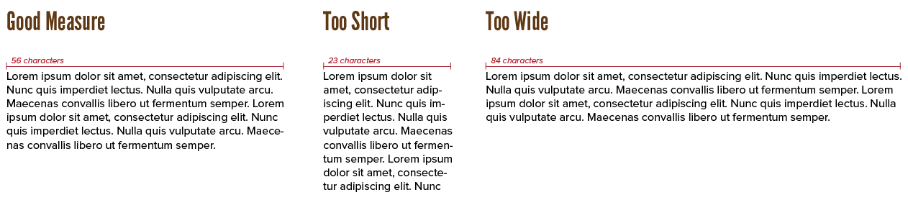
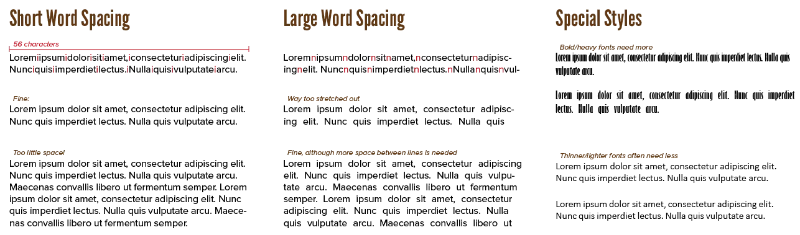
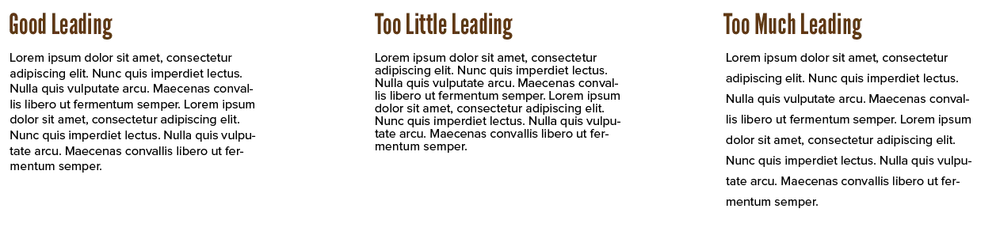

We started small: parts of letters, then special characters, then space between letters. Now let's take the next step: space between groups of letters

More specifically, the *horizontal* space between words, and *vertical* space between subsequent lines of text. This will allow us to say some clever things about the dimensions of text blocks.

## Measure

The measure is the actual *line width*. 

Firstly, this is influenced by kerning and tracking, which we learned last chapter.

But it's also obviously influenced by the *line length* ( = number of characters on a single line) and the *word spacing*
( = white space between words). 

If the measure is too long, people lose track of where they are. They don't get enough pauses when reading. If the measure is too short, lines and words feel unconnected and text blocks become way too long (vertically).

In general, a line length of about **45&ndash;75 characters** is recommended. A length of **66 characters** is often seen as ideal. Some exceptions ...

* If you have lots of horizontal space within the design, you can bump the character count towards a maximum of **90 characters**. 
* If you're working with multiple columns, you can use optimal line lengths of **40&ndash;50 characters**. 

{}
Using multiple columns is highly recommended if you have a very wide layout. It's always better than just making the text the full width _or_ centering a single narrow block in the center.
{}

## Word spacing

All these estimates are given for when you use the regular amount of word spacing. But you've guessed it: this is another property you can change. 

Not all software allows this easily. But it's an easy operation to fake: simply increase the whitespace around the empty "space" character. Because words are seperated by spaces, this should change word spacing in general.

As a rule of thumb, many designers use the width of the lowercase letter **i** as the word spacing. This is, however, only useful for short pieces of text. 

In long text blocks, word spacing should be larger. Why? Because of the big text block, people will perceive the spaces as being _smaller_ in contrast, which you need to combat. 

Consequently, the number of characters per line should be shorter to keep the measure in check. (Additionally, bold fonts often need more word spacing.)

You might, therefore, want to look at measure as a _physical_ length instead. An optimal measure is about **3&ndash;5 inches**.

It's all about balance.

* Letters need to be far enough apart to be distinct, but not so far they become unrelated
* Spacing needs to identify individual words, but also group them together for logical sentences.

Give your text room to breathe, but don't let it break into a bunch of clearly individual words.

## Leading

Now that we've discussed the horizontal size of a line, let's look at the vertical size. This is called **line height** or **leading**

This is harder to balance, because letters have those _descenders_ and _ascenders_. When the descenders of one line touch the ascenders of the next line, things get messy and uncomfortable. 

Therefore, the leading is usually not simply the maximum height of its letters ("100%"), but also includes some extra white space.

In most layouts, leading is slightly greater than cap height. This means setting it to the type size plus **1&ndash;4 points**. In percentages, this means setting it to **120%&ndash;150%** of the regular body text size.

Leading and measure directly influence each other. 

> The greater the width of a line, the greater the line height should be. 

If the leading is smaller than word spacing, it causes the reader to constantly jump to the next line on accident. 

If the leading is too large, it causes the lines to read as separate paragraphs or standalone pieces of text.

If you want to keep a reader's attention, make sure the text has an even and coherent *texture*. Again, columns can help you out here.

## Combining our Knowledge

Essentially, we've now learned to approach short and long texts differently.

Long texts need to be comfortable. Once you've found your rhythm, nothing must disturb you again. Design it so that the reader has a chance to settle in, but be generous enough with leading to prevent them from slipping to the next line before finishing the current. The reader must be relaxed. The spacing parameters need to be consistent or at least rhythmic (adding and removing space in regular intervals). Long text blocks often require a neutral and inconspicuous typeface.

Short texts are mostly for quick scanning and grabbing attention. Tracking can be tighter, word spaces and line height smaller. The font used should have a little verve, but not too much.

## Hyphenation

One problem still remains, though. We can't **force** lines to a certain length. Words can't be broken at random points, as it makes them illegible. (Image the symbol for a letter just being _cut in half_ and continuing on the next line with _the other half_.)

For this, *hyphenation* was invented. Split words at syllables and add a hyphen to show they have been split up. This website uses hyphenation as well, although browser support is not great at the moment.

Any proper text editing/layout software will hyphenate by default and do it well. Nevertheless, it's good to learn some general rules and get an intuition _why_ some things work that way. Mostly so that you can tinker with it and _break_ the rules when you know that's a better option.

Here are some guidelines on hyphenation:

-   Leave at least two characters behind, and take at least three forward.
-   Try to make the last line of a text block at least half the measure.
-   Avoid three or more consecutive hyphenated lines
-   Don't hyphenate (short) numerical and mathematical expressions. In fact, don't let them go over a line break at all.
-   Avoid hyphenated breaks where text is interrupted by other design elements. (Because of the other element, people forget what the last part of the word belonged to when they continue reading.)
-   Hyphenate proper names only as a last resort. (Unless they appear very often in your text.)

Hyphenation is not always the answer. It depends on the font, the context, the content. It also depends on the _alignment_---hyphenated text is usually "justified"---which is what next chapter is about!

## Monospaced Fonts

A quick remark about monospaced fonts. Their main property is that _all symbols are identical in width_ (and near-identical in _height_).

All these properties can be set for those fonts as well. That is no issue.

But, in general, you should just copy the existing spacing within the font. 

* The word-spacing is identical to, well, the width of any symbol in the font. (That width is the same everywhere anyways!)
* The measure is a multiple of that width (so X characters always fit _perfectly_ on the line)
* The leading is also a multiple of that width

In a sense, this makes the monospaced text look more like an _evenly spaced table_.