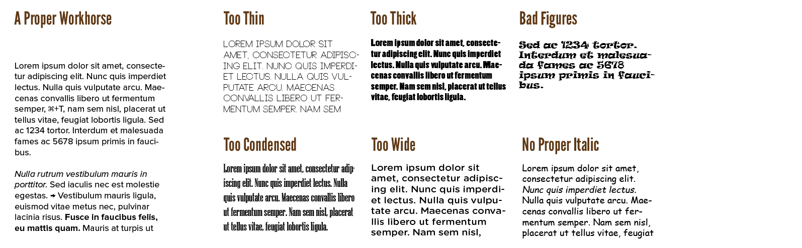
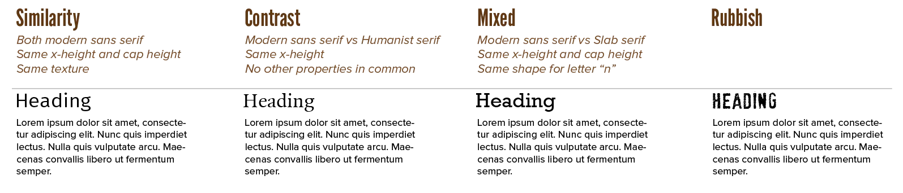

Type is made to be read, but also to be printed on a certain medium and convey a certain message. Type should be legible, but also pretty and inviting to look at. It shouldn't take up more space than necessary, nor create any conflicting (historical) associations.

Matching fonts is about this balance. The balance of the _technical_ side (legibility and matching characteristics) and the _visual_ side (economy, medium, history and message).

## Workhorses

I recommend you use a so-called *workhorse* as your first typeface. A real workhorse is a neutral and "invisible" font that brings focus to the content. In most designs, the content are large chunks of "body text".

A workhorse typically has the following properties:

-   **A good regular weight.** It shouldn't be so light that it disappears, and not so heavy that letter shapes fill in.
-   **The three key styles.** At least one bold and italic weight, with enough contrast to be
    noticed. These complement the regular weight.
-   **It is economical.** It should be narrow enough to fit large amounts of text within the available space, but the letters shouldn't be compressed beyond recognition.
-   **It has good numerals.** Confusing or misaligned figures are annoying, or maybe even dangerous, when immediate understanding of the numbers is required.
-   **It has a large array of symbols.** We call these fonts *expert sets*, as they include characters only so-called typographic experts would think about using.

{}
I don't think any graphic font has ever had all those properties. I suggest you stick to serif or sans-serif typefaces for the workhorse part of the design.
{}

## Similarity & Contrast

A good principle for visual design is: **no near misses**. 

Fonts match well together if they are either ... 

* *Very similar* (they are harmonious and look a lot like each other) 
* Or *very contrasted* (they are unlike each other in almost every way)

Choosing a font combination with properties in between will look like a mistake, rather than a stylistic choice. Like you accidentally bumped the font to 1pt larger or swapped it for the a similar-looking one. Either go big (extreme contrast) or go home (almost identical matching).

Similar fonts are great for signalling a subtle change in the hierarchy. For example, emphasizing or highlighting a word by setting it in *italics*. 

Contrasting fonts are great huge differences in hierarchy. For example, a heading versus regular body text, or even a logo versus headings.

Strong similarities among fonts are ...

-   Roughly the same **character width**.
-   Categorized within the same **typeface classification**
-   The same *perceived* **x-height**. As stated earlier, some serif fonts swing above and below their x-height with curves and ornamentation. This means two fonts with the exact same x-height _when measured objectively_ don't necessarily _look_ the same size.
-   An **even texture**. This means that the darkness/lightness and the smoothness/roughness of the letterforms are the same
-   Roughly the same shape for **the letter *n***. The parts of this letter frequently occur in all the other letters. Comparing the curves of the *n* can tell you a great deal about whether fonts match visually.

Obviously, to contrast fonts, you turn these similarities around. Pick fonts that do _not_ share these at all. This is harder to do, but adds more visual interest and balance to a design. 

There is one exception: **the x-height**. Try to keep this the _same_ (at the same point size) for matching fonts, even when contrasted.

The task is, as always, to not overdo this contrast. Otherwise you still end up with an incoherent mess.

A popular combination that always seems to work well, is combining one serif and one sans-serif typeface. A third typeface, if needed, could then be one of graphic type, used sparingly. Additionally, typefaces created by the same typographer or in the same time period often go well together.

## Media

Workhorses work across all media, while other typefaces generally don't. 

{}
Garamond is a beautiful serif font used frequently in printed books. But on a screen it often looks awful or illegible. It's best replaced with the sturdier Georgia: specifically designed as a "serif for screens".
{} 

Always keep in mind the final medium on which your design will appear. It only matters that the fonts you pick work well _there_.

## Message

When you design the typography for a message, you will always add some interpretation to it. Even if you choose a "neutral" typeface, you've made a choice telling your audience the message is neutral. 

Brands are a good example of this. They have to be authentic and recognizable through typeface. Using a bland or overused typefaces carries that same message over to the brand.

{}
"Man, that company logo uses Arial! They must be an uninspired lazy company that just picks the default option every time."

Even if Arial was _the perfect font_ for this company and its logo, this would be a message they unintentionally add.
{}

Some typefaces are only suitable for specific occasions, while others are only suitable at a certain time. Typographic trends exist, but they are insignificant and hard to predict. When trends are followed, the entertainment value is temporarily higher, but beware that your design might not stand the test of time.

Most of it, though, has to do with history. Choose faces whose historical associations are in keeping with the text, and don't go against the intended use of a typeface. 

For example, if I showed you several fonts, you'd be immediately able to pick the one that screams "cowboy" or "flower power" Using them in another context than the immediate association will most likely feel strange.

## Editing and finetuning

When you're not 100% satisfied with a font, you *can* always finetune it yourself. You can add your own characters, or modify some of the existing ones. Free font software exists---such as [BirdFont](https://birdfont.org/). Open the font in there and edit away.

This should, however, be avoided at all costs. Typographers add thousands of details, after many versions and tests, to make a font as good as possible. It's likely that you will miss that and can't just drop in a replacement that is better. At the same time, it should be extremely educational to try this ...

{}
It's like when people say "what were those game developers thinking!? I can improve this game easily!" And they start recreating the game themselves. And before you know it, they've encountered thousands of problems with their idea that was "better". Problems the original game developers also faced and had to solve through compromise.
{}

If a font requires too many changes, just drop it and pick a different one. (I haven't created a course on how to design your own fonts ... yet.)