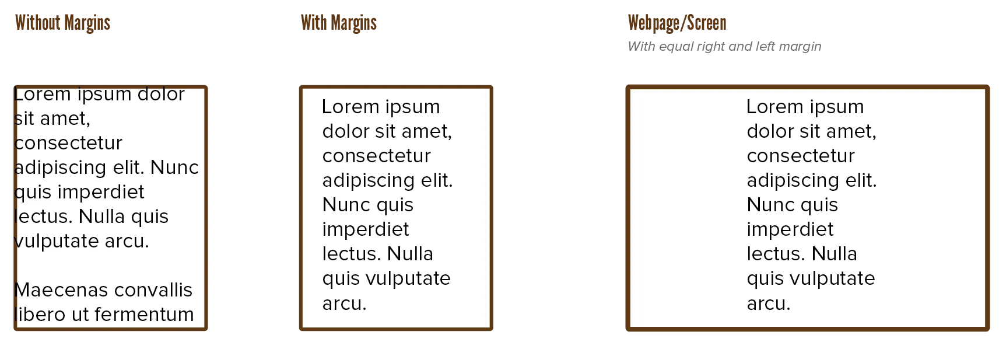
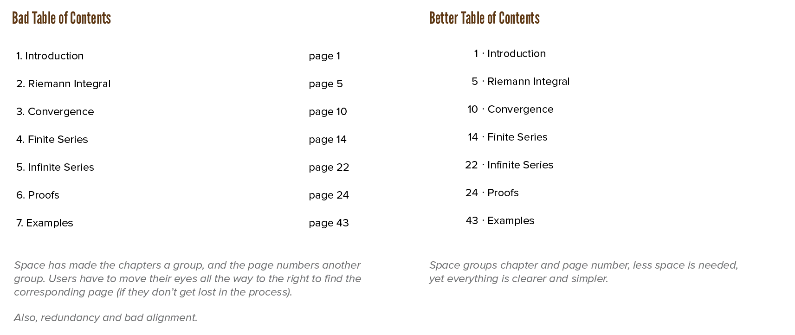
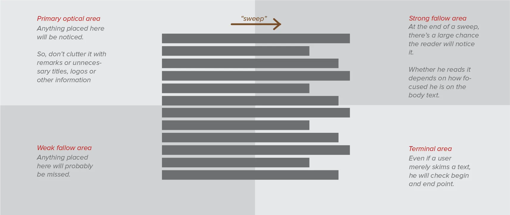

Having a grid is great for dividing the page into different sections. But not everything works equally well. People are accustomed to a certain standard page layout and reading direction, and if you want long pieces of text to be easily read, it's best to follow those guidelines. 

It's not that you can't go wild with extravagant grids! It's that you should reserve it for title pages and places that aren't 100% filled with body text.

## Page Dimensions

**The shape of a container determines what can be contained.**

If you pick a page size that's not right, you can tweak your typography all you want, but it will never become something it cannot be.

A large amount of content requires a larger page, or you'll be left with thousands of pages. A text-heavy layout requires a page that is longer than it is wide. An illustration-heavy piece with less text tends to have more landscape-like pages. 

A design with only square text blocks would do well with a perfectly square page. The other way around: children's picture books are usually big, chunky and perfectly square.

Take all of these factors into account when choosing your page dimensions.

Books for serious reading should fit in our hands. Font size should be no smaller than **9pt**, and no larger than **14pt**. Typefaces with an off-kilter x-height (very pronounced or very small) aren't great for those.

## Margins

It's perfectly possible, however, that you don't know the exact size at which a design is going to be viewed. While you perhaps can't predict the maximum size (such as the size of a user's screen), you *do* fully control how much of that space you want to take up.

For this, we have the *margins*. Margins solve a multitude of problems.

-   They set off text from the edges of the paper. This is much more legible and gives the design more room to breathe
-   They create a "safe zone". If the final dimensions of the work turn out differently than expected, margins make sure none of the important information is cut off, and that the design is still  intact.
-   They create room for notes and other messages connected to the body text, but on a separate level in the hierarchy. This doesn't just mean remarks or references, this also includes things such as page numbers or displaying the current chapter you're reading at the top of every page.
-   They balance and contrast the page by creating as much (near) empty spots as there are spots full of text or design elements.

Actively optimmize the margins as you design, every step of the way, and you will notice improvements in your typography. Be aware, though, that you don't clutter the design by putting too much in the margins. You don't need to fill every header, footer and aside with extra information. An interested reader knows what chapter or section he's at and doesn't need constant reminding.

Additionally, you can choose to hang punctuation and ornamentation (such as quotes and drop caps) into the margin, to keep the edges of text blocks even. Sometimes it works very well, sometimes it doesn't. Experiment.

{}
In case "optimize margins every step of the way" isn't clear, let me clarify. I have self-published about 6 books now. And every time, I changed the margin sizes 3&ndash;5 times while writing the novel. As I had more content, as I determined fonts and whether there would be images, I had to change the container so that my novel could best be contained.
{}

## Space

Besides adding space at the edges of the frame, you also need space between frames. These *gutters* are usually an automatic result of using a proper grid. 

This may seem obvious, but there is again an unintended side effect of space to watch out for.

There are two main reasons a typographic design needs space: 

* To set it off from other elements (to make it more readable)
* To lead the user through the design (by showing what's related and what not)

If everything's connected to everything---with no space between, or the exact same amount---the reader doesn't know where to go. Instead, whitespace automatically does the following.

* If you leave a lot of space between elements, you make clear that these are unrelated. 
* If you leave little space, elements suddenly become a group. 

Similarly, if you align elements along a common line in space, this line can be followed by the user.

Because we read from top to bottom, text is still best set in columns that are clearly taller than they are wide. As a result, space usually takes the form of columns as well. 

In summary:

* Things that belong together should have little space between them. (But enough to be separate.)
* Things that don't belong together should have lots of space between them. (Apply freely and in abundance!)
* Watch out for situations where you mix up these principles and accidentally group the wrong things.
* Usually, text automatically creates space shaped as columns. If not, you might want to shape your whitespace to a column anyway, as it's the clearest type.

## Gutenberg Diagram

The *Gutenberg Diagram* is an image that shows the general direction in which a reader's eyes scan or read a page. It's very useful in determining where you should place your most important content, so that it's the first thing users see. 

This diagram, however, is true for design with information evenly distributed across the page. It can always be "overruled" if you add enough contrast or emphasis somewhere else. 

The diagram looks like this:

Western readers naturally start top left, and move across and down in a series of sweeps until they reach bottom right. Each of these sweeps begins along an axis of orientation---a horizontal line created by aligned elements---and proceeds in left-to-right direction.

The fallow areas receive the least attention, unless visually emphasized. This tendency is called *reading gravity*. Designs that follow it often improve reading rhythm and comprehension.