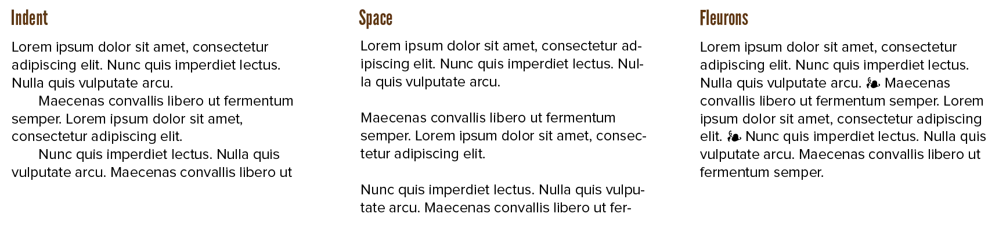
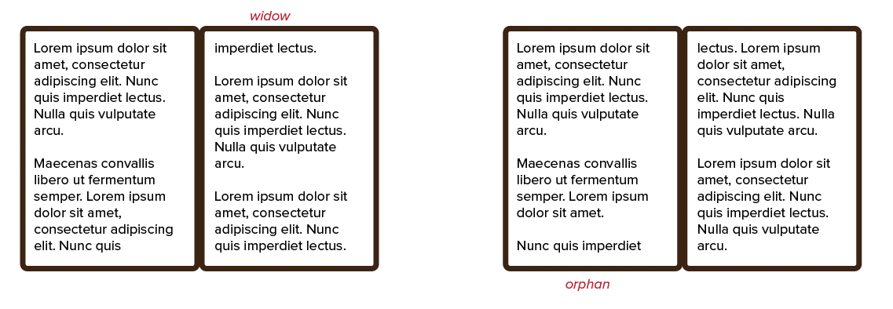
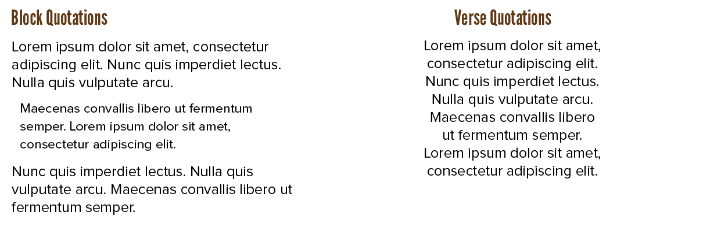

Thus far we've handled text as if it were bundled in huge so-called *text blocks*, based on the topic or function. Now we take another step up the ladder. What comes after text blocks? *Paragraphs* built from blocks of text. And then _multiple pages_ built from paragraphs.

## Paragraphs

Paragraphs are a literary convention designed to divide content into smaller portions that are easier to take in. It's not required to use them---nothing is required in art---but I don't recommend trying the "wall of text" technique. 

> **Type Error**: content and typography are tightly integrated. Often the best thing you can do, is to simply add clear structure to your _content_, instead of tweaking all other typographical values. One thought, one message, should be _one paragraph_. Don't fill the whole page with one wall of text.

The places where a paragraph ends and begins should therefore be clear. They should be distinct, yet the relation between one paragraph and the next should also be evident. If not, a _heading_ should come between them, as we've clearly switched to a different subject.

Traditionally, two common ways to mark the start of a paragraph exist. 

* *Indent* the first line by about **1&ndash;4** times the **point size**. 
* Leave *vertical white space* of about **4&ndash;10 points** between paragraphs.

The first paragraph of any chapter or text block, however, should *never* be indented. The first paragraph already stands apart on its own. Indenting only adds confusion. (You can see this if you pick up a book. The text is usually indented, but the first line of a new chapter is _not_.)

> **Type Error:** "The first word of the first line is *the* critical word of that particular body of text. Let it start flush, at least."

A less common way to separate pieces of text---not necessarily restricted to paragraphs---is by the use of so-called *fleurons*. These are simple typographic ornaments or symbols that mark the beginning or resumption of a section.

Whatever you do, don't use multiple spaces or other special characters in a row to achieve this effect. Always try to seperate paragraphs using _one_ key symbol or graphic meant for that purpose.

> **Type Error**: don't start two consecutive lines with the same word. (Although this is mostly a writing issue.) It feels like a mistake, like you've accidentally printed something twice. It sticks out when reading.

> **Type Exercise:** Invent new ways to separate paragraphs! Be creative. Find what works best and what gets in your way.

## Pagination

Pagination doesn't have many rules or concepts. There are only two worth mentioning:

* A book obviously has a left and right page. These, together, are called a **spread**. You want to design spreads as if they were one thing. Otherwise, for example, you get a left page _filled with content_ and a right one _nearly empty_, which stands out to a reader.
* If a page breaks text at the wrong moment, it can endlessly confuse readers. (Causing them to flip back-and-forth a few times to make sure they got it all.)

Balancing spreads is sometimes impossible, because the content doesn't allow it. You can move single lines from one page to another, you might move examples or bigger blocks around in the layout. But if a spread is unbalanced, then so be it.

A bigger problem are **widows** and **orphans**.

A **widow** is when the last line of a paragraph appears at the top of the next page. To solve this, either move more lines to the next page, or rewrite the paragraph to be shorter.

An **orphan** is when only the first line of a paragraph appears at the bottom of a page. (And the rest of it continues at the top of the next page.) To solve this, simply move this single line down to the next page.

I highly recommend solving these issues. It makes any typography way more consistent, easy to read, and professional. Leaving orphans reeks of carelessness to anyone seriously reading your text. Some software, such as the LaTeX markup language, automatically solve this.

## Webpages

Webpages can't work with multiple pages. Instead, they are dynamic. They extend in width and height, as the content requires, or as the screen size of the user changes. 

Of course, one solution is to break your content into multiple pages yourself. That's what I use on this website! Because books still use (small) pages for a reason. They are easier to read, easier to typeset well, easier to grasp. A (very) long webpage is harder to navigate, more overwhelming, and gives the reader the idea they can never take a break.

I advice this method. I see too many websites just dumping their content in one _huge_ block, never caring for how it looks or splittig it up into manageable chunks. Try to borrow the _good_ aspects of pagination to digital design.

If you still want all your content in one single (long) page, you need to cover it up with good navigation and hierarchy. More on that soon.

## Block Quotes

Before we move on to the bigger picture, I want to talk about one last special text block: quotations. 

I'll discuss three types: 

* Inline quotations
* Block quotes
* Verse quotations

Inline quotations have only one rule: if a piece of text starts with a quotation, you should always include the initial quotation mark. The usage of quotes is discussed in the special characters chapter, while the notation depends on the style of the writer.

Block quotes have more to them than that. A block quotation is used when citing at most three sentences from an external source. They should be formatted to make clear that the text is not the author's. Here are the rules:

-   Add extra **leading** before and after block quotations.
-   Indent them subtly, about **0.5&ndash;1 inch**.
-   If you decide to add quotation marks at the ends, let them hang in the margin to not disturb the even edges.
-   Subtly reduce font size and line height.

Verse quotations have short lines, sometimes without much or any punctuation. It's best to indent them considerably, or centre them (if they aren't too long).

{}
Before, I mentioned my huge website containing short stories in Dutch ([De Levenssaga](https://delevenssaga.nl)). 

In that design, each chapter starts with a **drop cap**. It's a technique where you enlarge the first letter and display it in a more decorative font. (This websites uses them as well, but way less pronounced.)

This, however, made quotes look odd. Any scene that started with dialogue, and thus quotes, looked _bad_.

I ended up rewriting the content to _never_ start a scene with dialogue. Because the other option, just leaving out the initial quote, is too confusing for any reader.

This is an example of using restrictions to be more creative and unique. Again, invite restrictions, let them be, they aren't bad in creative work.
{}