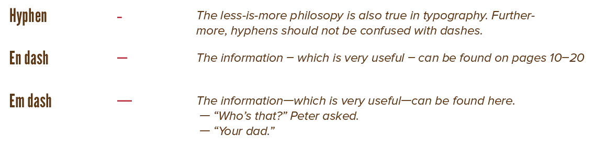
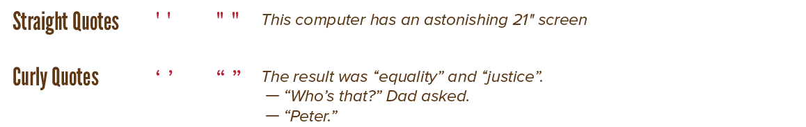
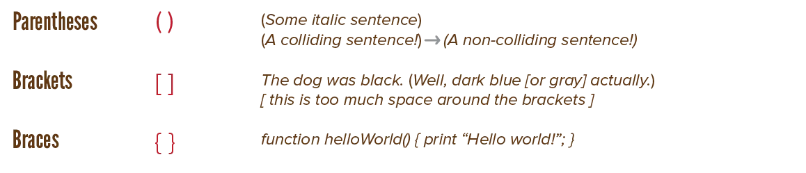
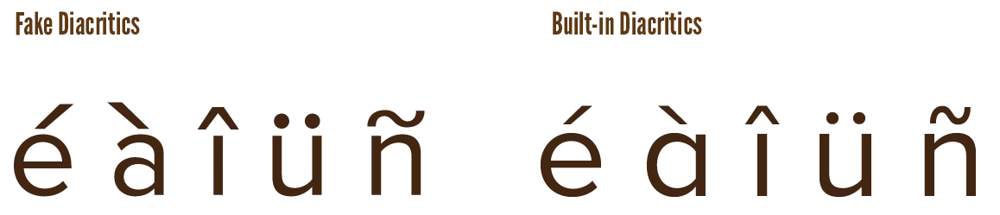
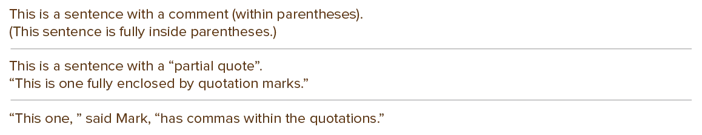

The first computer keyboards were made primarily for programming. That's why you can easily type all sorts of crazy symbols (`[]`, `\/`, `~`) ... but have a much harder time finding typographic symbols.

Additionally, good practices concerning punctuation and special characters aren't really taught in school. This chapter will, therefore, be a bit more generic. The information here is applicable to all branches or activities involving writing.

It's important to remember, though, that special characters serve mostly as necessary **notation**. They should never reduce legibility or functionality. They should _increase_ the precision of communication. Remove unnecessary punctuation whenever you can. Only use special characters to increase aesthetics if it doesn't compromise the clarity of the text.

## Where do I find these symbols?

Text editing software _should_ have a window or option symbol that's called **glyphs** or **symbols** or **special characters**.

It will give a complete table of _all special characters_ your currently selected font has. You'll be surprised how much is inside a font. You can search it visually, or search by name/category.

Some software also autocorrects these. For example, if I type any hyphen in Word, a space, and then a word, it automatically makes it a dash. So let's start with those characters ...

## Hyphens and Dashes

{}
Update! I don't agree with this image anymore. Don't use the "en dash" in space. Only use it for ranges of numbers. Use a close-set em dash instead.
{}

There are three flavours: 

* *Hyphens*: shortest (-)
* *En dashes*: width of the letter *n* (&ndash;) 
* *Em dashes*: width of the letter *m* (---)

These can be **close-set** (pushed againt the words) or **in space** (with a space between them and surrounding symbols).

What is the difference?

-   *Hyphens*: close-set if used to create a compound word (like "close-set"). Or when a word is broken up at the end of a sentence. Never in space.
-   *En dashes*: close-set to indicate a range of numbers, never in space.
-   *Em dashes*: close-set as a replacement of a comma (to introduce remarks or subclauses to a sentence), in space to introduce alternate speakers or quotes in a story.

In general, the *minus* in mathematical notation is ...

* A small variant (like the hyphen) to indicate negative numbers
* A wide variant (like the em dash) for the subtraction operator.

If possible, find a font that has special symbols built-in for mathematical operations.

> **Type Error:** Don't use multiple hyphens after each other to simulate dashes.

## Quotes

Quotes can change in two ways:

* Straight or curly
* Single or double

When to use which?

-   Use a single straight quote for *foot* (the measurement) and double straight quote for *inch*.
-   Use opening and closing curly quotes for all other cases. When used as an apostrophe, make sure the quote points downward.
-   With numerical plurals, omit the apostrophe

_Why open and close?_ This communicates more information. And design (and type) is all about communication, right? By using a matching pair, the reader is never left in doubt when a quote starts and ends.

I prefer double quotes in all cases. Single quotes are very easy to miss, especially on screens. At the same time, this means double quotes "interrupt" the flow of text more, which might not be what you want.

Some fonts don't have the curly variant. If I know I need quotes (which is 99% of the projects), I disregard those fonts.

## Parentheses, Brackets & Braces

Many fonts bodge these characters. They are either thick, too thin, or too symmetrical. Try to use the best version of these characters you can find. 

Additionally, the spacing isn't always satisfying. There shouldn't be too much space between the letters and the parentheses, nor too little. The reader shouldn't stop when they see a parenthesis and think, for a second, that the sentence has ended because there's so much space.

If the text within parentheses is italic (or otherwise styled), keep the parentheses themselves upright and normal. That is, unless this causes letters to collide with the parentheses.

As for their usage, parentheses are the most common. They indicate a comment or something that is somewhat important, but can be left out.

Brackets and braces are mostly for programming or scientific pieces. But what's the reason for that? It's because they are great for "grouping" pieces of text. You can also use them like that in your designs! Place brackets or braces _around_ things to give them their own place in the hierarchy.

## Diacritics & Symbols

Diacritics, just as fake bolds, can be simulated by computers. As expected, choose a font with naturally supported diacritics instead. 

English doesn't really use these. But almost all other languages _do_. If there is _any_ chance your text might not stay English 100% of the time, pick a font that supports diacritics. You don't want give your text an awkward, different meaning.

{}
For example, *papa* is father in Spanish, while *papá* is a potato.
{}

{}
My native language is Dutch. At least 50% of computer issues, by me and those around me, stem from the fact that their devices were setup to use an English keyboard by default ... which means you can barely type anything in Dutch.
{}

In a sense, you can do the **poor font design test**! When checking out a font, these characters are usually missing or poorly designed (in terms of visuals or spacing):

* Parentheses
* Brackets
* Asterisk
* Pilcrow (paragraph mark)
* Section sign
* Octothorp (hashtag; #)

## Ending Sentences

Ending sentences with a regular dot will suffice most of the time. You can explore, however, rewriting a sentence to become a question. Why? This makes it shorter and more active. (See what I did there? 😉)

{}
"I will now try to explain why you shouldn't do A but B" 

can be rewritten to 

"Why should you do B instead of A?"
{}

> **Type Error:** Never, ever, use multiple exclamation or question marks after each other. In fact, avoid using exclamation marks if you can. They are like bold font styles: great when used right, otherwise too attention-grabbing and in-your-face for their own good.

> **Type Error:** Never use two spaces after a period. It's unnecessary and disrupts the flow of the text. I don't know why this is a thing. Same with adding space before or after a question mark.

Another common problem is: *should punctuation (like a dot) come before or after quotes?" 

The answer is: before ... most of the time. If it's a whole sentence or phrase, keep punctuation within. Otherwise, follow regular rules.

{}
"He is a thief," she said. "Not to be trusted." 

Notice the comma _before_ the quote.
{}

{}
Yeah, they promised they would "look into the issue".
{}

{}
Follow this rule (most of the time). => (Follow this rule most of the time.)

I try to write full sentences within parentheses, instead of using them partially in a sentence. This often requires some rewriting.
{}

<!--  -->