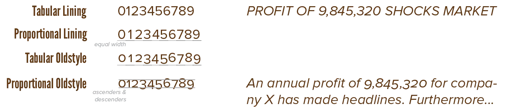
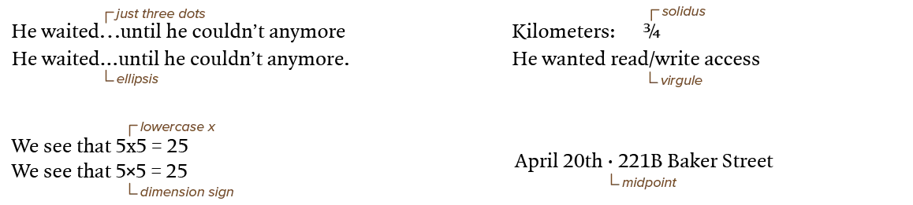

Continuing on last chapter, I will discuss a crucial special character: *figures* or *numerals*. At the end, I present some small rules or ideas that didn't fit anywhere else, but are nevertheless nice to know.

## Figures

This is another way to test if you're looking at a **good font**. They have multiple versions of the same numeral. Yes, even numbers can have different styles, like uppercase and lowercase!

Two styles are available: *lining* and *old style*.

### Lining Figures

These are the figures usually linked up with the 0&ndash;9 keys on your keyboard. They are called this way, because the top and bottom ends of all numerals line up. In other words, these are the uppercase characters of the numerals: all of them have the same height as the cap height of the font. An alternative name is *titling figures*.

These should be used in phrases with all caps.

### Old Style Figures

As opposed to lining figures, these are designed to look like lowercase letters. They have descenders and ascenders, and in general fit in with the lowercase letters of the font.

These should be used in line with lowercase text.

### Tabular Figures

Both lining and old style figures can be either *tabular* or *proportional*. 

* **Tabular**: every figure has the exact same width (like a monospaced font)
* **Proportional**: each figure is sized proportionately to its shape.

As the name suggest, tabular figures are best to use in tables or spreadsheets, or any visualization of a large set of data. It keeps columns and rows aligned. It makes a busy design filled with numbers more consistent and easy to parse.

Proportional figures work best in most other cases. They look better, prettier, and more like how readers expect numbers to look.

## Miscellaneous

Don't use an ampersand (`&`) in place of a simple *and*. Instead, reserve them for titles, headlines and proper names. In these cases, choose the best and most beautiful ampersand you can find 🙂

Don't use *TM* or *(c)* or anything like that for copyright and trademark symbols. Use the proper symbols, © and ™.

Instead of putting three dots after each other, use *ellipses*.

Use the *virgule* (steep slash) with words and dates, and the *solidus* (more diagonal slash) with split-level fractions.

Use a native dimension sign (a cross mark) instead of the lowercase letter *x* when dimensions are given.

When people still did inscriptions, it was common to use a *midpoint* (a dot, but slightly higher) between pieces of text to separate them. (Instead of a space like now.) For short pieces of text, it is still useful, and I use it often in footers of websites.

In summary: a good font has a dedicated symbol for most things. Use it. It will look more professional, with the right size and spacing.

And last but not least, if you're getting serious about typography, you might find it useful to remap your keyboard driver. Many useful and necessary symbols are buried far within the keyboard. By setting your own (hot)keys, you can make your life a lot easier.