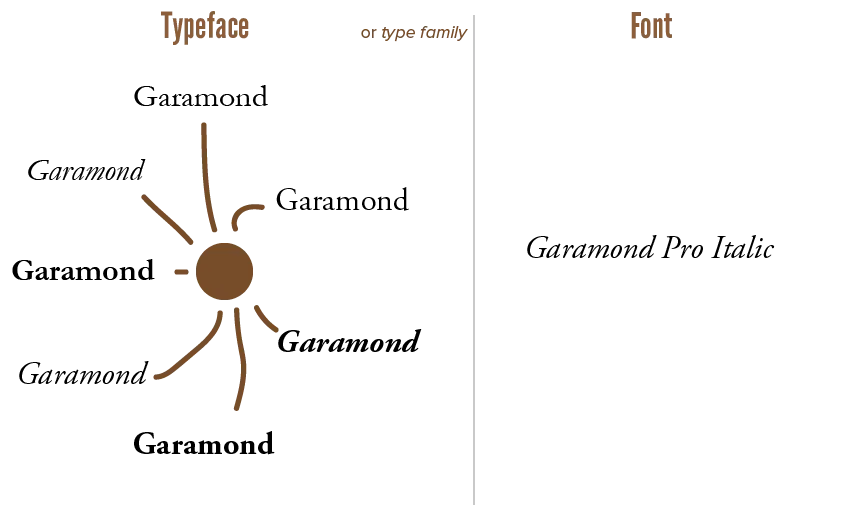
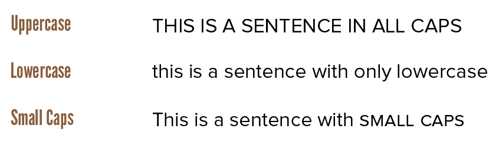
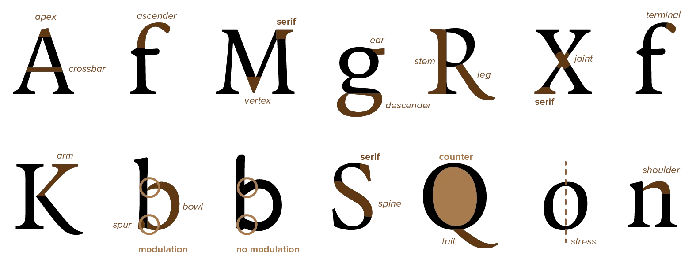
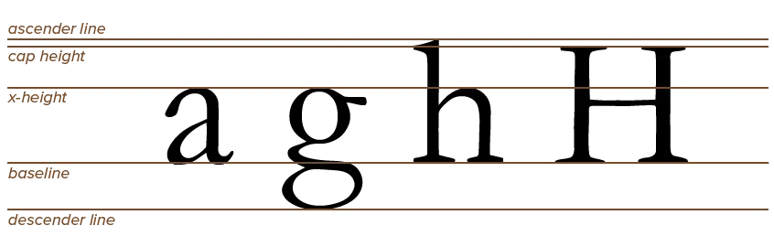

This article teaches the basic terminology used to describe typographical concepts. It's maybe not the most flashy part of any skill, but there's no better place for it than the start.

Once you know the proper name for something, I can communicate with shorter sentences and more specificity. Once you know something exists, you can find it everywhere and use it as part of your typesetting process.

If your design needs a formal look, for example, you don't want to pick a typeface typically grouped with playful typefaces. Or if you're matching two fonts, you typically want to check if certain key characteristics are the same.

## Fonts versus Typefaces

The terms are used interchangeably nowadays. I often accidentally do so as well---but that is wrong! 

Let's clarify the distinction here.

* A *typeface* is a package of font files that have the same style and key characteristics. Like how companies launch "product lines" where all the products are different, but are part of the same line, because they are 90% the same.
* A *font* is one instance of such a typeface. A certain weight, size or variation on the overall theme of the typeface. A font is a single file on your computer; a typeface is a collection of font files within the same folder.

That's why typefaces are often called **font families**.

{}
Garamond is a typeface. Garamond Bold, or Garamond Condensed, or ITC Garamond are fonts that belong to it.
{}

The easiest way to match fonts, obviously, is by picking different fonts from the same _family_. It's encouraged to explore all the different font styles of the same typeface, before reaching out and looking for another to add to your project. 

{}
Note that *type* and *typography* also aren't the same. A typographer is a person who works with type.
{}

## Uppercase, Lowercase & Small Caps

These are common concepts. But, to be sure, let's recap.

*  *Lowercase* letters are the ones you encounter most often. (abcdef ...)
*  *Uppercase* or *capital* letters are used to start sentences. (ABCDEF ...) They are bigger than lowercase. They usually have an altered form to make it look more distinct.
*  A compromise exists: *small caps* or *small capitals*. They have a similar _design_ as capital letters, yet a similar _size_ as lowercase letters. This helps fit capital letters within lowercase text without breaking the flow.

Most fonts support these three types of symbols. If not, a font usually has "CAPS" in their name, and can only type in capital  letters.

If small caps are not available, your computer will simulate them by shrinking down uppercase letters. This will rarely look good. Always look for font families where these variations (such as small caps) are unique, dedicated font files.

## Naming the Parts

I said I'd start small. And what's smaller than the parts of a single letter? 

Any letter, however different, will share the same few building blocks. Even when varying characteristics, most fonts fall into a handful of similar styles. I mean, an "o" still has to be recognizable as an "o"---you can't go too crazy. 

*Modulation* and *counters* are most important here. They help classify typefaces and identify weak spots within a typographic design.

*Modulated strokes* simply vary line width at curves, especially at spots where several curves intersect. Unmodulated strokes have a fixed width for every stroke. Modulated typefaces are often regarded as better, though this modulation can be very subtle. 

_Why are they better?_ The visual weight is more evenly spread across a letter, which increases legibility. With strokes all the same size, they form a big black dot of ink when they come together, which can be messy. (This is one of the reasons for the Comic Sans hate among typographers.)

## Naming the Placement

Now let's look at the size and placement of letters. How do designers make type look so clean and connected, instead of just a bunch of symbols beautiful on their own?

The **baseline** is the line on which all letters "sit". There might be parts sticking out at the top and bottom, but you'll always be able to notice an overall baseline in a line of text.

The **x-height** is the height of the body of lowercase letters. It's named that way because it's usually measured using a lowercase "x". Most of the time, fonts strictly follow this x-height. But fonts with more ornamentation or large curves often extend slightly beyond it.

The **ascenders** are the parts of some lowercase letters (such as "b" and "d") that extend above the x-height. 

The **descenders** are the parts of some lowercase letters (such as "p" and "q") that fall below the baseline. Like the baseline, you can often find an *ascender line* and *descender line* evident across all letterforms within the typeface.

The **cap-height** represents the height of an uppercase letter. It can be the same as the height of ascenders. It is, however, often raised slightly. Capitals rarely have ascenders or varying heights: their whole idea is that every capital letter is a block of the same dimensions.

