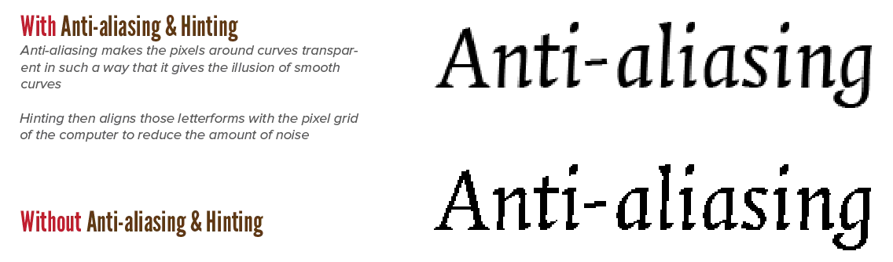

Some advice just couldn't be placed anywhere without seeming out of place or making things unnecessarily complicated. This chapter provides a list of leftover guidelines, rules and tips.

## Garamond & Georiga
Garamond is one of the best fonts for usage in print. Harry Potter famously used it.

For web, however, one of the best (neutral) serif alternatives is Georgia.

## Language & Medium
Type cannot be disconnected from material nor language. Some languages require different symbols, or the more frequent use of certain letters or diacritics. Pick fonts and designs that play into the strengths of the language displayed.

And, for example, if the type is going to be carved into wood, a different font should be used than when it's simply displayed on screen.

## Black & White
Dark text on a light background needs to be thicker. Light text on a dark background needs to be thinner. 

Therefore, when a text is back-lit or "glowing", such as is the case with airport signs, the type needs to be thinner to stay legible.

## Characters
Avoid confusion about characters. When picking a font, pick one where each character has clear, distinct features. 

An example is the huge similarity between the lowercase letter L and I. 

{}
We have this boardgame at home called "Flick 'em Up". The font they used for the front is beautiful! But those "l" and "i" together look very much like a single "u" ...
{}

## Timelessness
Since the invention of printing (15th century), the alphabet (and many typographic practices) haven't changed much. In fact, many of the most popular fonts are based on some old script from a few centuries ago, with only minor tweaks to make it better for screens. 

It's therefore reasonable to expect it won't change much in the future. So look to the past for inspiration. Good typography should be timeless. Don't try to be hip or follow trends.

## The importance of experience
We read best what we read most. We think roman fonts are the most legible, but if every book would have been set in proper italics, that would be fine as well. 

This is even true with badly designed typography. Therefore, sometimes, it's best to break the rules to account for user behaviour or expectations. Or to take a step back and look at a design without any of your experiences or assumptions clouding judgment.

## Handgloves
When testing a font, the word *Handgloves* contains enough information about a font and its letterforms for you to decide if you want to use it.

## Inherent typography
Some words just naturally sound better or look nicer than others, and some are just scarier or more boring. Keep in mind the meaning and natural form of words.

Facts or numbers may need some extra emphasis to come across. While already strong words, with strong associations or texture, may need less emphasis to keep the balance.

## Emotions
Dark emotions call for a black typeface with sharp edges.

Pleasant feelings are best evoked by informal, light characters. 

But as always, context matters a lot.

## Font size
For printed text, 9 to 12 point body text is optimal. Smaller sizes are acceptable for captions and notes. Larger type should be reserved for low-resolution displays or more senior audiences.

{}
I have to admit all my designs have only become _bigger_ over the years. The font sizes on my websites are way larger than when I started writing/designing. Maybe my eyes aren't the same as they used to. Maybe it's better to err on the safe side and go big.
{}

## Dark mode
Dark text on a light background, or vice versa, still works best. 

However, more and more designs are featuring a "dark mode". This is friendlier to the eyes, softer to read at night, and even easier on a computer to display. This comes at the cost of _people not being used to it_ and _harder to focus on_.

I say: try to add a toggle to your designs (if they are interactive) to allow both light and dark mode.

Coloured text on coloured backgrounds must be executed with caution.

Performance is optimal when the contrast levels exceed 70 percent, which is another reason to avoid heavily textured backgrounds. You can calculate contrast with any online website, or implement one of the common formulas yourself.

## No gimmicks
Whatever typographic genius you come up with, don't let it turn into a gimmick. When one master design is used to fit all sizes and content, subtleties are lost. "Jack of all trades, master of none."

## Physical context
Be aware of the situation in which people will read your design. How-to manuals or cookbooks are read in situations that are often less than ideal. So use big text, chunky letters, bold colors, large pages.

Another example: text along the highway will have to be read from great distance and with great speed (without compromising driver safety, of course).

## Ads
When going for an advertisement, or something like it, use no more than eight elements. Arrange them in a predictable layout. You don't want your ad to be ignored. But you also don't want people to _not realize_ it's an ad. 

This can go against laws, in some cases. But it's mostly a matter of setting the right mood (again). Ironically, a beautiful ad will perform worse than one that clearly communicates it's an ad for something.

## Start with the bulk
Make the bulk of the matter fit. Only after that's done, go back to the exceptions or extremes and work them out one by one. If you don't work this way, your design will only handle a few exceptions well, but fail overall.

## Fail on purpose
Sometimes, however, design needs to fail! By doing something odd or unusual, you direct attention towards the text which might otherwise be missed.

For example, by offsetting a word in a very weird way, it suddenly draws a lot of attention. Even if the word is in an inconspicous font at the same size as the rest. 

## Inspiration
When looking for inspiration, lots of typographers use their own handwriting!

{}
The remarks on this website use my handwriting. But, if I'm honest, I am in doubt if I should keep using it. The website design changed a lot over the years, and I became more professional, which means this font isn't as fitting as it used to be.
{}

## Keep it together
A ingle surface packed with well-organized information is often better than multiple pages with gigantic amounts of white space.

Typography is just as urban life: density invites intimate exchange among people and ideas.

{}
Many experienced programmers mention a similar thing. When coding, you are quickly taught to seperate everything into tiny reusable modules. But this results in even the simplest things spanning across 15 different files, each with only a handful of code lines. It's often much easier to read and write code if connected things are _kept together_ on the same screen or page.
{}

## Unexpected design matching
Combining a very traditional layout with a not-so-traditional (though not too silly) typeface often has a surprisingly wonderful effect.

As they say, there is no such thing as bad type. There's only type suited for particular purposes, and perhaps not for others.

When I keep saying "a **good font**" in this course, I hope it is clear that I mean a font that is generally easy to work with and will work great for a large set of purposes. Anything that can display letterforms, is a font. A font that is horrible in one design, but might be fine in another.

## The x-height
Sans-serif x-heights tend to be larger relative to their cap eights than serifs. This means sans serif typefaces can often be read at *very* small sizes, as opposed to serif typefaces.

## Don't ignore the content
Read the text before designing it, and use typography to honour this content. In general, typography needs to do the following things:

* Invite the reader into the text
* Reveal the meaning and message
* Clarify the structure and order
* Link it with the other design elements
* And, not to forget, create an emotional response, be it happiness, sadness, or just being interested/curious.

Good typography has a rhythm and a story, just like music.

## Licensing
Check the license of fonts. 

Some fonts may not be used on the web, some may only be used in non-commercial projects, some may only be used by a restricted amount of users, and so on. 

Not all fonts you find for free ... are actually free. I know, shocking.

## Be invisible
Typography should be very *ordinary*, so that attention is drawn to the quality of the composition. No aspect should stand out. Leading, measure, letterforms, space, everything should harmoniously work together.

You are invisible. Only a beautiful design and legible text remain, which take your user on a journey.

## Expectations
Be aware of typographic expectations. Fresh produce always seems to want a handwritten sort of message, while high-tech applications seem to demand a cool, technocratic look. 

Warm and cuddly products work well with a soft serif, while grainy whole foods are often represented by a handmade, rough typeface. Serious businesses want to relive the era of copperplate engraving.

## Digital Typography

Let me remind you that the typographic principles I've discussed, and that have governed print for the last decennia, work across all types of media---including screen. 

But there's one important aspect of which you should be aware.

Screens consist of pixels. Which means the letters you see are actually tiny square blocks put together to give you the illusion of smooth curves. Certain algorithms, such as **hinting** and **anti-aliasing**, are often automatically performed on text displayed on screen. 

You don't have much control over this. Only in rare case can you choose to turn them off. (Or must you add them yourself!)

But it's best to leave them on. They make the curves of fonts appear smooth. If your font looks pixelated, hard, or "crispy", this setting is most likely turned off or misconfigured.

{}
Software for creating games often has this as a setting, sometimes turned off by default. Because many _styles_ or _game elements_ do not want this anti-aliasing, such as _pixel art_ and _pixel (bitmap) fonts_.
{}