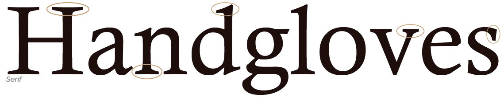
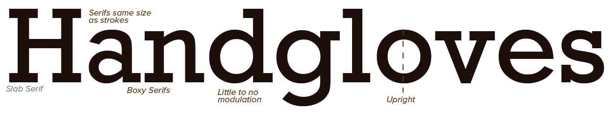
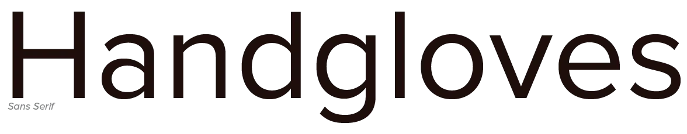
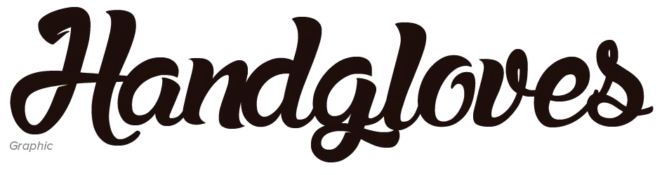
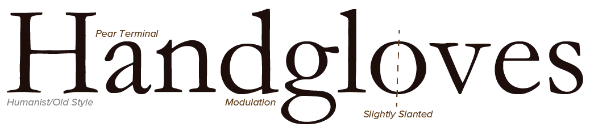
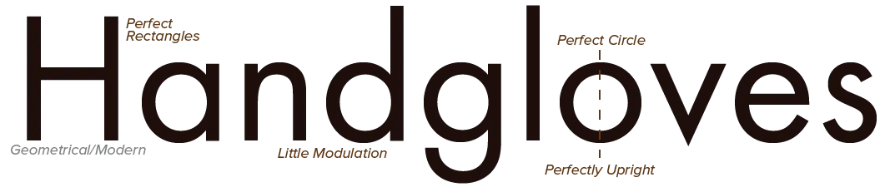
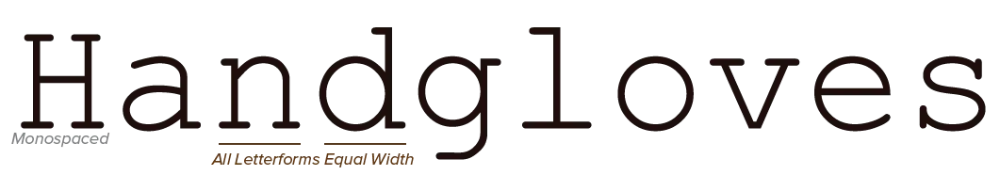
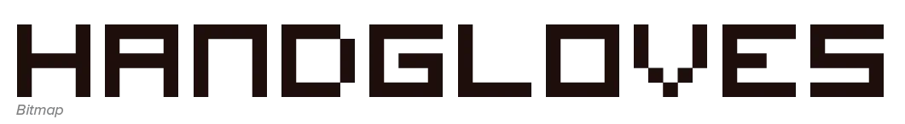
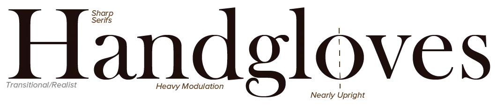

So soon in the course, we've already hit a sensitive subject! How to classify all typefaces on earth---and that's *a lot*---into a simple system. 

It's probably no surprise that a clear universal system ... doesn't exist. The classification rules below are the most common and useful, in my opinion, but they are no strict "rules".

Typefaces can be divided into the following groups: 

* Serif
* Sans-serif
* Graphic 

The first two groups are the largest and most common. They can be further categorized by their style: 

* Humanist
* Geometrical
* Transitional

> **Type Exercise:** After reading this chapter, pick a few of your favourite fonts and try to classify them! Even better, pick two fonts you think are classified the same. Try to combine them into a simple design.

## Serif

Not surprisingly, serif typefaces have serifs on their letters. Those are nothing more than any sort of decoration at the end of a stroke. Instead of just ending a stroke or chopping it off with a straight line, a serif adds some subtle ornamentation to every letter. This also increases legibility.

This makes them **the best choice** for when things are printed, displayed at a large size, or displayed on high-resolution screens.

### Slab Serif

Also called *Egyptian*. Where the serif is all about modulation, decoration, and subtle curves ... the slab serif is about being thick and boxy.

They have very little modulation or contrast in stroke width. Their vertical axis is upright, when apparant. They sport boxy serifs that are generally the same weight as the rest of the strokes within the letterform.

I love these for headlines, readability and numbers. For longer pieces of text they are overwhelming.

## Sans-Serif

"Sans" is French for "without".

So, literally, sans-serif typefaces are "without serifs". The stroke width is also more uniform and even.

This means less "clutter" and a clean look on (low-resolution) screens or small sizes. 

Yes, those serifs actually add noise---but that is a good thing! The way humans read, and how we're able to read at all, is very complex and interesting. The serifs and subtle modulation plays a key role in legibility. Every well-designed typeface has elements that nobody notices, but if you take them away, suddenly we get annoyed and can't read it as well.

{}
When I say low-resolution, I actually mean almost all digital screens. Printers are very high resolution. We print to the page, by default, at 300 DPI. But screens are way less dense than that. That's why sans-serif can look better on devices, while serif looks better when printed.
{}

## Graphic

Graphic typefaces can come from many different backgrounds or themes. In essence, though, we distinguish three categories:

-   **Script**: These typefaces look like they have been hand-lettered. Like someone is using his handwriting within the design. Should not be used too much, because of its reduced legibility. When displayed large, however, it can look stunning.
-   **Display**: These typefaces don't look like handwriting, yet display similar characteristics. They contain letterforms that are very useful for decorative purposes. Think of a unique logo or a heading with few words. Don't use for long pieces of text.
-   **Textured**: These are very rough, usually with holes or patterns within the letters themselves. Often hard to read but very atmospheric.
-   **Symbol**: Everything that's left over. These can be typefaces including only symbols or icons (instead of letters). Or letters written in a style that's unlike any of the others I've mentioned. (Like "Font Awesome": it's a font made of _icons_ so you can easily use those on your website.)

In general, graphic typefaces are more goofy, creative, unique, comical and better at attracting attention. More often than not, though, less is more.

## Humanist

Often called *old style*, it has rounded features and _very slightly_ modulated strokes. The vertical axis for all letters is slightly slanted. Terminals are pear shaped. Lowercase counters are relatively small. Sometimes the crossbar is angled, especially noticeable at the "e".

These typefaces are among the earliest created and based on *efficiency*. The forms of the letters are influenced by the human body and the nature of the pen tip.

## Geometrical

Also called *modern*. These create their letters out of basic geometrical shapes (such as triangle, square, circle). As such,they have perfectly round counters. The vertical axis is upright, and extra features (such as serifs) are hair thin. They have no modulation *or* extreme (precise) modulation. Nearly every part of every letter is geometrically rationalized.

Geometrical typefaces led to the creation of two subtypes: *monospaced fonts* and *bitmap fonts*.

### Monospaced

Monospaced fonts use the exact same width and height for all characters. This way, the content does not change how much space it takes up. This is useful when the space needs to stay constant or within certain limits, regardless of the content.

Three common uses are:

* Scripts are usually written in monospaced fonts. This way, if you have 60 pages, you know roughly how long it takes to film (or how many pages it will be in the final book). No matter what the content is. Formatting happens later.
* When programming, code editors all use monospaced fonts. This makes syntax look consistent and prevents mistakes or misreading all those complex symbols. 
* Video games often have score counters. (Like websites have visitor counters.) These need to stay on-screen, and look good in the design, *no matter the number inside*. So they use monospaced fonts.

### Bitmap

All fonts are made using "vectors". If you go inside a font file, you see each symbol is defined by _points_ and _lines_ connecting them.

Why? So that fonts can scale to any size! Without becoming pixelated! The computer just places the points further apart, draws the lines in realtime, and you have a perfectly crisp letter shape.

Bitmap fonts don't do this. They are built from raw pixels, at a fixed size.

_Why would you use an inferior system?_ Less-capable screens (such as that of cheap microwaves) cannot display those vector fonts. There might also be inconsistencies among browsers or devices, or the original font might be too big to load. If you know a font will only be used at a specific size, turning it into a bitmap version has many advantages.

## Transitional

Also called *realist* or *neo-classical*. It tries to find a balance between humanist and geometrical typefaces. The vertical axis is upright (or nearly so), the strokes heavily modulated, the serifs sharp and (relatively) visible. While not always the case, transitional typefaces often have a larger natural x-height.

They are often regarded as ordinary or "invisible". You don't notice the _font_, you only notice the _content_. This makes them ideal if you want to place all focus on the text, but can also result in boring or lifeless design.

