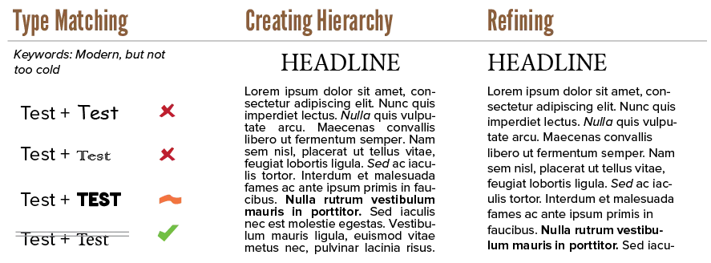

A course on typography, should obviously start by _defining_ it. Otherwise you don't know what we're working towards! Broadly speaking, typography is a design process in three stages: 

* Type matching
* Defining Hierarchy
* Refining

To show letters, you need a **typeface**: the set of symbols to display, saved inside a font file. The first stage is about finding the right typeface. One that conveys the message, mood and feeling you want. You often want multiple typefaces (or styles from the same family) that work well together in a design.

At the second stage, you use the typeface to create a hierarchy. Every piece of text has elements that are more important than others. Most articles are structured through headings, subheadings and paragraphs. That's what you decide in this stage: the size, style, weight, placement, and more for each level within the hierarchy. 

Maybe you use a thick weight for headlines, and a regular weight for body text. Or perhaps you decide to use blue italic text for comments, or red condensed text for emphasis.

At the third stage, you refine the parameters and properties of your typography to make it fit perfectly within your design. This often means slightly changing numerous values like: 

* Space between letters
* Space between lines
* Placement on the page
* Alignment of the text

None of these stages is more important than the others. Even though refining may seem quick and easy to you, or matching typefaces may seem like a breeze, they should all be executed with the same amount of care. Because even the most beautiful font is unreadable if all the letters are spaced so close that they overlap.

Knowing this, we can answer the main question. _What is typography?_

Typography is the act of using _type_, the symbols that make up the alphabet of a language, to ...

* Make information as readable as possible
* Provide a clear hierarchy or structure to the information
* Improve the aesthetics of a design
* Convey the right mood, feeling or context around a design
* Seemlessly integrate the textual elements with the non-textual elements of a design

{}
There's the ongoing joke about _Comic Sans_. It's one of the default typefaces and it looks more "playful" than the other defaults. So many people pick it, thinking it's nice and friendly. And it _can_ be nice! Comic Sans is one of the most _legible_ playful typefaces out there. 

The problem is that it has a strong mood attached to it. It has a cartoony and unserious feel. Which means using it in any other context provides friction in the design. Which means using it for longer paragraphs looks off.
{}

This course gives principles and ideas to help make the typography in your designs as strong as possible. 

It will not discuss evolution/history of type, nor give specific font recommendations or combinations.

I'm all about teaching _intuition_ and _skill_. I want you to choose a typeface because of strong reasons and principles, not because somebody on the internet told you to "use typeface X and Y". 

So let's get started!