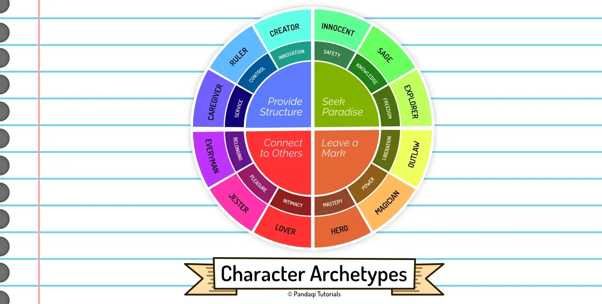

Earlier, I mentioned how most people _roughly_ fit into one or multiple stereotypes. A while ago, Karl Jung formalized these into 12 Archetypes. Below I'll give a short overview of the archetypes, their strengths and weaknesses, and their general role in stories.

Whenever you're stuck inventing characters, you can use this list as a guide. Pick a different archetype for each character, and try to stay true to it.

To keep things simple and bite-sized, I split the archetypes into 3 sub-categories.

* Ego: those who are able to discard their ego and live in service of others.
* Soul: those who have a passion in their soul and let it rule them.
* Self: those who are mostly occupied with developing themselves.

## Ego Types

### Innocent

**Goal?** Be happy.

**Fear?** Being punished for doing something bad or wrong.

**Strategy?** Do things and do them _well_.

**Strength?** Belief and optimism.

**Other?** Utopic, traditional, naïeve, mystical, holy, romantic, dreamer.

### Everyman

**Motto?** Everybody is equal.

**Goal?** Belong. Make connections with others.

**Fear?** Feeling like an outsider, separating yourself from the crowd.

**Strength?** Be down to earth.

**Talent?** Realism, empathy, lack of pretentiousness.

**Other?** A good neighbor, the silent majority, the realist.

### Hero

**Motto?** Where there is a will, there is a way.

**Goal?** Capability and expertise that helps improve the world.

**Fear?** Showing weakness, being vulnerable.

**Strategy?** Train and work hard to become as _strong_ and _capable_ as possible.

**Strength?** Competence and courage.

**Weakness?** Arrogance, overconfidence

**Other?** Fighter, savior, superhero, soldier, dragon slayer, winner, team player.

### Caregiver

**Motto?** Love thy neighbor (like thyself)

**Goal?** Help, protect or care for others.

**Fear?** Egoism and being ungrateful.

**Strategy?** Do things for others.

**Strength?** Compassion, generosity.

**Weakness?** Being exploited or taken advantage of.

**Other?** Holy, altruist, parent, helper, supporter

## Soul Types

### Explorer

**Goal?** Experience a beter, more authentic and more satisfying life. (The freedom to discover who you are by exploring the world.)

**Fear?** Conformity, feeling hollow inside, being restricted.

**Strategy?** Travel, seek new things to experience, escape boredom or normality.

**Strength?** Autonomy, ambition, staying true to their soul.

**Weakness?** Wandering, never finishing something, being without purpose, called a "misfit"

**Other?** Seeker, wanderer, vagabond, individualist, pilgrim

### Outlaw

**Motto?** Rules exist to be broken.

**Goal?** Reject or destroy what doesn't work.

**Fear?** Being powerless or ineffective.

**Strategy?** Disrupt, destroy or disband.

**Weakness?** Crime, taking things to an extreme, switching to the dark side.

**Other?** Rebel, criminal, terrorist, extremist, disruptor

### Lover

**Goal?** Intimacy and experience. Maintaining satisfying relationships with the people they love.

**Fear?** Being alone, being called a wallflower, being unwanted or undesirable.

**Strategy?** Increase attractivity both physically and emotionally.

**Talent?** Passion, gratefulness, appreciation and devotion.

**Other?** Partner, friend, intimate, enthusiastic, sensualist, teambuilder, significant other

### Creator

**Goal?** Create things of lasting value. Innovate. Realize a vision.

**Fear?** Not leaving anything of value behind. Not being good enough or producing good enough work.

**Strategy?** Develop artistic control and skill. Create culture and express their vision.

**Strength?** Creativity and imagination.

**Weakness?** Perfectionism, lack of realistic worldview.

**Other?** Artist, inventor, innovator, musician, writer, dreamer.

## Self Types

### Jester

**Motto?** You only live once.

**Goal?** To have fun in the moment. To have a great time as they're alive and light up the world.

**Fear?** To be bored, or to bore others.

**Strategy?** Play, make jokes, be funny, try silly things.

**Strength?** Joy.

**Weakness?** Frivolity, wasting time, taking things too lightly or joking at the wrong time.

**Other?** Joker, fool, deceiver, imposter, comic, 

### Sage

**Motto?** The truth shall set you free.

**Goal?** Find truth and knowledge. Use intellect and analysis to analyse the world and understand it.

**Fear?** Being deceived or misled. Or ignorance.

**Strategy?** Searching information and knowledge. Self-reflection and understanding of thought processes.

**Strength?** Wisdom, intelligence.

**Weakness?** Inability to act. Everything happens in the head, endless studying, but no practical action.

**Other?** Expert, academic, detective, advisor, thinker, philosopher, researcher, planner, professional, mentor, teacher, observant

### Magician

**Motto?** I'll make it happen.

**Goal?** Understanding the fundamental laws of the universe. Use it to make dreams come true.

**Fear?** Unintended negative consequences to this search.

**Strategy?** Develop a vision and live accordingly.

**Strength?** Finding win-win solutions.

**Weakness?** Become manipulative or power-hungry.

**Other?** Seer, catalyst, inventor, charismatic leader, shaman, healer, medicine man.

### Ruler

**Goal?** Control. Creating a succesvol and prosperous family or community.

**Fear?** Chaos. Being overthrown.

**Strength?** Responsibility, leadership.

**Weakness?** Being authoritarian, no ability to delegate or trust others to do tasks.

**Other?** Boss, leader, aristocrat, king/queen, politician, role model, manager, administrator.

## Another approach

Below is an image of the archetypes. It groups them into four categories based on another category. It's up to you which explanation you like more and want to use (the one above or the image). They're about the same archetypes!

## Now write!

Pick a few archetypes. Turn them into characters, then write the story around them.

As with all these challenges, the goal is not to write a full novel. It's not even to write a _good_ story. The goal is just to experiment with applying this tool to a (very) short story. To see if it works for you. To help memorize the different archetypes or at least get an intuition for them.

As you see, all the archetypes have strengths and weaknesses, innate goals and fears. These immediately present opportunities for challenges and limitations. For flaws that they might need to overcome.