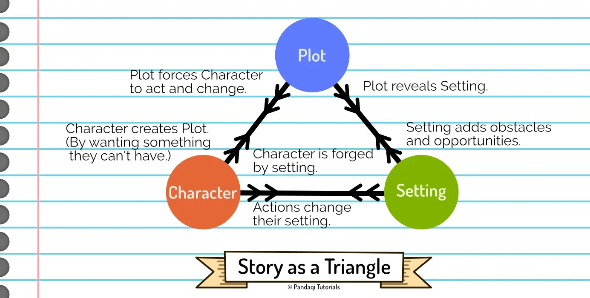

Welcome to the course on _Character_! In this course, I'll give you all my tips on how to _invent_ great characters for stories, but mostly how to _write_ and _develop_ them. Inventing characters is the slightly easier part. You can pick properties at random, or a personality that you think is awesome and interesting. In theory, any character can work.

The hard part is _writing_ them and _integrating_ them with your story. A character only works if the audience understand them deeply, care about them, feel their emotions. That only works if you're able to realistically show who that character is, in both good and bad times, throughout the whole story. 

Just telling people that "James was strong and handsome!" won't work. An amazing character is wasted if the plot or setting does not challenge them at all. But the right character in the right story? Magic.

### How this course works

Below is a general overview of this course.

* The first few chapters explain what I mean with "character". They also give some basic principles that, in my view, always hold true.
* The rest of the course merely gives **possible character tools** and asks you to write a (short) story with each one.
* (The final chapters give answers to common issues or questions I get a lot.)

The only way to get better at writing, is by _writing_. A lot. Writing and experimenting with different structures or pieces of advice. That's why most chapters simply present **a** possible way of looking at characters. (Similar to courses that teach formulas for how to construct your plot, such as the famous Hero's Journey.) Then the chapter asks you to take this new advice and write a story from it. This cements the advice in your brain and gives you an intuition for when it works and when it doesn't.

### Before you start

If you haven't already, I suggest reading the [Storytelling](../../storytelling/) course first. Character cannot stand on its own. It's impossible to explain my best tips for character _without_ also dealing with plot or setting. The image below shows how stories are an intersection of those three parts.

That's why I wrote that practical course that covers the basics of all elements at the same time. Courses such as this one, focusing on _one_ aspect of stories, are bonus tips and challenges once you're done with Storytelling. The Storytelling course already links to this one (for further reading) whenever applicable!

Let's get started!