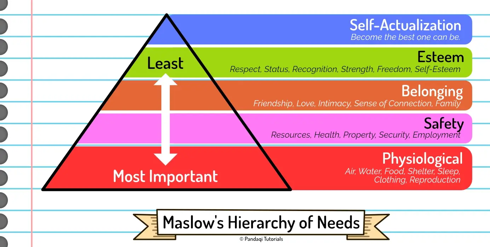

The approach below merely tells you to ask _five_ questions of each character to really nail them down. These questions are designed to identify your main character's arc. To determine what your hero wants and how they will change while pursuing this desire.

## The five questions

The questions are based on the very common idea that every good story is actually two stories. There's a story which contains most of the action and events, created by the character's main goal ( = their "want"). But while that's happening, there's another story that reveals what the character's goal actually should be ( = their "need").

The "want" creates the exciting plot. The "need" creates the deeper, emotional meaning. The other questions are a direct consequence of that and usually answer themselves once you have the want and need.

{}
A character might _want_ to be a millionaire. But as they pursue the goal, they actually realize they _need_ meaningful relationships in their life, not more money.
{}

The questions are ...

* What is their **want**?
* What is their **need**?
* What is the **lie** they believe?
* What is the **truth** they must realize? (They can accept or reject it once realized.)
* What is their **ghost**? (Past trauma that created the elements of previous questions.)

If you can answer these, you have a solid base for your character. 

{}
Let's extend the previous example. A character wants to be a millionaire, but actually needs to realize that they need something besides money.

What would be the lie they believe? That money will lead to happiness.

What is the truth they must realize? That meaningful relationships in their life will lead to happiness.

Now, _why_ do they believe this? What is their ghost? Maybe they grew up poor, with many negative consequences and events, causing them to become depressed and fearful. They decide that money would solve all their issues. That's the ghost they carry on their back at the start of this story.
{}

## Where do I find a "need"?

There isn't a "great list of all the needs in the world", of course. The most useful method I've found is to use the famous _Maslow's Hierarchy of Needs_.

Needs at the bottom are most important and must be regularly fulfilled to even survive. As you go higher, the needs become more advanced and less crucial.

The image below gives specific examples of each which you can directly use.

Also realize the following two take-aways.

* If somebody's basic needs are not met, it feels silly to need something more advanced. Say you have a character who lives in a dystopia and must struggle for food each day. Their need for survival and sustenance will _overpower_ their need for friendship, love or anything above it. You will have a _hard_ time making readers believe a story if this character chases a silly need.
* The basic needs are the most primal and powerful. If you don't have the time (or skill/motivation) to properly set up a character's wants and needs, go for a _basic need_. Threatening somebody's life is a fast and easy way to get tension and story. Threatening to take away somebody's dream career takes more setup to have readers empathize.

## A similar approach

Some time after writing this article, I found another set of 5 steps that is similar to this. I thought it was an interesting alternative and wanted to mention it.

How do you create an interesting character?

* Give them something to want.
* Give them something to hide.
* Give them something to fear.
* Give them something to obsess over.
* Then hurt them.

It's perhaps a more practical and intuitive way of designing a character for some people. When asked "what is the character's need?", you might be stumped and unable to come up with anything. When asked "what does the character fear?", you can probably list a great number of possible fears.

## Now write!

Write a story where each character is created by answering the five questions above!

Notice how these questions dig deep into the _core_ of the character. They say nothing about small details (like appearance, clothing, objects they carry, magical powers, etcetera). Those details should come naturally once you have the core. Once you know the beliefs and the backstory of a character, you can think a bit further and realize how that would influence their appearance or personality.