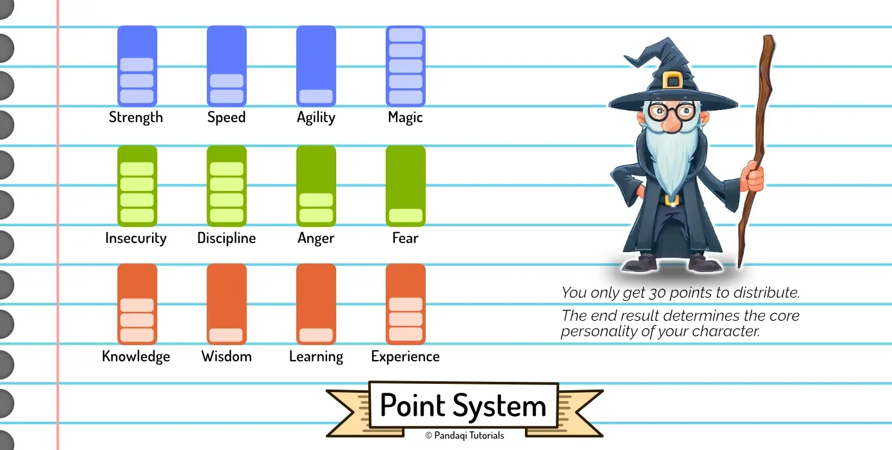

Last chapter, we discussed the method of the three sliders. This was already a very "logical" or "numerical" approach to building characters.

This final challenge chapter (of this course) takes this to the extreme: **the point system**. It is based on the way computer games often handle character. For example, many games give you X points to distribute (when you start, or when you level up) across many different properties of your character. Maybe there are 10 things to improve, but you only get 3 points. This means you _have_ to specialize your character. They must be really good at some things, and absolutely terrible at other things.

Well, this technique is _that_, but applied to the characters for your own story.

## Determine your properties

To use the point system, first determine a set of **properties** on which you can rate characters.

When I was young, I used the _very rough_ approach of three properties: physical, emotional, and intelligence. While this gives a nice start, it's far from enough for the point system.

Instead, you want to expand these three into more specific properties. This partially depends on your _story_ and the specific skills or attributes that are relevant. 

{}
If you write a fantasy story with lots of magic, you want to rate your characters based on skill or knowledge of said magic. In any other story, adding those properties to the point system would literally be useless!
{}

I might say ...

* **Physical**: Strength, Speed, Agility, Magic Ability
* **Emotional**: Insecurity, Discipline, Anger, Fear
* **Intelligence**: Knowledge, Wisdom, Learning Speed, Experience

## Determine your values

Once you have your set of properties, determine their values for each character!

A good rule of thumb is to give characters only _half_ the points they need. Say you have the 12 properties mentioned above, and they each go from 0 to 5, then you give each character 0.5 x 12 x 5 = 30 points to distribute.

This ensures they can't just be good at _everything_. It also ensures you can add a lot of variation with how you fill in the details. As always, _contrast_ is key. A character who is equally average at everything is usually boring and unhelpful for the story. (If you include one, make it only _one_, and make them being an "average joe" a point on purpose.) Instead, give them high highs and low lows.

{}
A typical "fighter" or "soldier" character will have very high marks (4 or 5) in all the physical traits. That naturally means they only have ~10 points left to distribute across all the other traits! Which leads to interesting limitations for the character.

But this technique goes further than generalizations, that's the strength of it. You can make many different _types_ of "strong" characters. For example, you can make them strong through magic only. This frees up a lot of points to add to other properties, so you might get a "really wise and capable, but insecure, wizard". 

Or you can make them physically capable through agility only. You might get a "very experienced and disciplined ninja, who is quick to pick up new skills".
{}

Now, you might wonder if it's wise to mix "positive" and "negative" properties. (For example, more fear is seen as bad, while more discipline is seen as good.) And yes, you can make your life a little easier by making all the properties traits that are generally seen as positive. This means adding more points to a trait will always mean the character is _better_ and more _capable_ at something.

However, the whole idea of stories is to _investigate_ whether something is good or bad. Feeling fear has a _function_, and thus can be good. (If you don't fear anything, you might get into needlessly reckless or dangerous situations and kill yourself.) Being disciplined has both bad and good sides. These are just _properties_, and characters can have _more_ or _less_ aptitude for them.

That's why I think you get more unique and compelling characters by mixing a wide variety of properties.

## Creating arcs

Similar to previous chapter (about the three sliders), the point system provides a very easy way to give characters arcs: you simply **add** or **remove** points over time.

{}
A character that starts out with no physical prowess, might grow stronger throughout the story. Each time they do, they get an extra point for one of those properties. 
{}

{}
A character who serves to learn information and solve a mystery, will slowly gain points on the "knowledge" property.
{}

If you want a truly _positive_ character arc, you will mostly add points. If you want a truly _negative_ one (like a tragedy or fallen hero), you will mostly remove points.

I am a big fan of gray characters, so I mostly _redistribute_ points. I take one away somewhere else, and add it to another property.

## Now write!

Invent a set of 10-15 properties suitable to _your_ story. (Or use my properties, if you want.)

Give each character half the points needed (maybe even fewer) and distribute them across the properties.

Turn the result into a coherent, logical character. (There are still many ways to interpret a "very strong" or "very wise" character. Especially when combined with other traits they have or lack, you still need that extra step of turning the numbers into actual personality.)

Now write a story with these characters!

This ends the chapters with "character tools" and practical (writing) challenges! The last few chapters of this course answer some common questions or resolve some topics I couldn't place anywhere else. 