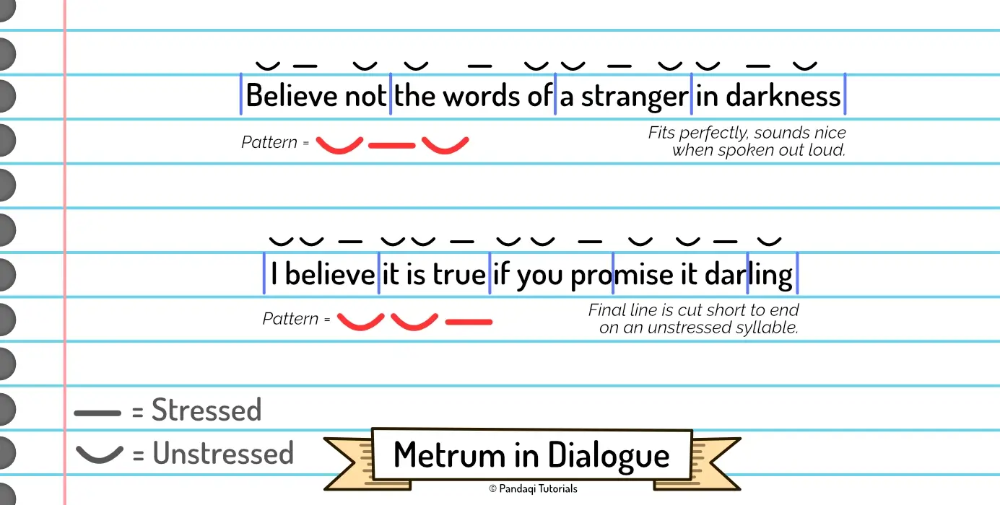
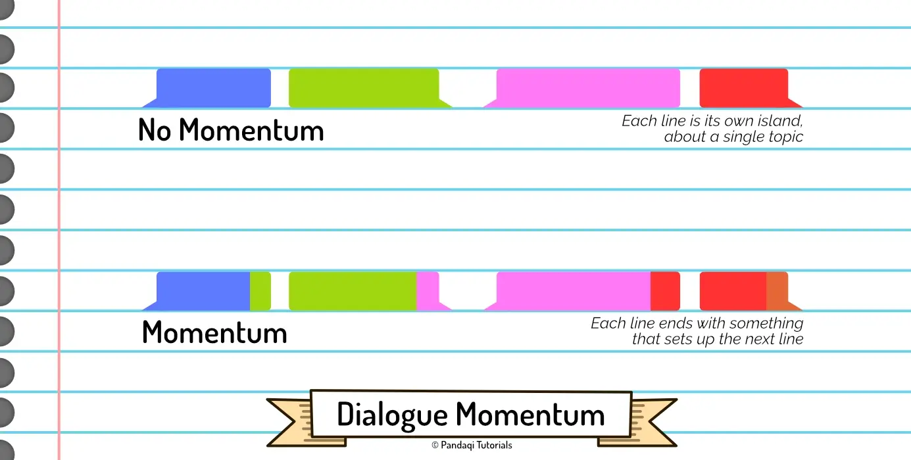

All chapters until now have talked about what to put in your dialogue (or what to leave out). It's about the (general) content of the dialogue.

This chapter will be about tiny changes you can make, such as rephrasing or picking synonyms, to help the dialogue _sound_ good. How to add a rhythm and flow to your dialogue. This will make it feel like music or poetry, if the dialogue is actually spoken (such as in a film or audiobook). But even when read, the reader benefits from dialogue with momentum and flow behind it.

## Repetition

If you listen to famous speeches, you'll hear a lot of repetition. The example below is from the famous "I Have a Dream" speech by Martin Luther King.

{}
“So **let freedom ring** from the prodigious hilltops of New Hampshire. **Let freedom ring** from the mighty mountains of New York. **Let freedom ring** from the heightening Alleghenies of Pennsylvania. **Let freedom ring** from the snowcapped Rockies of Colorado. **Let freedom ring** from the curvaceous slopes of California.”
{}

This is technically called "parallelism" or anaphora, as it's not an exact repetition. 

The repetition can occur as often as you want, though it often comes in threes. (Because saying something once or twice is not a pattern yet. But saying something 4+ times quickly runs the risk of becoming annoying.)

Such repetition gives your dialogue a nice structure and rhythm. The same way songs repeat melodies within themselves, and song lyrics almost always _rhyme_. (Which is just repeating a word with the final sound changed.)

{}
In fact, if you want to really learn about rhythm in your dialogue, I suggest you study speechwriting in more depth.
{}

That's the first trick. Structure the dialogue so that one part---the most crucial part---can be repeated a few times.

For another example, take the speech from Aragorn at the end of Lord of the Rings. Amazing scene.

{}
“I see in your eyes the same fear that would take the heart of me.

A day may come when the courage of Men fails, when we forsake our friends and break all bonds of fellowship, **but it is not this day**.

An hour of wolves and shattered shields when the Age of Men comes crashing down, **but it is not this day**!

This day we fight!

By all that you hold dear on this good earth, I bid you stand, Men of the West!”
{}

## Symmetry

A related trick is to have a symmetry to your dialogue. You start talking about something, then expand on it, then circle _back_ to the topic with which you started at the end. Sometimes, this symmetry is imperfect: at the end, your statement about the topic has slightly changed.

This adds a nice cohesion and flow to the dialogue. It's very similar to the repetition above, but I still wanted to mention it.

{}
"I did not ask for your help. You've been a nuisance, getting in my way, stumbling and mumbling your way into trouble, taking away whatever agency I had left---and I did not _ask_ for any of it!"
{}

## Literary Tricks

Last example sneakily used another trick. "Stumbling and mumbling", which obviously rhymes. There are many, many literary tricks like this. Simple techniques that make a line of dialogue sing just a little more.

All of those, however, are discussed in my course on [Prose](../../prose/). It's a long list. Don't try to memorize it, just refer to it whenever you're looking to spice up some dialogue.

You do not want to apply these all the time. At the very least, however, forcing such a trick into the dialogue can be a way to _challenge_ yourself to rephrase it into something better.

## Metrum

One such trick I did want to cover explicitly, is the _metrum_ (or _meter_).

> A metrum is a simple "rule" that the syllables in your line must follow.

If you listen to a lot of music, and especially if you _make_ music yourself, you'll naturally have a good ear for this. Again, I don't want you to memorize such rules and consciously apply them to _every line of dialogue_. It would be exhausting and overwhelming!

Instead, once in a while, take a few crucial lines of dialogue and try to apply a meter to them. Over time, this practice will seep into your brain and cause you to _subconsciously_ come up with dialogue that follows such rules.

So, how does it work? 

* You invent a pattern.
* This pattern tells you _how many syllables_ the line can have.
* But also where the _stressed_ syllables should fall.

### An example

For example, the word "computer" stresses the syllable "pu". The word "away" stresses "way". Single syllable words can be stressed or unstressed, depending on what you choose.

Now you can pick a pattern. A common one is the simple "yes no" (stressed unstressed).

* The line should have a number of syllables that's a multiple of two. (Otherwise the pattern won't fit.)
* And any time the pattern repeats, the first syllable should be stressed.

A line that does _not_ fit would be: "Keep your hands off of my computer!"

A line following the metrum would be: "Stay away from my computer!"

Now, this is a bit subjective, but I think the second line reads much more easily.

Another line that doesn't fit: "Don't pretend like you know everything, Tom!"

And now a version that does fit: "Don't pretend your knowledge has no bound, Tom!"

{}
The only requirement I'd say is always true, is that the final syllable of the line should not be stressed. It would feel like the sentence was abruptly cut off or left unresolved. If you need to modify your pattern on its final repetition to accomplish that, so be it.
{}

### A visual example

## Keep the momentum

Again, I think it's wise to compare dialogue to songs. Good songs usually have _momentum_. They slowly build towards the chorus or bridge, going faster and faster over time. A common mistake for beginning songwriters is that they add "dead spots" in their songs, where the music just pauses, or there's no clear transition into the chorus.

This idea of _flow_ or _momentum_ is equally important in dialogue. You don't want character A to ask a question, character B to answer, and then ... silence. The momentum has stopped. There's nowhere to go from here. The question has been asked, the answer given, and that's it. The dialogue is dead.

How do you prevent this?

In the [Plot](../../plot/) course, I introduce a technique called "improv plotting", also known as "yes, and" or "no, but". The idea is that you can always keep a scene going by ...

* Responding to what came before ("yes" or "no")
* But then adding _a little extra_ ("and" or "but")

A dialogue with momentum will see characters respond in meaningful ways to what came before, but then adding something new to keep going. (A new question, surprising information, a twist.)

Or, if you want a more concrete example, check the two conversations below.

{}
BAD: "Did you go to the party yesterday?"

"Yes."

"How was it?"

"Fun."
{}

{}
BETTER: "Did you go to the party yesterday?"

"Only for an hour or so. Why weren't you there?"

"Something came up. Did I miss anything?"

"Something serious?"
{}

As you see, this technique has the danger of making your dialogue convoluted. People respond and then ask _another_ question, basically creating multiple threads within the same dialogue. You can avoid this by only having people respond to what matters. 

In the example above, they already indicated the party wasn't that fun, so "did I miss anything?" is just ignored. It also shows they care about the well-being of the other, immediately asking if it's serious.

A better approach, however, is to only apply this technique when necessary. If dialogue is interesting enough on its own---creating intrigue or questions naturally---there's no need to overcomplicate it.

## The banger ending

Finally, there's a trick I've learned about the _order_ in which you reveal information.

In school, you were probably taught to move the point of a paragraph to the _front_. 

* You'd start a new paragraph with something like "Studies show that pollution has increased."
* Then the rest of the paragraph would _explain_ that sentence, with examples and more details.

This is great for non-fiction! It leads to maximum clarity.

But for maximum tension and interest? Move the point of the dialogue to the _back_!

* Start by telling a story, providing details, going off on a tangent.
* Which culminates, at the end of the dialogue, into the actual point somebody wanted to make.

{}
"And where were you, eh? Hiding in your room?" Sarah asked as she slammed the door shut. Her face was covered in blood, her body falling over from exhaustion.

James sat in the corner and looked away. "A year ago, my best friend died, fighting for their country. Two weeks ago my father died protecting a national secret from those terrorists. Everybody I cared about is dead. What was I doing? I was _staying alive_."
{}

By reversing the order, you keep tension and intrigue all the way from the start to the end. You can sneakily add lots of information and backstory without boring the reader: they want to keep following the dialogue to arrive at its final conclusion.

So make sure that conclusion is a strong line that resonates. As I said before, a line that potentially says "this conversation is DONE". If you're going to spend time refining the rhythm and sound of a sentence, spend it on those _final sentences_.

Those should have an impact. Those are what you want the audience to remember.

I've found that such memorable lines are commonly the intersection of two properties.

* **Unexpected**: they _stop_ the flow of the conversation or go _against_ it. That's what makes them stand out, that's what signals the conversation is now DONE.
* **Specific**: they're not some abstract statement or a line that could fit in almost _any_ scene. They're very specific to the situation and the character who says it.
