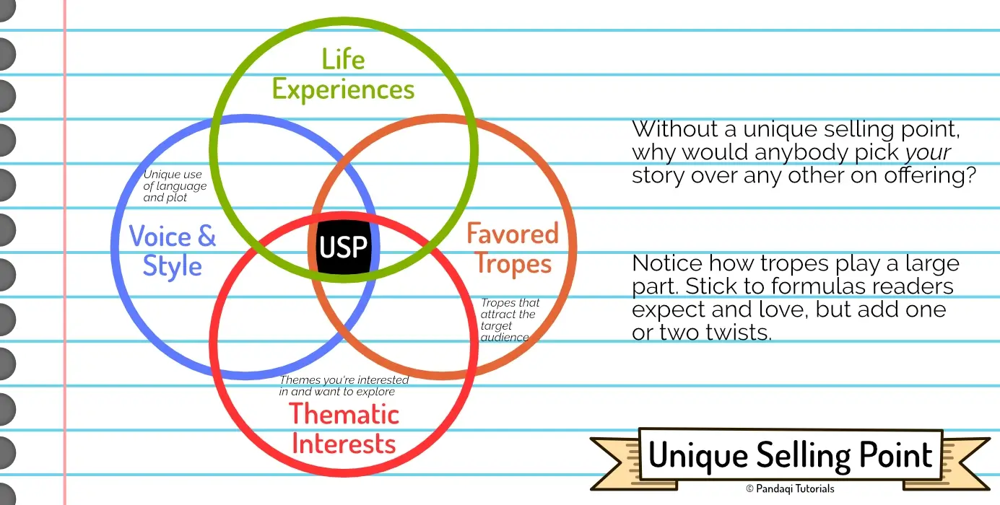

This article contains some advice or common mistakes that writers make with their first chapter (or first scene). Most authors, including me, will tell you that the first chapter is absolutely the most important one in your novel. This may sound extreme, but I really believe it is true. 

Anybody who considers buying your story, will start reading the _first chapter_. They'll only buy the book if that chapter satisfies them.

Throughout this course I've talked about Promise and Payoff numerous times. Your first chapter will always be the _promises_ you make to the reader, and the rest of the novel is basically trying to _deliver_ the promises from chapter 1. Well begun is half done.

That's why I think it's worthwhile spending more time and effort on your _first_ chapter than other ones.

{}
The same is obviously true for any other medium: screenwriting, theatre, music, whatever. The first few seconds or minutes of the piece should be what hooks the audience and communicates they don't want to miss this. Nobody thinks "hmm, wonder if I'll enjoy this song, let's listen to a random bit at minute 1:30"
{}

## About first sentences

Many great stories start with a rather mundane first sentence or paragraph. Not something to hook the reader, but something to set the scene for the first chapter. (It's actually preferred to give setup and setting as soon as possible, as I explained in [Opening & Closing Scenes](../opening-and-closing-scenes/).)

Clearly, this is not the end of the world. Your first chapter as a _whole_ should hook readers, not just a clever first sentence.

Nevertheless, I always challenge myself to find a _great_ first sentence. Why?

* It always helps. It communicates to the reader that you really tried to make this an amazing story, from sentence number one.
* It forces me to find one sentence (maybe one paragraph) that distills the _essence_ of the story. A sentence that communicates _why_ this story is going to be fun.

Usually, the first sentence or paragraph does the following.

> It states something **ordinary** (to set the scene, to feel familiar), but with a simple twist to the **extraordinary**

The extraordinary thing should be what makes your story special. A promise of what's to come.

{}
"It was raining on the day I asked my friends to fake my death."

A pretty ordinary statement, everybody knows rain, and then---woah, fake your death!?
{}

{}
"My house was big, old, and currently on fire from a dragon attack."

A description of the setting for the first chapter, oh it's on fire---woah, dragon attack!?
{}

## First chapter as a mini-story

From my experience, this works best in most stories. (I've seen this technique countless times in popular films and novels, and used it successfully in my own work.) At first glance, though, it might sound counterintuitive.

> Structure your first chapter(s) as a mini-story. Once done, forget about that, and start the actual story.

I've called this "start it and forget it" for a while. Your first chapter tells a mini-story, with a promise, progress and payoff. You can invent _anything_ for this! Make it as interesting and awesome as you can! 

Because once the first few chapters are done? You've hooked the reader into the story. The story can forget most of what happened, and actually start. The reader, now hooked, will continue reading and be patient enough for a slower buildup or more information.

In a sense, this mini-story _promises_ the reader that you know how to construct a good story. Yes, your first chapters are almost entirely _marketing_ for your story. Your first few chapters, which are often free to preview, should sell the longer story to readers.

But not just any mini-story will do, of course. Something _completely_ unrelated that never returns, is unsatisfying (and promises the reader the wrong thing).

Instead, your first chapter should ...

* Convey **tone** and **theme** above all. If you need to invent a tangentially related mini-story for that, do it.
* Have some elements (such as the hero, or the magic system, or a conflict) that are not forgotten---that **will** become part of the larger story.

{}
The first _Indiana Jones_ movie starts with him stealing an idol. You see him _in action_. This scene conveys the general feeling, mood and genre of the story. It's fun, full of action, and introduces our main character in a proactive way. But once the scene is over? It's barely relevant to the plot. That opening scene only existed to convey tone and theme---and that's why the film works so well.
{}

{}
Or take _The Dark Knight_ (second film of Nolan's Batman trilogy). It starts with a long sequence in which a bunch of criminals, with Joker masks, rob a bank. It's tense, it's full of action, but most of all it sets the _tone_ and _theme_! It communicates that this is a movie about crime, about the Joker, with similar action set pieces.

Because once the robbery is over? It barely matters to the story. The real story only starts _after_ that opening sequence. And The Dark Knight is also one of the most beloved films of all time.
{}

{}
Or let's invent something around a Romance. The first few chapters see our hero quickly falling in love, going on a date ... and then having a terrible experience and going back to zero. In one or two chapters, you've clearly showed the reader the genre, tone and themes this story will have. Afterwards, the real story can start.

The crucial bit, however, is that you can't 100% forget the opening. Of course not, that would make it completely useless. As such, there should be _one_ clear consequence to this opening mini-story that informs the rest of it. Maybe the hero is hurt by this bad experience, which makes them more reserved. Maybe their date is still in love and tries to win them back throughout the whole story. _Some_ element needs to be continued.
{}

## Unique Selling Point

Yes, even more marketing! Hopefully, I've slowly convinced you that the first chapter is all just marketing and trying to persuade your audience to give your full story a shot.

* Find the thing that makes your story **unique**. Why the reader should pick this one over the many others.
* Now make the reader **care** about that. Show them a hero (or an idea) that is worth caring about.
* And, at least in the first chapter, _heavily lean into_ those unique aspects.

Making the reader _care_ is something discussed more in the [Character](../../character/) course. But a good summary is that your main character should elicit empathy, and be relatable while also showing they are capable or an "ideal" to strive for.

To help find your unique selling point, check the intersection of four different areas: 

* Your personal voice or style
* Your life experiences
* Favored tropes (recurring elements in stories or genres that people really enjoy)
* Thematic Interests (themes that interest you)

This mixes things that are unique to _you_, with things that people generally like in stories. It's a great way to at least get an _idea_ of possible USPs.

## An example of doing it wrong

One of my (much) older Dutch novels had a terrible opening. I spent most of the time focusing on making the _whole_ story as strong as possible. I tweaked the ending, rewrote parts in the middle which were okay but could be better (or so I thought), and so forth.

But the start? I couldn't change that easily and thought it was "fine". So I barely focused on it. The result was a really strong story ... with such a boring start that the book did not sell well. So nobody actually _reached_ the good parts!

What was the boring start?

* A chapter at midnight. Hero A cannot sleep, reads a disturbing online message threatening somebody, and phones a friend to see if they can figure out who made the threat.
* Another chapter at midnight. Hero B cannot sleep, looks out the window (and sees that hero A is awake, because light is on). He gives some backstory about how he secretly maintains a blog slandering his own father, the major, then the chapter ends.

Yeah, not great, is it? It sets up the characters and coming conflicts really well. That's why I initially wrote it. Hero A is searching for a hacker who threatens people for dissenting opinions, while hero B's blog is quickly revealed and they must deal with the consequences.

But in hindsight, I should've completely rewritten the first 5 chapters to allow immediate conflict and action. My story really starts _after_ those first two chapters.

Having one person "wake up" (or being unable to sleep) at the start of a novel is a deadly sin. Doing it _twice_ is just asking for trouble.

## Common Mistakes

If you've read this whole course, you've already seen most of these. But here's a full list that's easy to use as a "checklist" after writing your first chapter.

These are **mistakes**, so avoid them or find better solutions.

**Sloppy Prose.** Prose is often likened to the clothing that your story wears. First impressions count and will taint everything after it. As such, bad prose immediately sends a bad signal and will turn away readers from an otherwise good story.

Make no mistakes. Don't present a wall of text: use copious amounts of whitespace, start a new paragraph often, maybe prefer a bit more dialogue in the opening. Do not tell things that haven't happened ("oh, it was all a dream!") or the narrator cannot know.

**False Promises.** Remember Promise, Progress, Payoff. If the first chapter promises one thing, and then you deliver another, it is unsatisfying. In a sense, you are "training" your readers how to read your story in the first chapter. Training them what to expect and how to think about the events.

How to mess this up?

* Get the audience invested in the wrong character. (The very first character we meet is assumed to be hero.)
* Wrong tone, theme or emotion. (A very grim opening to an otherwise lighthearted book.)
* Not foreshadowing or setting up the main conflict.

**Starting too Early.** Think back to my example earlier. My story had a bad opening because it started with chapters showing a pretty "normal day" for the characters. Their life only became abnormal around chapter 5. This means I started the story too early: before it actually gets interesting. 

(Of course, starting a story early and showing their regular daily life _can_ work if their daily life is really interesting!)

**Meaningless Action.** Now, many writers think they should start with _action, action, action_ to hook the readers. But action is only interesting if we understand _why_ it happens and _who_ we should root for. If you start with action, make sure you it is _meaningful_ action.

The action itself is never enough. It should develop and explore character, then lead to change or progress. A first chapter with action should _show_ the hero's flaws and traits, build sympathy, then kick off the plot by how the action resolves.

**Information Overload.** Similar to meaningless action. Information about your world or story is only interesting to readers _after_ they are invested in the hero and the general idea. How your magic system works, or the geography of your land, does not matter until a reader _wants_ to know about those things because they're invested.

Certainly do not start with information. In general, spread information in tiny bits throughout the story. Only give essential (or most interesting) information in the first chapter. And _if_ you decide to give information, make it self-contained. Pick one aspect, one place, one thread, and focus entirely on that in the opening.

(If you look for this, you'll notice that many stories wait very long to tell you pretty core concepts of their world. That's fine! _You_ probably have thought about your world and story for a long time, and are eager to tell the reader all the details. But the reader is quickly overwhelmed and is okay with learning new details much later on.)

**No Inciting Incident.** There's some debate about this term, but I use it to describe the _first_ event that kicks off your story: that's the inciting incident. And, in my experience, it should definitely come at the end of your first chapter. I wrote several stories that needed multiple chapters to "set up" the inciting incident (usually 2), and that never worked as well as rewriting it to happen in the first chapter.

It's related to "starting too early". If your first chapter ends, and the story has not clearly kicked off, then we could have started later, couldn't we? (It's fine if this makes the first chapter a bit longer than others, that's more common than you think.)

## Conclusion

Hopefully this gives a clear image of how to write a strong first chapter.

* See it as marketing. Promising the reader what's to come and that you can write a good (longer) story.
* Challenge yourself to find a great first line/paragraph.
* Write a mini-story to set _tone_ and _theme_. You're allowed to mostly forget it once done, as long as you continue _one_ element from that mini-story.
* Ensure you have a unique selling point and it's clearly communicated.
* Prevent all the pitfalls.

A strong first chapter makes everything after it easier. Without a strong first chapter, it doesn't matter how good your story is, because nobody will reach it.

It's fine if you don't get this the first try. Many authors write their whole story, and then go _back_ to the first chapter to rewrite, because now they know what it _should_ promise.