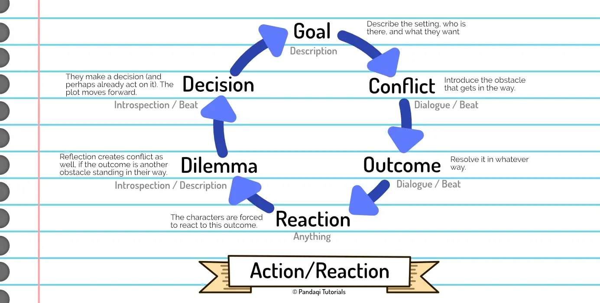

Inventing a great plot is obviously not the same as actually _writing_ it. With words, on the page, to actually put it in book form.

To do that, you'd use [Prose](../../prose/). As expected, it's a completely different topic and I wrote a separate course about it. It starts by explaining techniques for getting the story _in your head_ into a story _on the page_. After that, it provides numerous tips and tricks for rewriting that prose into something sharp and professional.

That course also explains the four types of prose you actually have at your disposal:

* Dialogue
* Beat / Action
* Description
* Introspection / Thoughts

Still, I wanted to give _some_ practical advice you could immediately use to get your plot on the page. A good _general_ idea or framework I've learned for this, is the **scene/sequel** cycle, otherwise called **action/reaction**. (Or as I like to sometimes call it: **doing/thinking**)

## Action/Reaction

At the start of this course, I already explained how plot is just the same cycle of "action-reaction" over and over until the end. 

Usually, one chapter or scene represents _one_ such cycle. (Something important happens and the characters immediately react.)

At other times, you might split it into two or three scenes. (Something important happens. Later, the characters consider it. Even later, they make decision and react.)

But if you look at (good) stories, the cycle is really only broken once a character dies or becomes incapable of acting / reacting. If you break it for any other reason, it's unsatisfying and destroys any momentum your story has.

How does this relate to prose? Well, the different steps of the cycle tell you what _type_ of prose to use. What _type_ of language or ideas to consider at this point in the scene.

Notice how the right side (first half of the scene) has a quick setup and then immediately dives into story and action, while the right side (latter half of the scene) is about reflection and formulating the reaction. Which allows the scene to _end_ on action or a cliffhanger, if you want.

When in doubt, use this as your framework. Pick the next big thing to happen in your plot, then construct a chapter like this.

* Set up the goal.
* Work through the conflict.
* Until something decisive happens.
* The narrator has a dilemma and reflects.
* Then they make a decision and react.

Books have the unique ability to get into somebody's thoughts. In visual media (e.g. screenwriting) you'd have to find some way to externally show the dilemma and what the character thinks about it. This is usually done through dialogue, such as having your main character talk about the issue with their best friend.

Without this reflection, however, there is no buildup to the reaction. It comes out of nowhere and you lose immersion, because, well, you _didn't_ immerse the audience.

Similarly, placing the decisive action right at the _start_ of a scene/chapter isn't a great idea. You need the buildup, the raising of stakes, to make that decisive action meaningful. Moreover, you need some setup and description (or "establishing shots" for film) for the audience to even know _where they are_ and _what the issue is_. 

For more information on this, read the [Prose](../../prose) and [Dialogue](../../dialogue/) courses!