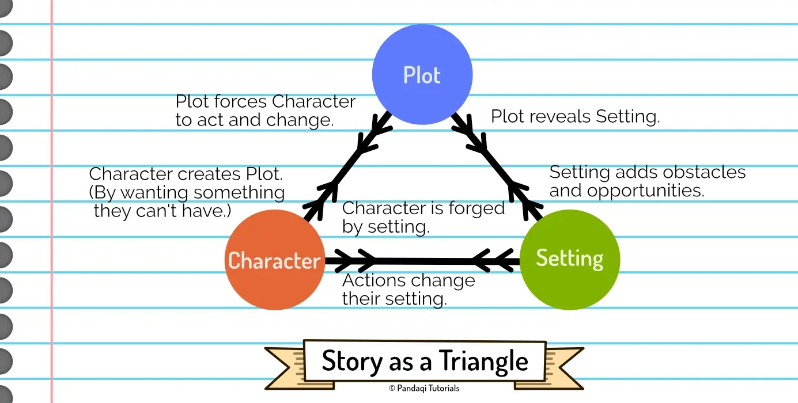

Welcome to the course on _Plot_. It's by far the longest one out of all my courses on creative writing. Why? Because plot is what _actually happens_ for hundreds of pages (or minutes). All other aspects of writing have to be shown "through your plot". 

You've created a great character? That's nice, but now you need to use _plot_ to actually make them do stuff and show who they are. You've created a beautiful world? Also nice, but now you need to construct a plot that _uses_ that world in the most interesting way.

That's why there are _many_ ways to construct a plot. Many ways to think about actions, events, consequences, and how to weave it all together.

That's why this course doesn't teach you one method. It does **not** say: "follow this formula every novel, with 8 precise steps, and you should be good!"

### How this course works

Instead, we do something that is more generally useful when trying to grow your plotting skills.

* The first few chapters explain what I mean with "plot" and establishes some principles that are always true or helpful. Just so we're talking about the same thing and have the same definitions.
* The rest of the course merely gives **possible plotting tools** and asks you to write a (short) story with each one.
* (The final chapters give answers to common issues or questions I get a lot, such as how to deal with an overly complicated plot. They are more "optional", as they only help if you have that particular issue.)

The best way to get better, is to _write_ a lot. To pick a new tool or framework each time, and use it to write a story. Do _not_ try to read through this course in one go, memorize it all, then hope you can apply it to your story! Our brains can't handle that.

Whenever I present a new way of thinking about plot, write a story with it. It will teach you when it works or doesn't work, it will teach you whether you _like_ this way of thinking about plot, and it will become an intuition instead of rote memorization. When you write your next big novel, your brain will be _filled_ with possible ideas and tools, and you will know which one to use for this particular story.

### Before you start

If you haven't already, I suggest reading the [Storytelling](../../storytelling/) course first. Plot cannot stand on its own. It's impossible to explain my best tips for plot _without_ also dealing with character or setting. The image below shows how stories are an intersection of those three parts.

That's why I wrote that practical course that covers the basics of all elements at the same time. Courses such as this one, focusing on _one_ aspect of stories, are bonus tips and challenges once you're done with Storytelling. The Storytelling course already links to this one (for further reading) whenever applicable!

{}
If you _do_ want specific plot formulas, I explain those in the Storytelling course as well. Start from the [Narrative Structure](../../storytelling/narrative-structure/) chapter and continue from there. It has everything, from the famous 3 Act Structure, to the Story Circle, to the Hero's Journey.
{}

Let's get started!