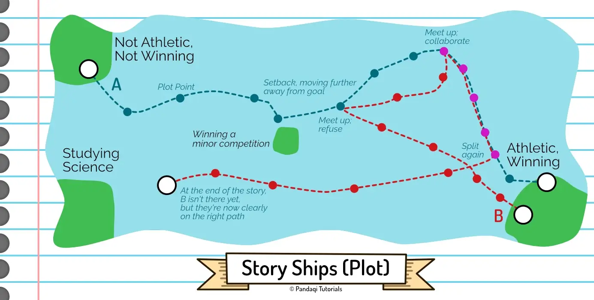
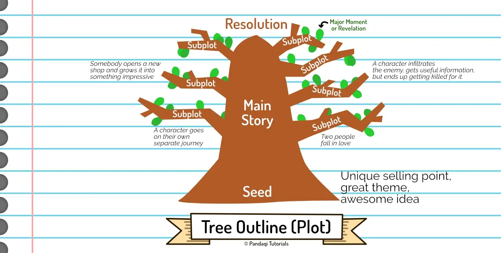

This is the final "plotting tool" or "writing challenge" I will give you. After this chapter will be more specific chapters about common mistakes or questions about plotting.

This is a method I devised myself. It's a combination of many things you've seen before, but in a very simple structure. It helps me, an improviser, with finding a balance while writing. A balance between "being surprised and seeing where the story leads" and "having an outline and knowing where I'm going"

I call it the **story ships**. (Or **story boats**, though that name is frustratingly similar to "story beats", which is a common narrative structure.)

## What are story ships?

In my view, good stories are driven by **characters going somewhere**. A good story comes from the journey of characters, and the interactions with other characters at different points.

The best way to encapsulate this, to my younger self, was by putting characters on **ships** :)

This is the theory of the story ships.

* At the start of the story, you put each character on a ship. This ship _is_ somewhere (right now, their status quo) and wants to _go_ somewhere (a destination, a goal). Characters with the same goal or direction, are on the same ship.
* As the story progresses, ships will reach new locations. This also causes ships to _meet_ each other. Whenever they meet, this causes _change_. (Maybe characters jump on the ship of another, abandoning their own. Maybe it's a collision that destroys one of the ships. Maybe the interaction simply means the character now charts a different course for their ship.)
* As soon as the ship reaches its destination, the story is over _for that character_.
* Once all ships have reached some destination, the story is done.

If you want, you can literally draw this. Imagine the paper is the whole ocean, and place islands (important locations or events) in it. Start the ships at different locations, make them travel along routes and _cross_ each other's paths regularly, until they arrive at a destination.

## Why?

Now _why_ did I create this method? Because this metaphor automatically circumvents many pitfalls for (beginning) writers.

It prevents **stasis**. A ship is always moving. Either the characters _actively_ steer it (through choices and actions), or they _passively_ follow the current (which means external circumstances move the ship).

It prevents **unnecessary characters**. We all know many stories in which characters just ... exist. They did one important thing in chapter 5, and now they just tag along like dead weight. Like a ghost who refuses to leave their castle.

A ship can only hold so many people. Everybody on the ship plays a role in steering or maintaining it. If somebody is doing _nothing_, they should be thrown off the ship.

You either make a character useful (by giving them their own ship on its own course), or you let their ship arrive at the destination (and now the character can just be completely removed from the story).

It constantly ensures **(different) interactions between characters**. When you're stuck together on a small ship, you obviously interact all the time. When you regularly meet another ship, you will interact with them. Characters can convince others to join their ship. Or they can fight, sinking another ship, which might mean killing all those characters in your story.

Most of the story is simple and straightforward, as ships are sailing on a clear (straight) line towards their goal. But the story automatically receives major, impactful moments whenever ships meet.

But most of all, it's a more **adventurous** way of looking at stories. It's not some abstract structure or fixed outline. It's about characters going on adventures on the wild ocean, discovering exotic islands, meeting unexpected characters. Thinking about stories this way makes me more _excited_ to tell a story. It gives _a_ structure that ensures at least a decent story, without limiting you too much.

## An example

Our hero wants to become the best athlete in the world. Currently, they are fat, weak, and not skilled in any way. They get in a ship, which now has a clear starting point and destination.

Another character enters the story, maybe a classmate at school. They are actually quite a skilled athlete. They're only doing it to satisfy their parents, however. Their real goal is to study and become a researcher. They get in a ship, which now has a clear starting point and destination.

The ships start moving. Every chapter, you write how their ships continue. Maybe the hero takes an action to improve their health ( = steering their ship in the right direction). Or maybe something happens _to_ the hero ( = the current shifts their trajectory), like an accident that breaks their leg.

The other character does the same thing.

You probably see where this is heading. After sailing a bit, their ships _meet_. They interact, the hero realizes they need help from that classmate, but they _refuse_. So the ships separate again, until a circumstance makes them meet again a while later. Now the classmate says yes, so both of them get in the same ship. 

We follow them _together_ for a few chapters. But then it becomes clear that the classmate really wanted something else. At the final stage, the final step before the hero reaches their goal, the classmate gets on its own ship again and sails in an entirely new direction (back to their original goal of becoming a researcher).

In the climax, the hero has to prove that they've come far enough to take the last leap _on their own_. (Which would probably comprise winning gold medal in some athletic event.) The other character has a tough scene in which they finally confront their parents and tell them they do not _want_ to become an athlete. This is like sailing the ship through a storm or rough waters.

Until, finally, both ships arrive at their destination and the story is over!

This is quite a simple example. I devised this method expressly because I _mostly_ write fantasy and longer stories (with many characters). As long as you place each character in a ship with a clear destination, it is _much_ easier to keep the story going forward, and to track everything that happens. Imagine the example above scaled up to 5+ characters.

## Alternative: Tree Outline

Some time ago, I found something that's _similar_ to what I describe here. It's called a **tree outline**.

* You plant a _seed_. That's the core event, theme, idea, or setup of your story.
* The trunk that grows from it is the _main conflict_. It's the thickest part which gets the most attention.
* But it also grows _branches_. These are your side characters, other storylines, minor mysteries.

First of all, this is another fun way of looking at story. Natural and organic.

Secondly, this is great for improvisers (who just start with a seed and see where it leads). It reminds you that the story always needs one _main_ storyline. It forces you to make all the subplots directly _related_ to the main storyline, because they have to grow from it. It forces you to go simpler and simpler as you stray further away from the main story, as branches only get smaller the further they get from the main trunk.

## Now write!

Write a story using this method! Put your characters into ships, which start somewhere and clearly want to go somewhere. Sometimes _they_ steer the ship (actively), sometimes they get pushed around by circumstance (passively), but they are always _moving_.

As each scene takes ships further along their route, have them meet up regularly. Provide great interactions between characters, have them switch sides, have them alter their routes because of an experience on the sea.

Finally, to help yourself, fill the sea with rich and interesting islands that readers want to visit some day.

{}
And if you don't like this at all, try the Tree Outline instead ;)
{}