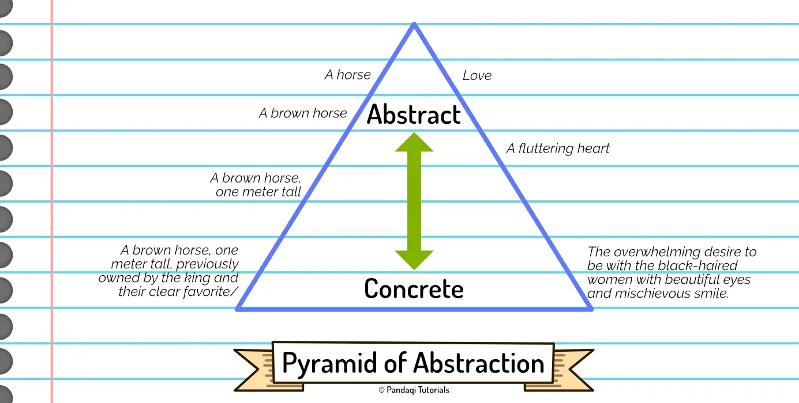

I couldn't decide where to place this chapter for the longest time. This is a useful concept to understand early on, but it might also be a little vague right now.

In the end, I split it in two: one part that's essential to know when writing your first draft, and another part that becomes more relevant when rewriting. This chapter is obviously the first part. (The chapter on [Rhythm & Flow](../rhythm-flow) is the second part.)

## Concrete vs Abstract

When conveying your ideas through writing, you want to distinguish between two categories: **concrete** and **abstract**.

Sometimes people call this **specific** versus **vague**. 

I, however, learned that a slightly different definition is more useful.

**Concrete** means that the audience all imagine the same thing in their head. You've given _specific details_ that paint very similar pictures in the minds of the audience.

{} 
A girl wearing black boots, a black dress, and black sunglasses partially covering hazel eyes.
{}

**Abstract** means the audience all imagine different things. You've left out so much information that the audience fills in the gaps with personal biases and life experiences. 

{}
A girl.
{}

Concrete means that there's less confusion among readers and you paint a more vivid, clear image. The disadvantage is that it takes more words, which causes the story to slow down. (And it's more work for you, the author!)

Abstract allows you to easily talk about themes and higher concepts, allowing the audience to draw their own conclusions or add their own imagination. The disadvantage is that it can be hard to understand or lead to disparity about what the author meant. It also tends to feel like a lecture from the author, instead of realistic thoughts from a character's point of view.

In this definition, abstract concepts like "love" or "loneliness" are pretty much the same as "a girl". They're equally vague. 

In fact, "a girl" might be _more_ vague. Humans have similar experiences and feelings connected to "love", but when you tell them to imagine any girl, they'll all imagine completely different beings.

As you see, concrete is usually better, but not _always_. It takes more words and more work. You want the concrete details to be in _service_ to abstract ("less tangible") thoughts or themes.

If you want a scene to intentionally feel vague, mysterious, or spiritual ... you might use abstract language on purpose. Alternatively, if you want to show how grounded and down-to-earth a character is, you'd probably shroud them in almost 100% concrete language.

## Pyramid of Abstraction

Now you're ready to learn about the pyramid!

Humans are physical beings who live in the _real world_. As such, we connect more easily and care more about _concrete_ (physical) details, rather than abstract concepts or ideas.

As such,

* Start by conveying the concrete, physical, tangible details of your world.
* Once you've established that, pull back further and further, until you can make a more abstract or profound point.

I see too many stories that start with huge questions that sound philosophical. Yes, it might create a nice marketing slogan or garner a little interest, but it can't sustain an actual story. 

The same thing happens on a _smaller_ scale with prose. Paragraphs that immediately jump into some abstract thought. Paragraphs that start with a general statement and get more specific over time---which is precisely the wrong order!

People don't get invested in an abstract thought or profound concept. They get invested in the tiny details that make them care about the characters and the world. Only if those are conveyed (well), can you eventually end up at bigger ideas.

There's a great quote about this.

> "If you want the reader to believe you about the big things, first make them believe you about the little things."

So, how do you use this pyramid when writing your first draft?

* The base is the largest, which means _most_ of your language should be concrete. Abstract ideas should only be a tiny portion of the prose.
* Whenever you have a thought, think about the concrete details first. If there are none, think a bit longer until you have invented concrete language to support the thought.
* Write the concrete stuff first, then finish with the more general or abstract thought later.

As I said, this is both true on a small scale (sentences, paragraphs) and the big scale (entire stories).

In fact, you might say this is the definition of story. A _concrete_ sequence of events (plot) to eventually portray an _abstract_ idea (theme, deeper meaning, message, character growth) near the end.

Without the concrete details, the story isn't fun or relatable. Without the abstract finish, the story feels superficial and hollow. You need them both, in this order. Both throughout your whole story as well as on a line-by-line basis.

{}
This chapter is also present in the [Worldbuilding](../../worldbuilding/) course and phrased almost identically. Because the same is true for building your story's world: first make the audience believe the little, tangible things ... before you can sell them on a different world with wildly different systems, physics, geography, etcetera.
{}

### A real example

My "Saga of Life" project taught me this like nothing else. It contains short stories based on important historical events or scientific discoveries. But scientific theories are quite _abstract_. Similarly, waging a war is a _big, abstract_ idea.

When I wrote the first few stories, long ago, I immediately noticed that they just weren't engaging. I started with a big battle scene, I had the characters talk about "saving the world" and all ... but the readers just wouldn't care. It's too intangible, it's too grandiose.

Since then, I developed the habit of telling such stories on the smallest scale possible. Yes, there's a war, but we're going to follow these three characters and their _specific, concrete_ issues. This allows an engaging story from start to finish, at which point I can _finally_ make more abstract or philosophical statements about the war.

This is also often what people mean when they say that a film or story "hit you over the head with _the message_". If a writer _really_ wants to force a message on the audience, they won't have the patience to actually build to it and support it with concrete arguments and storylines.

The problem is not trying to insert deeper meaning into the story---that's a good thing---the problem is not following the pyramid of abstraction.

## Show, don't tell

This idea is tightly related to the famous writer's adage **show, don't tell**. In this case, giving specific information is _showing_, while giving the general abstract statement is _telling_.

{}
TELL: "James was sad."

SHOW: "A tear fell from his face, as his mind went blank and he hid his face from people passing by."
{}

That's part of the reason why this course has no special chapter about this saying. It _is_ a very important one! But when it comes to prose, I think a more useful and correct approach is using the Pyramid of Abstraction. (And the Ladder of Abstraction discussed later.)

The second reason is that it has more to do with plotting and character than with prose. To learn how to _show_ somebody's personality or an important event in the story, you need to train your character development and narrative structures. If you can craft a detailed, specific, three-dimensional character ... showing who they are becomes natural. Because you _know_ their habits, ticks, appearance, thoughts, dialogue and how it reveals their personality.

If you don't, then what's the point? I can give you many examples about how to _tell_ something versus how to _show_ it. And the best you can do is _copy_ that to your story, where it probably doesn't fit at all!

No, to me, "show, don't tell" is only marginally related to the skill of writing prose. Visit the other courses in [Creative Writing](../../../creative-writing/) to learn all the pieces that go into _intuitively_ understanding how to show instead of tell. 

I only have two tips specifically related to prose that I wanted to give.

### Ask the 5 W's

If you're stuck trying to find _specific_ ways to express your thought, ask yourself the usual list of questions!

* Who?
* What?
* When?
* Where?
* Why?
* How?

{}
You want to write "Somebody entered a building for an important meeting." (but with more detail)

Who? Give some details about that "somebody", such as "a middle-aged man in a brown suit"

Where? Give some more details about that building, such as "he pushed the revolving front door to enter a wide open space with a high ceiling"

When? Maybe involve the time of day in your description, such as "A large clock on the back wall told him he was late. The early morning sun rays colored the entrance hall red and yellow."

You get the point. These questions are a quick way to get at details that vividly _show_ the situation instead.
{}

### Use all senses

This is a similar set of questions you can ask yourself. Go through all the **senses** and see if you can involve them.

The most common senses are of course 

* Sight
* Sound
* Taste
* Touch
* Smell

But our body has many more _specific_ senses. Such as balance, or that dread you can feel in your stomach, or tickling. If you can, try to describe your thought with a wide array of (specific) senses.

{}
When writing a fight scene, most writers will just describe the blow-by-blow. Action beat after action beat, swords swinging or guns firing. That quickly gets tiresome and cliché.

Instead, try to involve the other senses. Maybe somebody is hit in their jaw and now tastes blood. Maybe somebody hears a ticking sound, leading to the sudden realization that somebody placed a bomb. Maybe the fighting has been going on for a while and the decaying bodies cause a horrible stench on the battle field.

All of these descriptions are much more creative and effective.
{}

### Be certain

Whatever you do, though, be _certain_. If you write something, it is true for the person narrating this story. 

You can say: "A pouch sat on the table." (a general statement, as readers imagine different pouches)

Or you can say: "A small, black pouch sat on the table. It was made of velvet and held inside a large group of fine diamonds. It felt soft and new, but had a fumigated smell." (a specific statement)

But you do **not** say: "Something that looked like a small bag was lying on something that was perhaps a table."

{}
I remember reading in a Harry Potter book, long ago, a sentence like "Hagrid kissed Harry's forehead with what must have been a very scratchy kiss."

While this is fine and somewhat fits the tone, it's also very weird and unnecessary. 

We view the story through Harry's eyes. He _knows_ what the kiss felt like, to him. He actually felt it! He doesn't need to guess! Language like this makes your prose much longer and more convoluted than it needs to be.

Just say "Hagrid gave Harry's forehead a scratchy kiss".
{}

## Conclusion

Train yourself to turn any thought into concrete, specific prose first. Prose that leads into the more general or abstract idea you wanted to get across. This order feels most natural and most engaging to humans.

Later on, in the chapter about [Rhythm & Flow](../rhythm-flow) I talk about the Ladder of Abstraction which is a _very_ similar idea with just a few tweaks.

