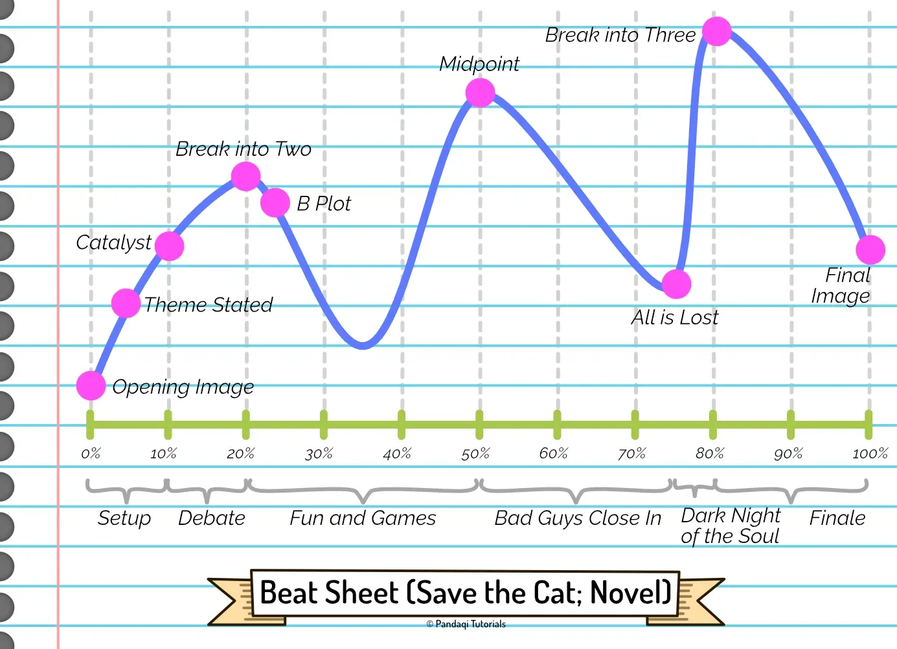

Maybe you thought that the narrative structures discussed thus far were too _limiting_ for your creativity. Well, then I have bad news for you. Those were extremely vague and conceptual compared to the **beat sheet**.

It's a very popular tool. I follow quite a lot of authors, both up and coming (usually young adults with their own YouTube channel) and established senior writers (with blogs). And most of them have, at some point, created their own version of the beat sheet. Perhaps with more beats, fewer beats, different names and descriptions, but in the end it's roughly the same PDF each time.

The idea is based on the belief that most ("good") stories follow a near identical structure. The structure is so ingrained in the human psyche, that the beat sheet even tells you at what _page_ you should write a certain event.

As you might expect, I do not think this is true. Especially for improvisers like me, the beat sheet feels like nothing more than following a formula, and one that doesn't even give the right answers half the time.

That said, it's still an amazing _tool_. For some writers, for some stories, it will be a godsend. Even if it isn't for you, _practicing_ it (for one or two stories) will still be helpful. It's especially helpful if you're stuck or in a creative dry spell: knowing exactly what to do at what chapter gives you some certainty.

## My beat sheet

I don't have my own beat sheet. After looking around for a while, I decided not to copy a beat sheet from one specific author. (I haven't tried them all, so I wouldn't even know which one's the best.) 

Instead, I will copy one from a popular published book on writing: **Save the Cat**. There are multiple versions of this book (one for screenwriting, one for novels, etcetera).

I picked the one for **novels**. Why? 

* This course leans more toward novel writing than screenwriting. 
* It is my belief that every good story should start as a novel, then adapted to film. (Many famous directors have explained that their scripts basically start like novels, which are simplified and changed for the final film. Additionally, films adapted from books usually have a much stronger and consistent story, because authors just don't get away with bullshit plots as easily as screenwriters.)

As such, the beat sheet below is for novels. Adapting it to film just means shortening and streamlining it.

## The beat sheet

Below is an image of the story and all its beats. I try to stay consistent with the other images in this course, with the height of the line indicating the _strength of the conflict_.

Now let's look at the beats in more detail.

### #1: Opening Image (0%--1%)

The status quo. A snapshot of the current life of your hero, before they go on adventure.

### #2: Theme Stated (5%)

The theme of the story is clearly presented. Usually, a character (not the hero) hints at what the hero's arc will be. What their life lesson will be. Obviously, this is subtle and the hero ignores it.

### #3: Setup (1%--10%)

These scenes explore the status quo further, but most importantly its _flaws_. We introduce the supporting characters and the hero's (primary) goal. We also show the hero's reluctance to change, and what's at stake if they don't.

### #4: Catalyst (10%)

A life-changing event happens to the hero. (The beat sheet calls this the "inciting incident". I've discussed before how views differ on this topic and some call the very first event that sets the story in motion the "inciting incident".)

This catapults them into a new world. This event should be big enough to prevent the hero from being able to return (to their status quo). Think of: break-ups, deaths, firings, or invitations.

### #5: Debate (10%-20%)

In these scenes, the hero reacts to the Catalyst. They debate what to do next, showing their reluctance to change (once more). Usually presented as a question like "Should I go?" or "What do I do?"

### #6: Break into Two (20%)

The hero decides to accept the call to adventure. They leave their comfort zone, try something new, or venture into a new "world". This action should be decisive and impactful. (In a 3 Act structure, we now cross the threshold into Act 2.)

Usually, a new or modified goal is introduced, which the hero will pursue in the next chapters.

### #7: B-story (22%)

We introduce new characters who will ultimately serve to help the hero learn the theme or life lesson. This is often called a mentor or helper character. But it could come in any form: a love interest, nemesis, family member, friend, teacher, ...

### #8: Fun and Games (20%-50%)

This is the longest sequence, with multiple scenes and chapters. We see the hero in this new world. They might love it tremendously or hate it with all their heart. They might be succeeding or floundering. That's up to you!

In any case, the reader wants to see the hero pursuing that goal you set up. The fun is in the _tries_ and the _progress_ being made.

This beat is also called "promise of the premise". It should fulfill the hook of the novel, be the "meat" of the story, and represent why the reader picked up the novel in the first place.

I feel this is important enough for an example.

{}
Let's say you start your book by showing a teenage girl who discovers she has magical powers. That's the hook. That's on the cover of the book as marketing blurb. What do readers expect? A girl going on magical adventures and using her magic for stuff!

This part of the book _has_ to deliver on that promise. You might think "oooh let's take away the magic, let's make her fight to get it back, that's good conflict". It is, but it's breaking a promise, and that weighs more heavily. The reader expected magic, but got a girl who is sad and mad because she does NOT have magic. Probably not satisfying. 
{}

### #9: Midpoint (50%)

The middle of the novel. The "fun and games" culminates in one of these:

* False Victory (the hero has thus far been succeeding and achieved a goal)
* False Defeat (the hero has thus far been failing and suffers a loss)

But the story isn't over, obviously. Which means something else should happen, perhaps unexpected, that raises the stakes and pushes the hero forward.

Now comes the realization: yes, it _was_ just "fun and games" up until now. Let's get serious.

Popular choices are plot twists, adding time restraints (like a ticking time bomb), or ramping up the love story. 

### #10: Bad Guys Close In (50%-75%)

What happens here, depends on how you constructed the midpoint.

* False Victory? Now things will progressively get **worse** for the hero. They enter a downward spiral.
* False Defeat? Now things will progressively get **better** for the hero. They enter an upward path.

The hero usually gets a new or modified goal to pursue after the midpoint.

Regardless of the path the _plot_ takes, the hero's deep-rooted flaw keeps existing and closes in. They might be winning or losing, trying something new, gaining skills ... but that flaw remains and slowly grows to be the biggest obstacle.

### #11: All Is Lost (75%)

The lowest point of the novel. Something happens to the hero that pushes them to rock bottom. (This is usually the combination of the external obstacle and their internal flaw.)

This beat often has a "whiff of death": something does (either literally or figuratively) to symbolize the death of the old hero, and prepare the rebirth of the transformed hero.

### #12: Dark Night of the Soul (75%-80%)

The hero tries to process everything that has happened and find a way to continue. They should be _worse off_ than at the start of the novel.

It's the darkest hour, but its darkness before the dawn. The moment _right before_ the hero finds a solution ... but only after confronting their flaw and learning their life lesson.

### #13: Break into Three (80%)

The "Eureka!" moment. The hero realizes what they must do to fix both external and internal problems. They are reborn as an improved version of themselves. The character arc is nearly complete. Act 3 starts.

### #14: Finale (80%-99%)

The hero must prove they have _really_ transformed. To do so, we _show_ the hero enacting a plan and executing it. Bad guys are destroyed, flaws are conquered, lovers are reunited.

The hero's world is saved (plot), but it's also a better place than it was before (character and change).

### #15: Final Image (99%-100%)

This should be a mirror of the opening image. An "after" snapshot of who the hero is after going on this adventure, juxtaposed with the "before" snapshot from the opening. 

## Now write!

That's the nice part of such a strict structure. It needs no further explanation!

First, decide on the length of your story. (The number of words, roughly.) You'll need that to implement the beat sheet, otherwise you don't know what "5%" means.

> Now write a story that follows these beats exactly.

That's it. Either write an outline following these beats before starting, or use it to make decisions while writing. (Look at what page you're on, check what should happen according to the beat sheet, then make that happen.)

The sheet reinforces the common themes you have seen throughout this course. That of a status quo, an inciting incident, a midpoint, a return home after _changing_. Of setup and payoff, promises to the reader and fulfilling on that promise.

If you really enjoy this, seek out other authors who present their own beat sheets.