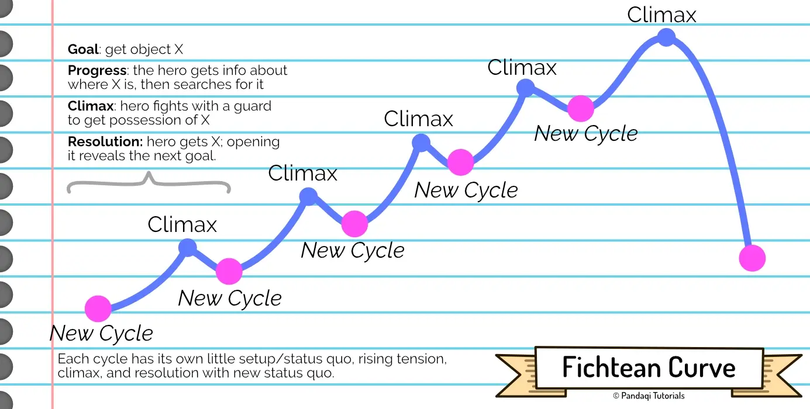

The Fichtean curve is a slight variation on the 3 Act Structure, which is very common in fantasy and sci-fi novels, or longer "adventure" stories in general. 

The original 3 Act Structure has only one big climax and conflict. This is great for shorter stories, or those with a conflict that takes one big step (by the hero) to resolve. But longer stories need more structure than that, and often need more small steps (of progress) before the hero can tackle their biggest issues.

In such cases, the Fichtean curve can come in handy.

## What is it?

It's _basically_ a 3 Act Structure, _but_ the rising tension is not a straight line trending upwards. It's a cycle of peaks, which you can repeat as many times as you need.

In other words, this structure constantly repeats the cycle of ...

* Here's a new conflict
* Let's work to defeat it
* Climax, resolution, restart the cycle

{}
Many adventure stories are "fetch quests". The hero learns that he needs objects A, B and C to defeat evil! So they go on an adventure to find object A. Once found, they move to object B. Once found, they move to object C. Now they finally have the tools, so they defeat evil in a climax, end of story.
{}

This narrative structure works really well to keep readers engaged and to keep good pace in your story. You regularly make progress and have tiny climaxes.

Also notice how there are no other parts, such as the midpoint turnaround. It's just repeating cycles, and each cycle ends in a slightly higher state of conflict than the previous. The "inciting incident" can, therefore, simply be the first obstacle they encounter. 

{}
In many adventure movies, the story literally starts with something basic like "hey we want to have this powerful object, wanna go help us grab it?" That one short mission, usually finished within the first 20 minutes, _leads to_ all the other missions and fetch quests.
{}

This runs the risk, however, of writing a story that is nothing more than _plot_. As my fetch quest example shows. Many Hollywood movies are nothing more than "grab these objects and tada you win". There's no deeper meaning, no message, nothing smart going on. It's just _plot_ to provide as much action as possible.

## The Rule of Three

That's why it's important to remember where this curve originally comes from: the **rule of three**. 

Many myths and legends challenge the hero not once, not twice, but exactly three times.

* The story starts with the first challenge, but the hero ignores it (or fails)
* Later, they are challenged a second time, in a different way. The audience hopes the hero learned their lesson, but they did not.
* The third time is the biggest challenge, but the hero is also now equipped to provide the biggest resistance. This is the vital challenge. (A win means the myth has a happy ending, a loss means the myth turns into a tragedy.)

The Fichtean Curve is basically an extension of that.

* Every cycle, every little conflict and climax, should _challenge_ the characters in some new way. They should conflict with their personality, their flaws, their beliefs, their skills.
* Consider grouping the cycles into threes (with a similar theme), and making the third the _biggest one_ (clearly). Otherwise, if your story has 10 cycles (for example), they all have equal weight and the story become monotone and repetitive. If one cycle clearly provides a bigger conflict, once in a while, you add that variety and surprise that makes the story tick.

{}
Our hero is selfish. The first challenge comes when they cross a bridge. An old man carrying a sword asks for help crossing---maybe they are blind or incapacitated. The hero ignores him, eager to get on with their quest.

The second challenge comes when he treks through a town and a building catches fire. A girl runs toward the building, trying to cast magical spells to douse the flames He could help, but that would slow him down, so he makes his way out of town.

At the third challenge, he encounters a monster and has to fight him with bare hands. He realizes he could have had a swordsman with him, or a powerful witch, but no, he ignored them all and chose only himself.

Now it's up to you, the writer, if the hero sees his mistake and fixes it in time ... or _learns_ his lesson by being defeated.
{}

## Now write

Apply the Fichtean curve to an idea!

* Pick a character (or multiple) with traits that can be challenged. These can be external (such as lacking a skill) or internal (an emotional vice).
* Now write a story that repeatedly throws a challenge in their way. Design the challenge to be the absolute _worst_ for your character (at that time), as if the natural world specifically hates that character :p Keep the cycle rather short: setup and payoff, introduction and resolution, should be close to each other.
* Keep repeating this cycle, as your characters change and grow over time.
* Until the final cycle, which presents the biggest challenge, but now the characters are _ready_ for it. (The final challenge should consist of elements that were also present in earlier challenges. But in a slightly different or weaker version.)
* And remember the rule of three. 

Don't worry about making it waaaay too plot-heavy at first. This happens automatically with a narrative structure like this. You can (and probably should) fix this during the edit afterwards.

As stated, this is great for longer stories and things closer to action or adventure. For other types of stories, this cyclic structure (of many tiny climaxes and nothing else) will only hinder you.