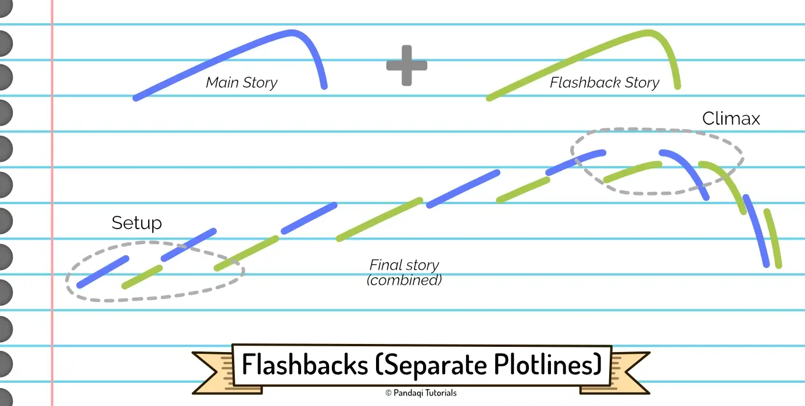
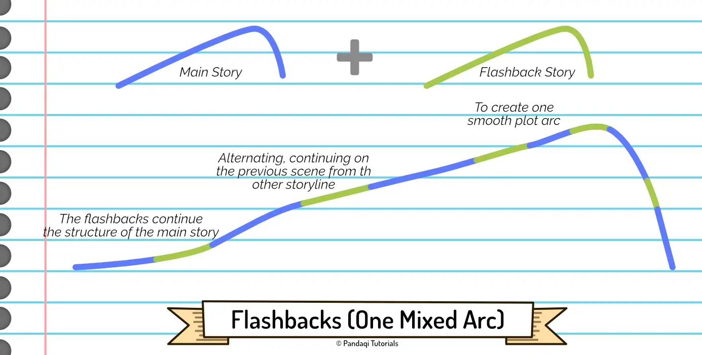
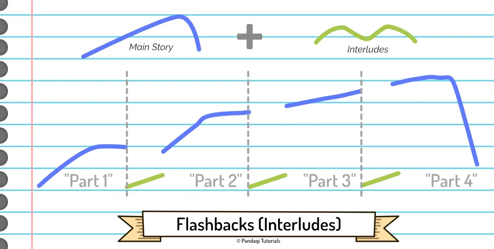

So far, our narrative structures have been _linear_. This is fine, because almost all stories are linear. We simply start when the story becomes interesting, follow the hero through time (chronologically), then end when the story is over. We experience time linearly, so messing with it needs a _good reason_.

Fortunately, there are many good reasons. So let's practice nonlinear storytelling through one of the easiest and most common techniques: flashbacks.

## What is a flashback?

In books, flashbacks and memories might seem similar. Often, a situation will cause a character to remember something from the past, using one or two paragraphs to explain it. This is often used by authors as a quick way to give extra information (about the plot or the character).

This is not a flashback. Any story you read will have these quick memories or reminders of the past scattered throughout.

> A flashback is a full _scene_ from an earlier point in time (than the current time in the story)

Of course, you also have _flashforwards_. A scene from some point in the future.

## The art of nonlinear storytelling

Now we get to an interesting bit about storytelling. When I was young, I saw flashbacks and the like as nasty tricks. Surely, they were only used by lazy authors who couldn't just give the information in a more natural way? They were just stupid experiments to annoy high school students who had to write essays, right?

{}
I once had to read a book, at high school, which was told in reverse. You started with the consequences of some action, then worked backward in time towards the actual action and why it happened. Absolutely hated it and was confused for 200 pages. The "trick" was supposed to make the story interesting, because the actual event and consequences were ... boring and meaningless. Never do that!
{}

In reality, most events are rather boring and predictable when you _see them happen chronologically_. If you were able to see everything, in the right order, you would almost be able to predict the future. You'd see where everything was headed, what the next step would surely be.

A mundane sequence of events can be made exciting by telling it in a different order. A simple mystery can turn into a great puzzle if you give the pieces in a different way or different order.

Two storylines that aren't extraordinary on their own, can turn into a riveting adventure if you alternate between them, hopping forward and backward in time.

The only thing that matters is telling the best possible story. Over the years, I've learned that playing with time (and _how_ you tell the story) is a large part of that. 

> Manipulate _what_ you tell the reader and _when_ as much as you need to get the best story.

## Structure & Variety

Which brings us to an even deeper truth about human beings. 

> We enjoy things that are a good mix between structure and variety.

Flashbacks and flashforwards give variety (by adding a time jump). It allows us to weave multiple storylines, from different time periods, together into one linear story. 

But this only feels good if they are a consistent part of the narrative structure.

If your whole book is linear, and you suddenly add one flashback during the climax ... it's going to feel strange and confusing to the reader.

If your flashbacks are erratic and jump to completely unrelated scenes, it adds _too much_ variety.

## Common flashback structures

### Two Linear Storylines

That's why flashbacks are often still "linear". The flashbacks simply tell a second storyline, chronologically. Slowly, you learn how this "flashback storyline" influences the "current time storyline" you're reading. (It might take until the final scene before this is revealed.)

That's the first common structure.

As explained in the chapter on [multiple storylines](../the-a-b-c-story/), these two storylines should ideally handle different parts of the character. The main storyline is about their _want_ (their external goal), while the flashbacks explain more about their personality and inner _need_.

The downside of this structure _can_ be that the "rising tension" basically "resets" every time you switch. (The previous storyline hasn't progressed as far as the other one, so you necessarily lower the stakes for a little bit.) This doesn't need to be a bad thing, though. As we saw in the (advanced) 3 Act Structure---and we'll see again in later structures---it's common for the story to "fluctuate". To go in cycles of "rising tension, calming down" for 4 or 5 times before reaching the main climax. This is especially useful for _longer_ stories that need to set smaller goals to keep the reader engaged.

It can also be hard to _combine_ the two storylines in a way that makes sense and stays interesting. If they really only meet up at the end, the story before it can get slow and unfocused.

### One Arc

Another structure is to mix flashbacks into the main narrative to create _one_ arc.

{} 
A chapter ends with the hero encountering some mystical location with purple plants. The next chapter is a flashback. It shows them playing in the garden as a kid ... until they _also_ stumble upon purple plants, which attack them.
{}

The flashback actually heightens the conflict of the main story. The flashback gives new information (to the reader), which recontextualizes what was happening in the main story. They are intertwined to the point of it being one arc.

### Interludes

I love this, some people think it's chaotic. Nevertheless, it is very common, especially in longer (fantasy) novels.

The main story happens linearly, but it is broken into "parts" (as many as you need). Between two parts, you add an "interlude": a few chapters about a _different_ storyline, usually at a _different_ moment in time.

This allows you to do fewer flashbacks or group them. It also allows you to make the flashbacks more varied, as the interludes provide enough structure to prevent confusion.

In other words, you lose some narrative strength (and "rising tension"), but you're able to put basically _anything_ you want in the interludes. A fun chapter of a one-time character, a mysterious scene that takes place in the future, an reference to something from the previous book in the series.

## Now write!

You can write a short story for each common flashback type. Or you can pick the one for which you have the best idea.

The main idea remains the same.

* Use time jumps to your advantage. They can make even simple mysteries or obvious storylines _interesting_ and _exciting_, when put in the right order. When used with purpose, it is not a "lazy trick", but a powerful tool.
* Use time jumps for variation and giving information, but make sure they follow _some_ structure to prevent confusion.
* But don't just use flashbacks as "info dumps". Make sure they are relevant to the current point of the (main) story. Use the time difference in an interesting way, or to provide the most interesting scenes from a character's past. If you don't, there's no point to flashbacks. Just telling the information as a memory would have sufficed.

I hinted at other nonlinear structures in this chapter, such as telling a story in _reverse_. I would not recommend trying that, at this point. It is _hard_ to pull off well and needs solid planning and experience with storytelling. Other nonlinear structures will appear in later chapters!