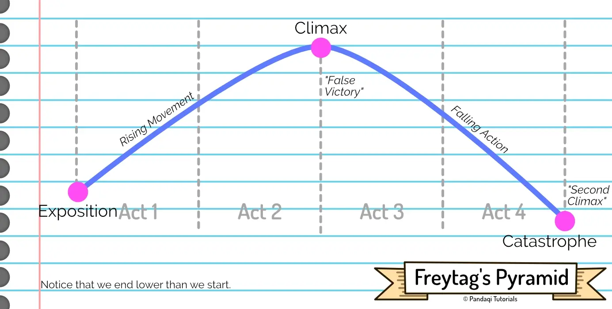
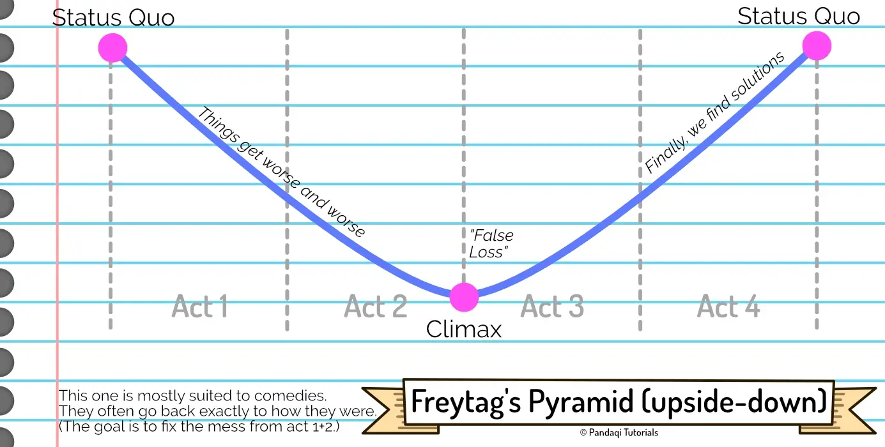

So far, our narrative structures have looked like lines (trending upward) or circles. What if ... the structure looked like a pyramid instead?

Freytag's Pyramid is one of the oldest dramatic structures. It is more basic and less flexible than "modern" structures. But that doesn't make it less useful or true.

Interestingly, it's most suitable to **tragedy** or **comedy**. There's a deeper lesson there, I think, about comedy and tragedy being very close cousins.

## The pyramid

It only has five major parts. (For consistency, I keep calling the protagonist the "hero", even if it ends in tragedy.)

* **Exposition**: explanation of the world, the "inciting incident", or the "exciting force" as Freytag called it. (Which does a better job describing that this can also be an inner force or emotion that compels the hero to do something.)
* **Rising Movement**: conflict builds and builds
* **Climax**: yes, the climax happens _halfway_ the story. That's when conflict hits its peak ... and the hero **wins**.
* **Falling Action**: but now the climax shows itself to have consequences, and the victory is a false one. Slowly but surely, all pieces of the hero fall apart, and their life comes crumbling down.
* **Catastrophe**: until, inevitably, the hero's path ends in tragedy and catastrophe. (In modern times, people might call this a climax as well.)

In the eyes of some, tragedy is the strongest form of storytelling that exists. There's a reason most (famous) myths and legends are tragedies, from Orpheus to Romeo & Juliet.

I'm not sure about "strongest", but it's certainly one of the strongest. There's a satisfaction to _knowing_ how the story goes, knowing it will end in tragedy, and still seeing the downfall and the crumbling pieces. It's a weird mix of pleasure and pain that humans somehow have learned to love. 

It is strong enough that most tragedies actually spoil themselves at the start, by saying something like "both lovers will die at the end", and people _still_ love watching the story!

You also get _two_ climaxes for free! Halfway the story, and at the end. (This is very similar to the important "midpoint turnaround" and the actual climax in the 3 Act Structure. As you learn more narrative structures, you'll see a few general truths repeating themselves everywhere.)

In a sense, this is what happens when the hero does **not** realize the difference between their want and their need. They fall from grace, it ends in tragedy. (While the Hero's Journey ends in triumph because the hero _does_ realize this and manages to compensate.)

## Application to comedy

There's a good chance that our sense of humor evolved as a way to deal with tragedy, pain, or uncomfortable emotions in general. It helps ward off negative emotions and foster connections with others (the thing that keeps all humans ticking). Comedy is literally the antidote to tragedy, the inverse. 

As such, writing a comedy means **inverting** the pyramid. 

* Comedies usually start out pretty normal.
* But then they devolve into chaos. Things just get _worse_ and _worse_. There are no victories here, no small achievements, things just go wrong even more. (Most of the fun comes from seeing how things can go even more wrong, surprising viewers with the next crazy thing that will happen.)
* Until we reach the climax halfway, in which the hero starts winning.
* They win, and win, and win. Slowly the chaos is cleaned up, though it takes a good while (Now the fun comes from seeing them win and how they will solve the multitude of problems that arrived.)
* Until we finally return back to the normal state.

You can see this structure clearly in sitcoms. They start out with a pretty normal Friday night situation. One thing goes wrong ... another goes wrong ... a miscommunication makes it go even _more_ wrong ...

Halfway the episode, it's a huge mess. Now they must do fun stuff to clean it all up, which they magically achieve at the end of the episode.

A tragedy goes from a good situation to a terrible catastrophe. A comedy goes from a catastrophe to a happy ending.

## The mark of a great story

I characterize great tragedies as "you COULD have WON!"

There are some stories that stick with me, and still make me angry to this day, because the hero _could_ have won if they hadn't made one _dumb_ decision! Even though it frustrates me, I recognize that as a good story. It's the ultimate moral lesson about what happens if you do **not** overcome your flaws.

{}
Orpheus is a great example. He could have had EVERYTHING! But noooo, at the last second, his distrust causes him to look over his shoulder.
{}

{}
Or take the scene from Game of Thrones (season 4), where the Red Viper battles the Mountain. I won't spoil the details, but let me just say the same thing. He could have had EVERYTHING! But noooo, at the last second, his rage and hunger for justice make him do dumb stuff.
{}

A nice benefit of this pyramid is that the first part of their arc is roughly the same as any other arc. The reader will not _know_, halfway the story, if a character is on a tragedy path or not. This opens the door for great plot twists or surprising turns for a character. Who readers thought to be a hero coming to save the day, turns out to have been a tragic hero all along.

## Now write

You can write two stories with this: one tragedy and one comedy. (Or combine them into one; now _that's_ a challenge!)

The important parts are that ...

* The climax is _halfway_
* It's a (false) victory.
* And the hero does not realize the gap between their want and their need. (If they had, they'd not have fallen into tragedy.)

For a comedy,

* The climax is actually a false loss. The protagonist thinks they've screwed up everything and hope is lost. 
* Until they realize a way out, a plan to fix the mess. Usually a funny, convoluted, weird plan.
* Remember it's a pyramid: a straight line down, then a straight line up. If you swerve too much, adding tiny victories/losses, adding _nuance_, you actually lose that comedic factor.

If you feel up to the task, write another story with two storylines. The first is your regular hero on the Hero's Journey, the other _seems_ like a hero too ... but is actually on a Freytag's Pyramid. One flaw causes them to stumble before being able to help the other hero and reach their goal. 

See how strong you can make the surprise once readers realize the direction of the story. See if you can evoke that reaction of "you COULD have WON!"

As always, think about these things _before_ and _after_ writing. Make a good plan beforehand. After writing, check if you followed the pyramid closely enough. Maybe you notice you added some tiny victories somewhere during the downfall, which shouldn't happen in this narrative structure. Take them out during editing.

But while writing, turn off the criticism and just write.