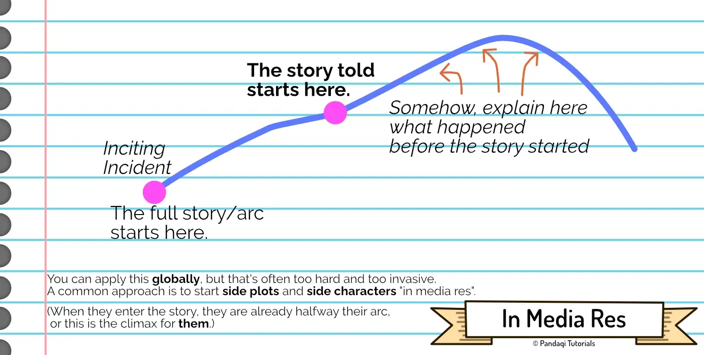

I remember being taught the concept of "in media res" at elementary school. Unfortunately, it was taught badly. Many people know the word, but have a somewhat useless understanding of the concept. Hopefully, this chapter clarifies it.

To most, the term means "right amidst the action". To start a story "in media res", means to jump immediately into an action scene without explanation or setup. To most modern writers, this is the _only_ way to start a story. Nobody has the patience for _prologues_ and long _explanations_ at the start, right? Jump right into the story!

And in a sense, it _is_ the only way. Every story has to start somewhere. Every story starts with the reader knowing _nothing_ and, therefore, jumping right into the new world. The first paragraph you read can obviously never be "setup" or "explained" beforehand.

Yes, start your story as close as possible to the moment it gets interesting. That's a general rule.

## What does it mean?

What the concept really means, is that you start _after_ the inciting incident. Your story starts somewhere along your narrative structure, instead of at the start. You can even start at the end. (We all know a few stories that start with a climactic fight scene, and then the narrator is like "wondering how we got here? let me tell ya")

It's just a different _order_ in which you tell a story. You start at some other interesting point along your storyline, usually way after the inciting incident. Then, as the story progresses, you slip in information about what came before. (Through conversations, memories, flashbacks, reading diaries, however you want to do it.)

The advantage is obviously that you can start at a really interesting chapter. A chapter that might even become _more_ interesting when you explain, at some later stage, what came before. Maybe the chapter that motivates you the most to write, at this moment.

The disadvantage is that it can be confusing and disorienting at first, and that it's quite _hard_ to do well. 

It's one of the great challenges of the writer. The reader needs certain information, to understand the world and the story. But they don't _want_ to read information. It's boring, it's overwhelming. So you need to carefully drip feed the information in smart ways.

## Application to side characters

As I've explained it now, it seems like it's only applicable to the overall story (or the arc of the main character). That's not true. In fact, it's perhaps _more_ useful when applied to minor characters or storylines.

It's very common for the hero to meet characters who are already halfway their arc. Similarly, it's common for the hero to stumble into a mystery or event sequence that's already been going for a while. That's also "in media res".

It's a bit of a trick, but a powerful one.

> If you want to make your story more interesting, don't start (all) elements at the beginning!

By meeting a character _along_ their arc, we can ...

* Make that meeting a exciting as possible, because we have more freedom. (The character could be anywhere along their arc.)
* And ensure we have mysteries/progress to make in the future, as we reveal bits of their past. (Bits of their arc that came _before_ they entered the story.)

As such, I mostly use this tool for many of the minor characters or subplots. I think it's particularly useful for "pantsers" (improvisers like me), because it allows you to start "where you feel like this plotline should start". As long as you remind yourself that this storyline is "in media res", and you still need to explain what came before _at some point_, you're good.

## Now write

Pick one of the narrative structures you've learned before. When unsure, keep it simple with a 3 Act Structure.

Now start your story somewhere along this curve. Not at the start, not at the end, but somewhere in between. Pick a chapter that would lead to the best opening paragraphs and the coolest first chapter(s).

Now, as the story continues, try to explain what came before in creative ways. To make the story whole, the reader needs to know the inciting incident _at some point_. They need to know what events lead to that first chapter _at some point_.

Apply the same idea to most of the side characters or side plots. (In fact, if it's too hard to apply it to the whole story, start by applying it just to one side character.)

This chapter is great for practicing your skill at giving information ("explaining, but in a fun way") and playing with story order.